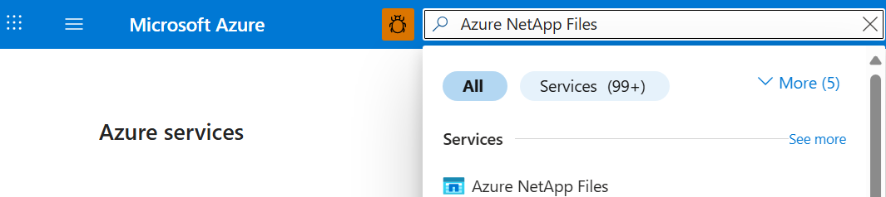
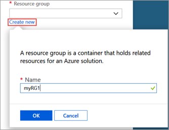
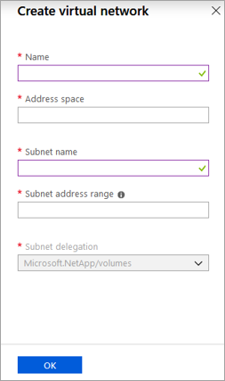

# Quickstart: Set up Azure NetApp Files and create an NFS volume

This article shows you how to quickly set up Azure NetApp Files and create an NFS volume. 

In this quickstart, you will set up the following items:

- Registration for NetApp Resource Provider
- A NetApp account
- A capacity pool
- An NFS volume for Azure NetApp Files

If you don't have an Azure subscription, create a [free account](https://azure.microsoft.com/free/?WT.mc_id=A261C142F) before you begin.

To see all features that you can enable for an NFS volume and relevant considerations, see [Create an NFS volume](azure-netapp-files-create-volumes.md). 

## Register for NetApp Resource Provider

> [!NOTE]
> The registration process can take some time to complete.
>

# [Portal](#tab/azure-portal)

For registration steps using Portal, open a Cloud Shell session as indicated above and follow these Azure CLI steps:

[!INCLUDE [azure-netapp-files-cloudshell-include](../../includes/azure-netapp-files-azure-cloud-shell-window.md)]

# [PowerShell](#tab/azure-powershell)

This how-to article requires the Azure PowerShell module Az version 2.6.0 or later. Run `Get-Module -ListAvailable Az` to find your current version. If you need to install or upgrade, see [Install Azure PowerShell module](/powershell/azure/install-azure-powershell). If you prefer, you can use Cloud Shell console in a PowerShell session instead.

1. In a PowerShell command prompt (or PowerShell Cloud Shell session), specify the subscription that has been approved for Azure NetApp Files:
    ```powershell-interactive
    Select-AzSubscription -Subscription <subscriptionId>
    ```

2. Register the Azure Resource Provider:
    ```powershell-interactive
    Register-AzResourceProvider -ProviderNamespace Microsoft.NetApp
    ```

# [Azure CLI](#tab/azure-cli)

Prepare your environment for the Azure CLI.

[!INCLUDE [azure-cli-prepare-your-environment-no-header.md](~/reusable-content/azure-cli/azure-cli-prepare-your-environment-no-header.md)]

[!INCLUDE [azure-netapp-files-cloudshell-include](../../includes/azure-netapp-files-azure-cloud-shell-window.md)]

# [Template](#tab/template)

None.

Use the Azure portal, PowerShell, or the Azure CLI to [register for NetApp Resource Provider](azure-netapp-files-register.md).

---

## Create a NetApp account

# [Portal](#tab/azure-portal)

1. In the Azure portal's search box, enter **Azure NetApp Files** and then select **Azure NetApp Files** from the list that appears.

      

2. Select **+ Create** to create a new NetApp account.

3. In the New NetApp Account window, provide the following information:
   1. Enter **myaccount1** for the account name.
   2. Select your subscription.
   3. Select **Create new** to create new resource group. Enter **myRG1** for the resource group name. Select **OK**.
   4. Select your account location.

      

      

4. Select **Create** to create your new NetApp account.

# [PowerShell](#tab/azure-powershell)

1. Define some variables so we can refer to them throughout the rest of the examples:

    ```powershell-interactive
    $resourceGroup = "myRG1"
    $location = "eastus"
    $anfAccountName = "myaccount1"
    ```

    > [!NOTE]
    > Please refer to [Products available by region](https://azure.microsoft.com/global-infrastructure/services/?products=netapp&regions=all) for a list of supported regions.
    > To obtain the region name that is supported by our command line tools, please use `Get-AzLocation | select Location`
    >

1. Create a new resource group by using the [New-AzResourceGroup](/powershell/module/az.resources/new-azresourcegroup) command:

    ```powershell-interactive
    New-AzResourceGroup -Name $resourceGroup -Location $location
    ```

2. Create Azure NetApp Files account with [New-AzNetAppFilesAccount](/powershell/module/az.netappfiles/New-AzNetAppFilesAccount) command:

    ```powershell-interactive
    New-AzNetAppFilesAccount -ResourceGroupName $resourceGroup -Location $location -Name $anfAccountName
    ```

# [Azure CLI](#tab/azure-cli)

1. Define some variables so we can refer to them throughout the rest of the examples:

    ```azurecli-interactive
    RESOURCE_GROUP="myRG1"
    LOCATION="eastus"
    ANF_ACCOUNT_NAME="myaccount1"
    ```

    > [!NOTE]
    > Please refer to [Products available by region](https://azure.microsoft.com/global-infrastructure/services/?products=netapp&regions=all) for a list of supported regions.
    > To obtain the region name that is supported by our command line tools, please use `az account list-locations --query "[].{Region:name}" --out table`
    >

2. Create a new resource group by using the [az group create](/cli/azure/group#az-group-create) command:

    ```azurecli-interactive
    az group create \
        --name $RESOURCE_GROUP \
        --location $LOCATION
    ```

3. Create Azure NetApp Files account with [az netappfiles account create](/cli/azure/netappfiles/account#az-netappfiles-account-create) command:

    ```azurecli-interactive
    az netappfiles account create \
        --resource-group $RESOURCE_GROUP \
        --location $LOCATION \
        --account-name $ANF_ACCOUNT_NAME
    ```

# [Template](#tab/template)

[!INCLUDE [About Azure Resource Manager](../../includes/resource-manager-quickstart-introduction.md)]

The following code snippet shows how to create a NetApp account in an Azure Resource Manager template (ARM template), using the [Microsoft.NetApp/netAppAccounts](/azure/templates/microsoft.netapp/netappaccounts) resource. To run the code, download the [full ARM template](https://github.com/Azure/azure-quickstart-templates/blob/master/quickstarts/microsoft.netapp/anf-nfs-volume/azuredeploy.json) from our GitHub repo.

:::code language="json" source="~/quickstart-templates/quickstarts/microsoft.netapp/anf-nfs-volume/azuredeploy.json" range="177-183":::

<!-- Block begins with "type": "Microsoft.NetApp/netAppAccounts", -->

---

## Create a capacity pool

# [Portal](#tab/azure-portal)

1. From the Azure NetApp Files management blade, select your NetApp account (**myaccount1**).

    

2. From the Azure NetApp Files management blade of your NetApp account, select **Capacity pools**.

    

3. Select **+ Add pools**.

    :::image type="content" source="./media/shared/azure-netapp-files-new-capacity-pool.png" alt-text="Screenshot of new capacity pool options.":::

4. Provide information for the capacity pool:
    * Enter **mypool1** as the pool name.
    * Select **Premium** for the service level.
    * Specify **4 (TiB)** as the pool size.
    * Use the **Auto** QoS type.

5. Select **Create**.

# [PowerShell](#tab/azure-powershell)

1. Defining some new variables for future reference

    ```powershell-interactive
    $poolName = "mypool1"
    $poolSizeBytes = 4398046511104 # 4TiB
    $serviceLevel = "Premium" # Valid values are Standard, Premium and Ultra
    ```

1. Create a new capacity pool by using the [New-AzNetAppFilesPool](/powershell/module/az.netappfiles/new-aznetappfilespool)

    ```powershell-interactive
    New-AzNetAppFilesPool -ResourceGroupName $resourceGroup -Location $location -AccountName $anfAccountName -Name $poolName -PoolSize $poolSizeBytes -ServiceLevel $serviceLevel
    ```

# [Azure CLI](#tab/azure-cli)

1. Defining some new variables for future reference

    ```azurecli-interactive
    POOL_NAME="mypool1"
    POOL_SIZE_TiB=4 # Size in Azure CLI needs to be in TiB unit (minimum 4 TiB)
    SERVICE_LEVEL="Premium" # Valid values are Standard, Premium and Ultra
    ```

2. Create a new capacity pool by using the [az netappfiles pool create](/cli/azure/netappfiles/pool#az-netappfiles-pool-create)

    ```azurecli-interactive
    az netappfiles pool create \
        --resource-group $RESOURCE_GROUP \
        --location $LOCATION \
        --account-name $ANF_ACCOUNT_NAME \
        --pool-name $POOL_NAME \
        --size $POOL_SIZE_TiB \
        --service-level $SERVICE_LEVEL
    ```

# [Template](#tab/template)

<!-- [!INCLUDE [About Azure Resource Manager](../../includes/resource-manager-quickstart-introduction.md)] -->

The following code snippet shows how to create a capacity pool in an Azure Resource Manager template (ARM template), using the [Microsoft.NetApp/netAppAccounts/capacityPools](/azure/templates/microsoft.netapp/netappaccounts/capacitypools) resource. To run the code, download the [full ARM template](https://github.com/Azure/azure-quickstart-templates/blob/master/quickstarts/microsoft.netapp/anf-nfs-volume/azuredeploy.json) from our GitHub repo.

:::code language="json" source="~/quickstart-templates/quickstarts/microsoft.netapp/anf-nfs-volume/azuredeploy.json" range="184-196":::

<!-- LN 185, block begins with  "type": "Microsoft.NetApp/netAppAccounts/capacityPools", -->

---

## Create an NFS volume for Azure NetApp Files

# [Portal](#tab/azure-portal)

1. From the Azure NetApp Files management blade of your NetApp account, select **Volumes**.

    

2. Select **+ Add volume**.

    

3. In the Create a Volume window, provide information for the volume:
   1. Enter **myvol1** as the volume name.
   2. Select your capacity pool (**mypool1**).
   3. Use the default value for quota.
   4. Under virtual network, select **Create new** to create a new Azure virtual network (VNet). Then fill in the following information:
       * Enter **myvnet1** as the Vnet name.
       * Specify an address space for your setting, for example, 10.7.0.0/16
       * Enter **myANFsubnet** as the subnet name.
       * Specify the subnet address range, for example, 10.7.0.0/24. You cannot share the dedicated subnet with other resources.
       * Select **Microsoft.NetApp/volumes** for subnet delegation.
       * Select **OK** to create the VNet.
   5. In subnet, select the newly created Vnet (**myvnet1**) as the delegate subnet.

      

      

4. Select **Protocol**, and then complete the following actions:
    * Select **NFS** as the protocol type for the volume.
    * Enter **myfilepath1** as the file path that will be used to create the export path for the volume.
    * Select the NFS version (**NFSv3** or **NFSv4.1**) for the volume.
      See [considerations](azure-netapp-files-create-volumes.md#considerations) and [best practice](azure-netapp-files-create-volumes.md#best-practice) about NFS versions.

    

5. Select **Review + create** to display information for the volume you are creating.  

6. Select **Create** to create the volume. 
    The created volume appears in the Volumes blade.

    

# [PowerShell](#tab/azure-powershell)

1. Create a subnet delegation to "Microsoft.NetApp/volumes" with [New-AzDelegation](/powershell/module/az.network/new-azdelegation) command.

    ```powershell-interactive
    $anfDelegation = New-AzDelegation -Name ([guid]::NewGuid().Guid) -ServiceName "Microsoft.NetApp/volumes"
    ```

2. Create a subnet configuration by using [New-AzVirtualNetworkSubnetConfig](/powershell/module/az.network/new-azvirtualnetworksubnetconfig) command.

    ```powershell-interactive
    $subnet = New-AzVirtualNetworkSubnetConfig -Name "myANFSubnet" -AddressPrefix "10.7.0.0/24" -Delegation $anfDelegation
    ```

3. Create the virtual network by using the [New-AzVirtualNetwork](/powershell/module/az.network/new-azvirtualnetwork) command.

    ```powershell-interactive
    $vnet = New-AzVirtualNetwork -Name "myvnet1" -ResourceGroupName $resourceGroup -Location $location -AddressPrefix "10.7.0.0/16" -Subnet $subnet
    ```

4. Create the volume by using the [New-AzNetAppFilesVolume](/powershell/module/az.netappfiles/new-aznetappfilesvolume) command.

    ```powershell-interactive
    $volumeSizeBytes = 1099511627776 # 100GiB
    $subnetId = $vnet.Subnets[0].Id

    New-AzNetAppFilesVolume -ResourceGroupName $resourceGroup `
        -Location $location `
        -AccountName $anfAccountName `
        -PoolName $poolName `
        -Name "myvol1" `
        -UsageThreshold $volumeSizeBytes `
        -SubnetId $subnetId `
        -CreationToken "myfilepath1" `
        -ServiceLevel $serviceLevel `
        -ProtocolType NFSv3
    ```

# [Azure CLI](#tab/azure-cli)

1. Defining some variables for later usage.

    ```azurecli-interactive
    VNET_NAME="myvnet1"
    SUBNET_NAME="myANFSubnet"
    ```

1. Create virtual network without subnet by using the [az network vnet create](/cli/azure/network/vnet#az-network-vnet-create) command.

    ```azurecli-interactive
    az network vnet create \
        --resource-group $RESOURCE_GROUP \
        --name $VNET_NAME \
        --location $LOCATION \
        --address-prefix "10.7.0.0/16"

    ```

2. Create a delegated subnet by using [az network vnet subnet create](/cli/azure/network/vnet/subnet#az-network-vnet-subnet-create) command.

    ```azurecli-interactive
    az network vnet subnet create \
        --resource-group $RESOURCE_GROUP \
        --vnet-name $VNET_NAME \
        --name $SUBNET_NAME \
        --address-prefixes "10.7.0.0/24" \
        --delegations "Microsoft.NetApp/volumes"
    ```

3. Create the volume by using the [az netappfiles volume create](/cli/azure/netappfiles/volume#az-netappfiles-volume-create) command.

    ```azurecli-interactive
    VNET_ID=$(az network vnet show --resource-group $RESOURCE_GROUP --name $VNET_NAME --query "id" -o tsv)
    SUBNET_ID=$(az network vnet subnet show --resource-group $RESOURCE_GROUP --vnet-name $VNET_NAME --name $SUBNET_NAME --query "id" -o tsv)
    VOLUME_SIZE_GiB=100 # 100 GiB
    UNIQUE_FILE_PATH="myfilepath2" # Please note that creation token needs to be unique within subscription and region

    az netappfiles volume create \
        --resource-group $RESOURCE_GROUP \
        --location $LOCATION \
        --account-name $ANF_ACCOUNT_NAME \
        --pool-name $POOL_NAME \
        --name "myvol1" \
        --service-level $SERVICE_LEVEL \
        --vnet $VNET_ID \
        --subnet $SUBNET_ID \
        --usage-threshold $VOLUME_SIZE_GiB \
        --file-path $UNIQUE_FILE_PATH \
        --protocol-types "NFSv3"
    ```

# [Template](#tab/template)

<!-- [!INCLUDE [About Azure Resource Manager](../../includes/resource-manager-quickstart-introduction.md)] -->

The following code snippets show how to set up a VNet and create an Azure NetApp Files volume in an Azure Resource Manager template (ARM template). VNet setup uses the [Microsoft.Network/virtualNetworks](/azure/templates/Microsoft.Network/virtualNetworks) resource. Volume creation uses the [Microsoft.NetApp/netAppAccounts/capacityPools/volumes](/azure/templates/microsoft.netapp/netappaccounts/capacitypools/volumes) resource. To run the code, download the [full ARM template](https://github.com/Azure/azure-quickstart-templates/blob/master/quickstarts/microsoft.netapp/anf-nfs-volume/azuredeploy.json) from our GitHub repo.

:::code language="json" source="~/quickstart-templates/quickstarts/microsoft.netapp/anf-nfs-volume/azuredeploy.json" range="148-176":::

<!-- Block begins with  "type": "Microsoft.Network/virtualNetworks", -->

:::code language="json" source="~/quickstart-templates/quickstarts/microsoft.netapp/anf-nfs-volume/azuredeploy.json" range="197-229":::

<!-- Block begins with  "type": "Microsoft.NetApp/netAppAccounts/capacityPools/volumes", -->

---

## Clean up resources

# [Portal](#tab/azure-portal)

When you are done and if you want to, you can delete the resource group. The action of deleting a resource group is irreversible.

> [!IMPORTANT]
> All resources within the resource groups will be permanently deleted and cannot be undone.


>[!IMPORTANT]
>Before you delete a resource group, you must first delete the backups. Deleting a resource group will not delete the backups. You can preemptively delete backups on volumes by [disabling the backup policy](backup-disable.md) or you can [manually delete the backups](backup-delete.md). If you delete the resource group without disabling backups, backups will continue to impact your billing.  

1. In the Azure portal's search box, enter **Azure NetApp Files** and then select **Azure NetApp Files** from the list that appears.

2. In the list of subscriptions, select the resource group (myRG1) you want to delete.

    


3. In the resource group page, select **Delete resource group**.

    

    A window opens and displays a warning about the resources that will be deleted with the resource group.

4. Enter the name of the resource group (myRG1) to confirm that you want to permanently delete the resource group and all resources in it, and then select **Delete**.

    

# [PowerShell](#tab/azure-powershell)

When you are done and if you want to, you can delete the resource group. The action of deleting a resource group is irreversible.

> [!IMPORTANT]
> All resources within the resource groups will be permanently deleted and cannot be undone.

1. Delete resource group by using the [Remove-AzResourceGroup](/powershell/module/az.resources/remove-azresourcegroup) command.

    ```powershell-interactive
    Remove-AzResourceGroup -Name $resourceGroup
    ```

# [Azure CLI](#tab/azure-cli)

When you are done and if you want to, you can delete the resource group. The action of deleting a resource group is irreversible.

> [!IMPORTANT]
> All resources within the resource groups will be permanently deleted and cannot be undone.

1. Delete resource group by using the [az group delete](/cli/azure/group#az-group-delete) command.

    ```azurecli-interactive
    az group delete \
        --name $RESOURCE_GROUP
    ```

# [Template](#tab/template)

None.

Use the Azure portal, PowerShell, or the Azure CLI to delete the resource group.

---

## Next steps

> [!div class="nextstepaction"]
> [Storage hierarchy of Azure NetApp Files](azure-netapp-files-understand-storage-hierarchy.md)

> [!div class="nextstepaction"]
> [Service levels for Azure NetApp Files](azure-netapp-files-service-levels.md)

> [!div class="nextstepaction"]
> [Create an NFS volume](azure-netapp-files-create-volumes.md)

> [!div class="nextstepaction"]
> [Solution architectures using Azure NetApp Files](azure-netapp-files-solution-architectures.md)

> [!div class="nextstepaction"]
> [Application resilience FAQs for Azure NetApp Files](faq-application-resilience.md)
