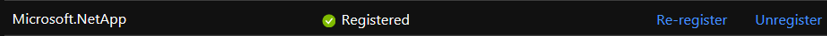

# Register for Azure NetApp Files

> [!IMPORTANT] 
> Before registering the Azure NetApp Files resource provider, you must have received an email from the Azure NetApp Files team confirming that you have been granted access to the service. 

In this article, learn how to register for Azure NetApp Files so that you can begin to use the service.

## Submit a waitlist request for accessing the service

1. Submit a waitlist request for accessing the Azure NetApp Files service through the [Azure NetApp Files waitlist submission page](https://forms.office.com/Pages/ResponsePage.aspx?id=v4j5cvGGr0GRqy180BHbR8cq17Xv9yVBtRCSlcD_gdVUNUpUWEpLNERIM1NOVzA5MzczQ0dQR1ZTSS4u). 

    Waitlist signup does not guarantee immediate service access. 

2. Wait for an official confirmation email from the Azure NetApp Files team before continuing with other tasks. 

## Register the NetApp Resource Provider

To use the service, you must register the Azure Resource Provider for Azure NetApp Files.

> [!NOTE] 
> You will be able to successfully register the NetApp Resource Provider even without being granted access for service. However, without access authorization, any Azure portal or API request to create a NetApp account or any other Azure NetApp Files resource will be rejected with the following error:  
>
> `{"code":"DeploymentFailed","message":"At least one resource deployment operation failed. Please list deployment operations for details. Please see https://aka.ms/arm-debug for usage details.","details":[{"code":"NotFound","message":"{\r\n \"error\": {\r\n \"code\": \"InvalidResourceType\",\r\n \"message\": \"The resource type could not be found in the namespace 'Microsoft.NetApp' for api version '2017-08-15'.\"\r\n }\r\n}"}]}`

1. From the Azure portal, click the Azure Cloud Shell icon on the upper right-hand corner:

      

2. If you have multiple subscriptions on your Azure account, select the one that has been whitelisted for Azure NetApp Files:
    
        az account set --subscription <subscriptionId>

3. In the Azure Cloud Shell console, enter the following command to verify that your subscription has been whitelisted:
    
        az feature list | grep NetApp

   The command output appears as follows:
   
       "id": "/subscriptions/<SubID>/providers/Microsoft.Features/providers/Microsoft.NetApp/features/ANFGA",  
       "name": "Microsoft.NetApp/ANFGA" 
       
   `<SubID>` is your subscription ID.

    If you do not see the feature name `Microsoft.NetApp/ANFGA`, you do not have access to the service. Stop at this step. Follow instructions in [Submit a waitlist request for accessing the service](#waitlist) to request service access before continuing. 

4. In the Azure Cloud Shell console, enter the following command to register the Azure Resource Provider: 
    
        az provider register --namespace Microsoft.NetApp --wait

   The `--wait` parameter instructs the console to wait for the registration to complete. The registration process can take some time to complete.

5. In the Azure Cloud Shell console, enter the following command to verify that the Azure Resource Provider has been registered: 
    
        az provider show --namespace Microsoft.NetApp

   The command output appears as follows:
   
        {
        "id": "/subscriptions/<SubID>/providers/Microsoft.NetApp",
        "namespace": "Microsoft.NetApp", 
        "registrationState": "Registered", 
        "resourceTypes": […. 

   `<SubID>` is your subscription ID.  The `state` parameter value indicates `Registered`.

6. From the Azure portal, click the **Subscriptions** blade.
7. In the Subscriptions blade, click your subscription ID. 
8. In the settings of the subscription, click **Resource providers** to verify that Microsoft.NetApp Provider indicates the Registered status: 

      

## Next steps

[Create a NetApp account](azure-netapp-files-create-netapp-account.md)