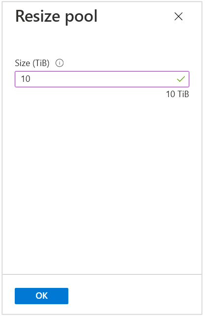
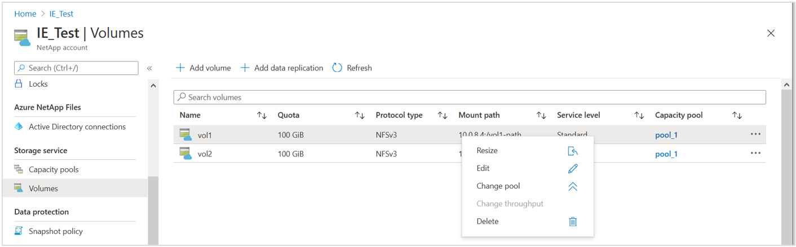

# Resize a capacity pool or a volume
You can change the size of a capacity pool or a volume as necessary, for example, when a volume or capacity pool fills up. 

For information about monitoring a volume’s capacity, see [Monitor the capacity of a volume](monitor-volume-capacity.md).

## Considerations

* Volume quotas are indexed against `maxfiles` limits. Once a volume has surpassed a `maxfiles` limit, you cannot reduce the volume size below the quota that corresponds to that `maxfiles` limit. For more information and specific limits, see [`maxfiles` limits](azure-netapp-files-resource-limits.md#maxfiles-limits-).
* Capacity pools with Basic network features have a minimum size of 4 TiB. For capacity pools with Standard network features, the minimum size is 1 TiB. For more information, see [Resource limits](azure-netapp-files-resource-limits.md)

## Resize the capacity pool using the Azure portal 

You can change the capacity pool size in 1-TiB increments or decrements. However, the capacity pool size cannot be smaller than the sum of the capacity of the volumes hosted in the pool. 

Resizing the capacity pool changes the purchased Azure NetApp Files capacity.

1. From the NetApp Account view, go to **Capacity pools**, and select the capacity pool that you want to resize.
2. Right-click the capacity pool name or select the "…" icon at the end of the capacity pool row to display the context menu. Select **Resize**. 

      

3. In the Resize pool window, specify the pool size. Select **OK**.

     

## Resize a volume using the Azure portal

You can change the size of a volume as necessary. A volume's capacity consumption counts against its pool's provisioned capacity.

1. From the NetApp Account view, go to **Volumes**, and select the volume that you want to resize.
2. Right-click the volume name or select the "…" icon at the end of the volume's row to display the context menu. Select **Resize**.

     
    
3. In the Update volume quota window, specify the quota for the volume. Select **OK**.   

     

## Resizing the capacity pool or a volume using Azure CLI  

You can use the following commands of the [Azure command line (CLI) tools](azure-netapp-files-sdk-cli.md) to resize a capacity pool or a volume:

* [`az netappfiles pool`](/cli/azure/netappfiles/pool)
* [`az netappfiles volume`](/cli/azure/netappfiles/volume)

## Resizing the capacity pool or a volume using REST API

You can build automation to handle the capacity pool and volume size change.   

See [REST API for Azure NetApp Files](azure-netapp-files-develop-with-rest-api.md) and [REST API using PowerShell for Azure NetApp Files](develop-rest-api-powershell.md). 

The REST API specification and example code for Azure NetApp Files are available through the [resource-manager GitHub directory](https://github.com/Azure/azure-rest-api-specs/tree/main/specification/netapp/resource-manager/Microsoft.NetApp/stable). 

## Resize a cross-region replication destination volume 

In a [cross-region replication](cross-region-replication-introduction.md) relationship, a destination volume is automatically resized based on the size of the source volume. As such, you don’t need to resize the destination volume separately. This automatic resizing behavior is applicable when the volumes are in an active replication relationship, or when replication peering is broken with the [resync operation](cross-region-replication-manage-disaster-recovery.md#resync-replication). 

The following table describes the destination volume resizing behavior based on the [Mirror state](cross-region-replication-display-health-status.md):

|  Mirror state  | Destination volume resizing behavior |
|-|-|
| *Mirrored* | When the destination volume has been initialized and is ready to receive mirroring updates, resizing the source volume automatically resizes the destination volumes. |
| *Broken* | When you resize the source volume and the Mirror state is *broken*, the destination volume is automatically resized with the [resync operation](cross-region-replication-manage-disaster-recovery.md#resync-replication).  |
| *Uninitialized* | When you resize the source volume and the Mirror state is still *uninitialized*, resizing the destination volume needs to be done manually. As such, it's recommended that you wait for the initialization to complete (that is, when the Mirror state becomes *mirrored*) to resize the source volume. | 

> [!IMPORTANT]
> Ensure that you have enough headroom in the capacity pools for both the source and the destination volumes of cross-region replication. When you resize the source volume, the destination volume is automatically resized. But if the capacity pool hosting the destination volume doesn’t have enough headroom, the resizing of both the source and the destination volumes will fail.

## Next steps

- [Create a capacity pool](azure-netapp-files-set-up-capacity-pool.md)
- [Manage a manual QoS capacity pool](manage-manual-qos-capacity-pool.md)
- [Dynamically change the service level of a volume](dynamic-change-volume-service-level.md) 
- [Understand volume quota](volume-quota-introduction.md)
- [Monitor the capacity of a volume](monitor-volume-capacity.md)
- [Capacity management FAQs](faq-capacity-management.md)
- [Resource limits](azure-netapp-files-resource-limits.md)
