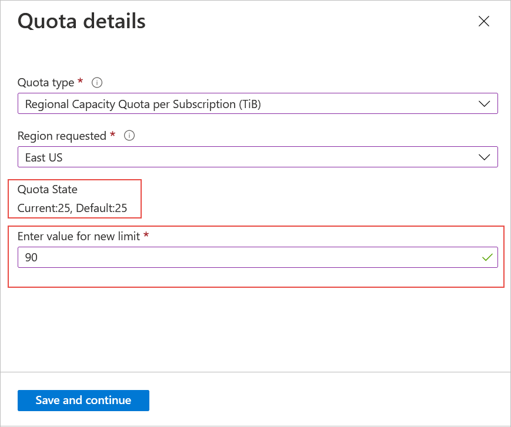

# Resource limits for Azure NetApp Files

Understanding resource limits for Azure NetApp Files helps you manage your volumes.

## Resource limits

The following table describes resource limits for Azure NetApp Files:

|  Resource  |  Default limit  |  Adjustable via support request  |
|----------------|---------------------|--------------------------------------|
|  [Regional capacity quota per subscription](regional-capacity-quota.md)   |  25 TiB  |  Yes  |
|  Number of NetApp accounts per Azure region per subscription  |  10    |  Yes   |
|  Number of capacity pools per NetApp account   |    25     |   Yes   |
|  Number of volumes per subscription   |    500     |   Yes   |
|  Number of volumes per capacity pool     |    500   |    Yes     |
|  Number of snapshots per volume       |    255     |    No        |
|  Number of IPs in a virtual network (including immediately peered VNets) accessing volumes in an Azure NetApp Files hosting VNet    |   <ul><li>**Basic**: 1000</li><li>**Standard**: [Same standard limits as VMs](../azure-resource-manager/management/azure-subscription-service-limits.md#azure-resource-manager-virtual-networking-limits)</li></ul>  |    No    |
|  Minimum size of a single capacity pool   |  1 TiB*     |    No  |
|  Maximum size of a single capacity pool    |  2,048 TiB   |   No   |
|  Minimum size of a single regular volume    |    100 GiB    |    No    |
|  Maximum size of a single regular volume     |    100 TiB    |    No    |
|  Minimum size of a single [large volume](large-volumes-requirements-considerations.md) | 50 TiB |     No |
| Large volume size increase | 30% of lowest provisioned size | Yes |
|  Maximum size of a single [large volume](large-volumes-requirements-considerations.md)    | 1,024 TiB |    No    |
| Maximum size of a single large volume on dedicated capacity (preview) | 2,048 TiB | No |
|  Maximum size of a single file     |    16 TiB    |    No    |    
|  Maximum size of directory metadata in a single directory      |    320 MB    |    No    |    
|  Maximum number of files in a single directory  | *Approximately* 4 million. <br> See [Determine if a directory is approaching the limit size](#directory-limit).  |    No    |   
|  Maximum number of files `maxfiles` per volume     |  See [`maxfiles`](#maxfiles)  |    Yes    |    
|  Maximum number of export policy rules per volume     |    5  |    No    | 
|  Maximum number of quota rules per volume     |   100  |    No    | 
|  Minimum assigned throughput for a manual QoS volume     |    1 MiB/s   |    No    |    
|  Maximum assigned throughput for a manual QoS volume     |    4,500 MiB/s    |    No    |    
|  Number of cross-region replication data protection volumes (destination volumes)     |    50    |    Yes    |     
|  Number of cross-zone replication data protection volumes (destination volumes)     |    50    |    Yes    |     
|  Maximum numbers of policy-based (scheduled) backups per volume  | <ul><li> Daily retention count: 2 (minimum) to 1019 (maximum) </li> <li> Weekly retention count: 1 (minimum) to 1019 (maximum) </li> <li> Monthly retention count: 1 (minimum) to 1019 (maximum) </ol></li> <br> The maximum hourly, daily, weekly, and monthly backup retention counts *combined* is 1019.  |  No  |
|  Maximum size of protected volume  |  100 TiB  |  No  |
|  Maximum number of volumes that can be backed up per subscription   |  20  |  Yes  |
|  Maximum number of manual backups per volume per day |  5  |  Yes  |
|  Maximum number of volumes supported for cool access per subscription per region |  10  |  Yes  |


\* [!INCLUDE [Limitations for capacity pool minimum of 1 TiB](includes/2-tib-capacity-pool.md)]

For more information, see [Capacity management FAQs](faq-capacity-management.md).

For limits and constraints related to Azure NetApp Files network features, see [Guidelines for Azure NetApp Files network planning](azure-netapp-files-network-topologies.md#considerations).

## Determine if a directory is approaching the limit size <a name="directory-limit"></a>  

You can use the `stat` command from a client to see whether a directory is approaching the maximum size limit for directory metadata (320 MB). If you reach the maximum size limit for a single directory for Azure NetApp Files, the error `No space left on device` occurs.   

For a 320-MB directory, the number of blocks is 655,360, with each block size being 512 bytes.  (That is, 320x1024x1024/512.)  This number translates to approximately 4 million files maximum for a 320-MB directory. However, the actual number of maximum files might be lower, depending on factors such as the number of files with non-ASCII characters in the directory. As such, you should use the `stat` command as follows to determine whether your directory is approaching its limit.  

Examples:

```console
[makam@cycrh6rtp07 ~]$ stat bin
File: 'bin'
Size: 4096            Blocks: 8          IO Block: 65536  directory

[makam@cycrh6rtp07 ~]$ stat tmp
File: 'tmp'
Size: 12288           Blocks: 24         IO Block: 65536  directory
 
[makam@cycrh6rtp07 ~]$ stat tmp1
File: 'tmp1'
Size: 4096            Blocks: 8          IO Block: 65536  directory
```

## `Maxfiles` limits <a name="maxfiles"></a> 

Azure NetApp Files volumes have a value called `maxfiles` that refers to the maximum number of files and folders (also known as inodes) a volume can contain. When the `maxfiles` limit is reached, clients receive "out of space" messages when attempting to create new files or folders. If you experience this issue, contact Microsoft technical support.

The `maxfiles` limit for an Azure NetApp Files volume is based on the size (quota) of the volume, where the service dynamically adjusts the `maxfiles` limit for a volume based on its provisioned size and uses the following guidelines.

- For regular volumes less than or equal to 683 GiB, the default `maxfiles` limit is 21,251,126.
- For regular volumes greater than 683 GiB, the default `maxfiles` limit is approximately one file (or inode) per 32 KiB of allocated volume capacity up to a maximum of 2,147,483,632.
- For [large volumes](large-volumes-requirements-considerations.md), the default `maxfiles` limit is approximately one file (or inode) per 32 KiB of allocated volume capacity up to a default maximum of 15,938,355,048.
- Each inode uses roughly 288 bytes of capacity in the volume. Having many inodes in a volume can consume a non-trivial amount of physical space overhead on top of the capacity of the actual data.
    - If a file is less than 64 bytes in size, it's stored in the inode itself and doesn't use additional capacity. This capacity is only used when files are actually allocated to the volume.
    - Files larger than 64 bytes do consume additional capacity on the volume. For instance, if there are one million files greater than 64 bytes in an Azure NetApp Files volume, then approximately 274 MiB of capacity would belong to the inodes.


The following table shows examples of the relationship `maxfiles` values based on volume sizes for regular volumes. 

| Volume size | Estimated maxfiles limit |
| - | - |
| 0 – 683 GiB | 21,251,126 |
| 1 TiB (1,073,741,824 KiB) | 31,876,709 |
| 10 TiB (10,737,418,240 KiB) | 318,767,099 |
| 50 TiB (53,687,091,200 KiB)	| 1,593,835,519 |
| 100 TiB (107,374,182,400 KiB) | 2,147,483,632 |

The following table shows examples of the relationship `maxfiles` values based on volume sizes for large volumes. 

| Volume size | Estimated maxfiles limit |
| - | - |
| 50 TiB (53,687,091,200 KiB) |	1,593,835,512 |
| 100 TiB (107,374,182,400 KiB)	| 3,187,671,024 |
| 200 TiB (214,748,364,800 KiB)	| 6,375,342,024  |
| 500 TiB (536,870,912,000 KiB)	| 15,938,355,048 |

To see the `maxfiles` allocation for a specific volume size, check the **Maximum number of files** field in the volume’s overview pane.

:::image type="content" source="./media/azure-netapp-files-resource-limits/maximum-number-files.png" alt-text="Screenshot of volume overview menu." lightbox="./media/azure-netapp-files-resource-limits/maximum-number-files.png":::

You can't set `maxfiles` limits for data protection volumes via a quota request. Azure NetApp Files automatically increases the `maxfiles` limit of a data protection volume to accommodate the number of files replicated to the volume. When a failover happens on a data protection volume, the `maxfiles` limit remains the last value before the failover. In this situation, you can submit a `maxfiles` [quota request](#request-limit-increase) for the volume.

## Request limit increase

You can create an Azure support request to increase the adjustable limits from the [Resource Limits](#resource-limits) table. 

>[!NOTE]
> Depending on available resources in the region and the limit increase requested, Azure support may require additional information in order to determine the feasibility of the request.

1. Navigate to **Help** then **Support + troubleshooting**.   
1. Under the **How can we help you** heading, enter "regional capacity quota" in the text field then select **Go**. 

    :::image type="content" source="./media/azure-netapp-files-resource-limits/support-how-can-we-help.png" alt-text="Screenshot that shows the How can we help heading." lightbox="./media/azure-netapp-files-resource-limits/support-how-can-we-help.png":::

    1. Under the **Current selection** heading, search for "Azure NetApp Files" in the text field for **Which service are you having an issue with?**.
    1. Select **Azure NetApp Files** then **Next**. 

    :::image type="content" source="./media/azure-netapp-files-resource-limits/support-service.png" alt-text="Screenshot of choosing a service option." lightbox="./media/azure-netapp-files-resource-limits/support-service.png":::

    1. Under **Which resource are you having an issue with?**, locate and select your subscription then locate and select your resource (the NetApp account).
    
    :::image type="content" source="./media/azure-netapp-files-resource-limits/support-resource.png" alt-text="Screenshot with the option to select your subscription and resource." lightbox="./media/azure-netapp-files-resource-limits/support-resource.png":::

    1. Under **Are you having one of the following issues?**, select **Storage: Azure NetApp Files limits** then **Next**.
    
    :::image type="content" source="./media/azure-netapp-files-resource-limits/support-issue.png" alt-text="Screenshot showing the option to choose Azure NetApp Files limits as an issue." lightbox="./media/azure-netapp-files-resource-limits/support-issue.png":::

    1. Select **Create a supoprt request**. 

1. Under the **Problem description** tab, provide the required information:
    1. For **Issue Type**, select **Service and Subscription Limits (Quotas)**.
    2. For **Subscription**, select your subscription. 
    3. For **Quota Type**, select **Storage: Azure NetApp Files limits**.  


1. Under the **Additional details** tab, select **Enter details** in the Request Details field.  

    

1. To request limit increase, provide the following information in the Quota Details window that appears:
    1. In **Quota Type**, select the type of resource you want to increase.  
        For example:   
        * *Regional Capacity Quota per Subscription (TiB)*
        * *Number of NetApp accounts per Azure region per subscription*
        * *Number of volumes per subscription*

    2. In **Region Requested**, select your region.   
        The current and default sizes are displayed under Quota State.
    
    3. Enter a value to request an increase for the quota type you specified.
    
    

1. Select **Save and continue**. Select **Review + create** to create the request.

## Next steps  

- [Understand the storage hierarchy of Azure NetApp Files](azure-netapp-files-understand-storage-hierarchy.md)
- [Requirements and considerations for large volumes](large-volumes-requirements-considerations.md)
- [Cost model for Azure NetApp Files](azure-netapp-files-cost-model.md)
- [Regional capacity quota for Azure NetApp Files](regional-capacity-quota.md)
- [Request region access for Azure NetApp Files](request-region-access.md)
- [Application resilience FAQs for Azure NetApp Files](faq-application-resilience.md)
