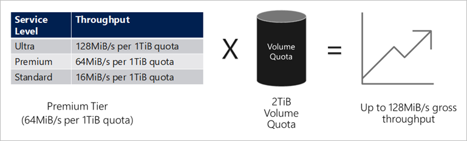
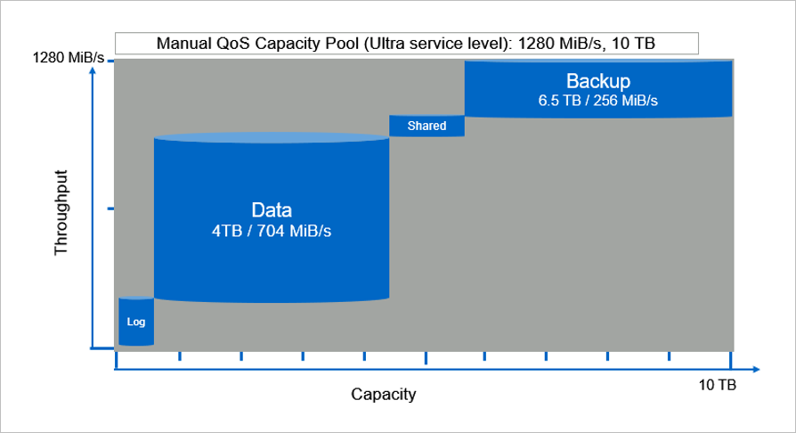

# Service levels for Azure NetApp Files
Service levels are an attribute of a capacity pool. Service levels are defined and differentiated by the allowed maximum throughput for a volume in the capacity pool based on the quota that is assigned to the volume. Throughput is a combination of read and write speed. 

## Supported service levels

Azure NetApp Files supports three service levels: *Ultra*, *Premium*, and *Standard*. 

* Ultra storage

    The Ultra storage tier provides up to 128 MiB/s of throughput per 1 TiB of capacity provisioned. 

* Premium storage

    The Premium storage tier provides up to 64 MiB/s of throughput per 1 TiB of capacity provisioned. 

* Standard storage

    The Standard storage tier provides up to 16 MiB/s of throughput per 1 TiB of capacity provisioned.

## Throughput limits

The throughput limit for a volume is determined by the combination of the following factors:
* The service level of the capacity pool to which the volume belongs
* The quota assigned to the volume  
* The QoS type (*auto* or *manual*) of the capacity pool  

### Throughput limit examples of volumes in an auto QoS capacity pool

The following diagram shows throughput limit examples of volumes in an auto QoS capacity pool:

* In Example 1, a volume from an auto QoS capacity pool with the Premium storage tier that is assigned 2 TiB of quota will be assigned a throughput limit of 128 MiB/s (2 TiB * 64 MiB/s). This scenario applies regardless of the capacity pool size or the actual volume consumption.

* In Example 2, a volume from an auto QoS capacity pool with the Premium storage tier that is assigned 100 GiB of quota will be assigned a throughput limit of 6.25 MiB/s (0.09765625 TiB * 64 MiB/s). This scenario applies regardless of the capacity pool size or the actual volume consumption.

### Throughput limit examples of volumes in a manual QoS capacity pool 

If you use a manual QoS capacity pool, you can assign the capacity and throughput for a volume independently. When you create a volume in a manual QoS capacity pool, you can specify the throughput (MiB/S) value. The total throughput assigned to volumes in a manual QoS capacity pool depends on the size of the pool and the service level. It is capped by (Capacity Pool Size in TiB x Service Level Throughput/TiB). For instance, a 10-TiB capacity pool with the Ultra service level has a total throughput capacity of 1280 MiB/s (10 TiB x 128 MiB/s/TiB) available for the volumes.

For example, for an SAP HANA system, this capacity pool can be used to create the following volumes. Each volume provides the individual size and throughput to meet your application requirements:

* SAP HANA data volume: Size 4 TiB with up to 704 MiB/s
* SAP HANA log volume: Size 0.5 TiB with up to 256 MiB/s
* SAP HANA shared volume: Size 1 TiB with up to 64 MiB/s
* SAP HANA backup volume: Size 4.5 TiB with up to 256 MiB/s

The following diagram illustrates the scenarios for the SAP HANA volumes:

 

## Next steps

- [Azure NetApp Files pricing page](https://azure.microsoft.com/pricing/details/storage/netapp/)
- [Cost model for Azure NetApp Files](azure-netapp-files-cost-model.md) 
- [Create a capacity pool](azure-netapp-files-set-up-capacity-pool.md)
- [Service Level Agreement (SLA) for Azure NetApp Files](https://azure.microsoft.com/support/legal/sla/netapp/)
- [Dynamically change the service level of a volume](dynamic-change-volume-service-level.md) 
- [Service-level objectives for cross-region replication](cross-region-replication-introduction.md#service-level-objectives)
