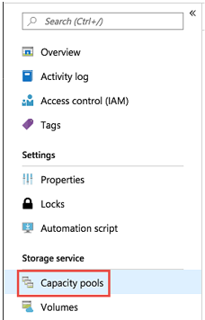

# Set up a capacity pool

Setting up a capacity pool enables you to create volumes within it.  

## Before you begin 

You must have already created a NetApp account.   

[Create a NetApp account](azure-netapp-files-create-netapp-account.md)

## Steps 

1. Go to the management blade for your NetApp account, and then, from the navigation pane, click **Capacity pools**.  
    
    

2. Click **+ Add pools** to create a new capacity pool.   
    The New Capacity Pool window appears.

3. Provide the following information for the new capacity pool:  
   * **Name**  
     Specify the name for the capacity pool.  
     The capacity pool name must be unique for each NetApp account.

   * **Service level**   
     This field shows the target performance for the capacity pool.  
     Specify the service level for the capacity pool: [**Ultra**](azure-netapp-files-service-levels.md#Ultra), [**Premium**](azure-netapp-files-service-levels.md#Premium), or [**Standard**](azure-netapp-files-service-levels.md#Standard).

   * **Size**     
     Specify the size of the capacity pool that you are purchasing.        
     The minimum capacity pool size is 4 TiB. You can create a pool with a size that is multiples of 4 TiB.   
      
     

4. Click **OK**.

## Next steps 

- [Service levels for Azure NetApp Files](azure-netapp-files-service-levels.md)
- See the [Azure NetApp Files pricing page](https://azure.microsoft.com/pricing/details/storage/netapp/) for the price of different service levels
- [Delegate a subnet to Azure NetApp Files](azure-netapp-files-delegate-subnet.md)
