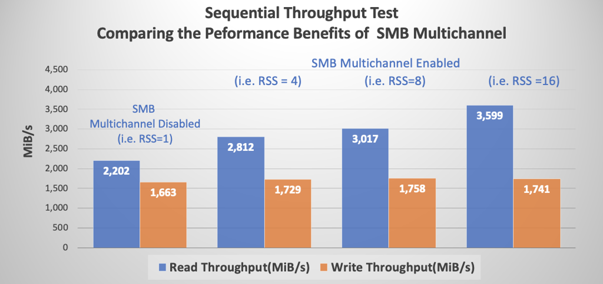
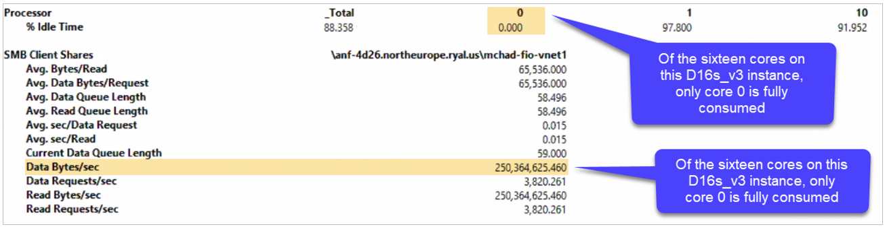
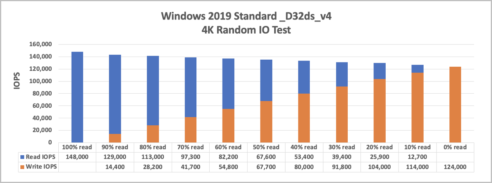
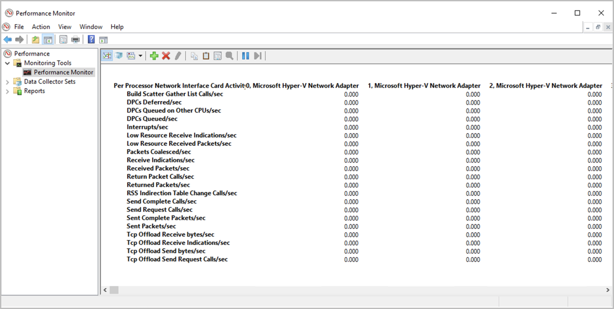
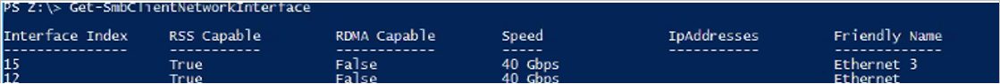
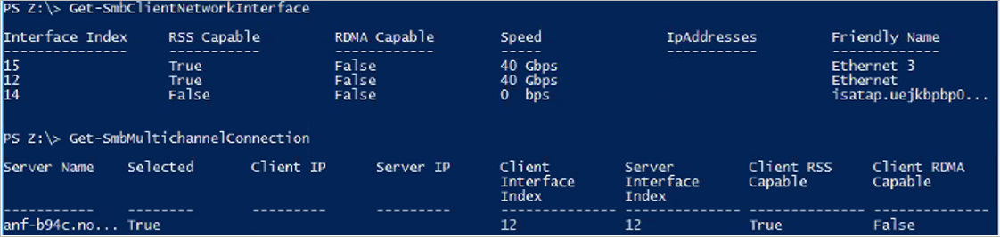

# SMB performance best practices for Azure NetApp Files

This article helps you understand SMB performance and best practices for Azure NetApp Files.

## SMB Multichannel

SMB Multichannel is enabled by default in SMB shares. All SMB shares pre-dating existing SMB volumes have the feature enabled; all newly created volumes also have the feature enabled at time of creation. 

Any SMB connection established before the feature enablement needs to be reset to take advantage of the SMB Multichannel functionality. To reset, you can disconnect and reconnect the SMB share.

Windows has supported SMB Multichannel since Windows 2012 to enable best performance. See [Deploy SMB Multichannel](/previous-versions/windows/it-pro/windows-server-2012-r2-and-2012/dn610980(v%3Dws.11)) and [The basics of SMB Multichannel](/archive/blogs/josebda/the-basics-of-smb-multichannel-a-feature-of-windows-server-2012-and-smb-3-0) for details. 

### Benefits of SMB Multichannel

The SMB Multichannel feature enables an SMB3 client to establish a pool of connections over a single network interface card (NIC) or multiple NICs and to use them to send requests for a single SMB session. In contrast, by design, SMB1 and SMB2 require the client to establish one connection and send all the SMB traffic for a given session over that connection. This single connection limits the overall protocol performance that can be achieved from a single client.

### Performance for SMB Multichannel

The following tests and graphs demonstrate the power of SMB Multichannel on single-instance workloads.

#### Random I/O  

With SMB Multichannel disabled on the client, pure four-KiB read and write tests were performed using FIO and a 40-GiB working set. The SMB share was detached between each test, with increments of the SMB client connection count per [receive side scaling](/windows-hardware/drivers/network/introduction-to-receive-side-scaling) network interface settings of `1`,`4`,`8`,`16`, and `set-SmbClientConfiguration -ConnectionCountPerRSSNetworkInterface <count>`. The tests show that the default setting of `4` is sufficient for I/O intensive workloads; incrementing to `8` and `16` had negligible effect. 

The command `netstat -na | findstr 445` proved that additional connections were established with increments from `1` to `4`, `4` to `8`, and `8` to `16`. Four CPU cores were fully utilized for SMB during each test, as confirmed by the perfmon `Per Processor Network Activity Cycles` statistic (not included in this article.)

The Azure virtual machine (VM) doesn't affect SMB (nor NFS) storage I/O limits. As shown in the following chart, the D32ds instance type has a limited rate of 308,000 for cached storage I/OPS and 51,200 for uncached storage I/OPS. However, the graph above shows significantly more I/O over SMB.

#### Sequential I/O 

Tests similar to the random I/O tests described previously were performed with 64-KiB sequential I/O. Although the increases in client connection count per RSS network interface beyond four had no noticeable effect on random I/O, the same doesn't apply to sequential I/O. As the following graph shows, each increase is associated with a corresponding increase in read throughput. Write throughput remained flat due to network bandwidth restrictions placed by Azure for each instance type and size. 

Azure places network rate limits on each VM type and size. The rate limit is imposed on outbound traffic only. The number of NICs present on a VM has no bearing on the total amount of bandwidth available to the machine. For example, the D32ds instance type has an imposed network limit of 16,000 MB per second (2,000 MiB/s). As the sequential graph above shows, the limit affects the outbound traffic (writes) but not multichannel reads.

## SMB Signing

The SMB protocol provides the basis for file and print sharing and other networking operations such as remote Windows administration. To prevent man-in-the-middle attacks that modify SMB packets in transit, the SMB protocol supports the digital signing of SMB packets. 

SMB Signing is supported for all SMB protocol versions that are supported by Azure NetApp Files. 

### Performance impact of SMB Signing  

SMB Signing has a deleterious effect upon SMB performance. Among other potential causes of the performance degradation, the digital signing of each packet consumes additional client-side CPU as the perfmon output below shows. In this case, Core 0 appears responsible for SMB, including SMB Signing. A comparison with the non-multichannel sequential read throughput numbers in the previous section shows that SMB Signing reduces overall throughput from 875MiB/s to approximately 250MiB/s. 

## Performance for a single instance with a 1-TB dataset

To provide more detailed insight into workloads with read/write mixes, the following two charts show the performance of a single, Ultra service-level cloud volume of 50 TB with a 1-TB dataset and with SMB multichannel of 4. An optimal `IODepth` of 16 was used; Flexible I/O (FIO) parameters were used to ensure the full use of the network bandwidth (`numjobs=16`).

The following chart shows the results for 4 KiB random I/O, with a single VM instance and a read/write mix at 10% intervals:

The following chart shows the results for sequential I/O:

## Performance when scaling out using 5 VMs with a 1-TB dataset

These tests with 5 VMs use the same testing environment as the single VM, with each process writing to its own file.

The following chart shows the results for random I/O:

The following chart shows the results for sequential I/O:

## How to monitor Hyper-V ethernet adapters  

One strategy used in testing with FIO is to set `numjobs=16`. Doing so forks each job into 16 specific instances to maximize the Microsoft Hyper-V Network Adapter.

You can check for activity on each of the adapters in Windows Performance Monitor by selecting **Performance Monitor > Add Counters > Network Interface > Microsoft Hyper-V Network Adapter**.

After you have data traffic running in your volumes, you can monitor your adapters in Windows Performance Monitor. If you don't use all of these 16 virtual adapters, you might not be maximizing your network bandwidth capacity.

## SMB encryption

This section helps you understand SMB encryption (SMB 3.0 and SMB 3.1.1) 

[SMB encryption](/windows-server/storage/file-server/smb-security) provides end-to-end encryption of SMB data and protects data from eavesdropping occurrences on untrusted networks. SMB encryption is supported on SMB 3.0 and greater. 

When sending a request to the storage, the client encrypts the request, which the storage then decrypts. Responses are similarly encrypted by the server and decrypted by the client.

Windows 10, Windows 2012, and later versions support SMB encryption.

### SMB encryption and Azure NetApp Files

SMB encryption using Advanced Encryption Standard (AES) is enabled at the share level for Azure NetApp Files. SMB 3.0 employs AES-CCM algorithm, while SMB 3.1.1 employs the AES-GCM algorithm.

SMB encryption isn't required. As such, it's only enabled for a given share if the user requests that Azure NetApp Files enable it. Azure NetApp Files shares are never exposed to the internet. They're only accessible from within a given virtual network, over VPN or express route, so Azure NetApp Files shares are inherently secure. The choice to enable SMB encryption is entirely up to the user. Be aware of the anticipated performance penalty before enabling this feature.

### Impact of SMB encryption on client workloads

Although SMB encryption has impact to both the client (CPU overhead for encrypting and decrypting messages) and the storage (reductions in throughput), the following table highlights storage impact only. You should test the encryption performance impact against your own applications before deploying workloads into production.

|     I/O profile    	|     Impact    	|
|-	|-	|
|     Read and write workloads    	|     10% to 15%     	|
|     Metadata intensive    	|     5%  	|

## Accelerated Networking 

For maximum performance, it's recommended that you configure [Accelerated Networking](../virtual-network/create-vm-accelerated-networking-powershell.md) on your VMs where possible. Keep the following considerations in mind:  

* The Azure portal enables Accelerated Networking by default for VMs supporting this feature. However, other deployment methods such as Ansible and similar configuration tools can't. Failure to enable Accelerated Networking can hobble the performance of a machine. 
* If Accelerated Networking isn't enabled on the network interface of a VM due to its lack of support for an instance type or size, it remains disabled with larger instance types. You need manual intervention in those cases.
* There's no need to set accelerated networking for the NICs in the dedicated subnet of Azure NetApp Files. Accelerated networking is a capability that only applies to Azure VMs. Azure NetApp Files NICs are optimized by design.

## Receive side scaling 

Azure NetApp Files supports receive side scaling (RSS).

With SMB Multichannel enabled, an SMB3 client establishes multiple TCP connections to the Azure NetApp Files SMB server over a network interface card (NIC) that is single RSS capable. 

To see if your Azure VM NICs support RSS, run the command
`Get-SmbClientNetworkInterface` as follows and check the field `RSS Capable`: 

## Multiple NICs on SMB clients

You shouldn't configure multiple NICs on your client for SMB. The SMB client doesn't match the NIC count returned by the SMB server. Each storage volume is accessible from one and only one storage endpoint, meaning only one NIC is used for any given SMB relationship. 

As the output of `Get-SmbClientNetworkInterface` below shows, the VM has two network interfaces: 15 and 12. As shown under the following command `Get-SmbMultichannelConnection`, even though there are two RSS-capable NICs, only interface 12 is used in connection with the SMB share; interface 15 isn't in use.

## Next steps  

- [SMB FAQs](faq-smb.md)