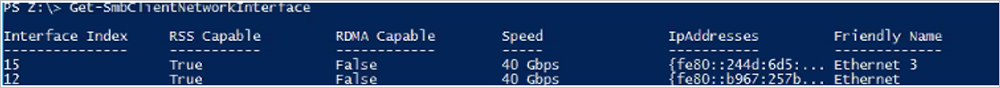
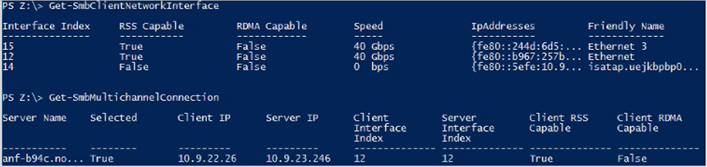
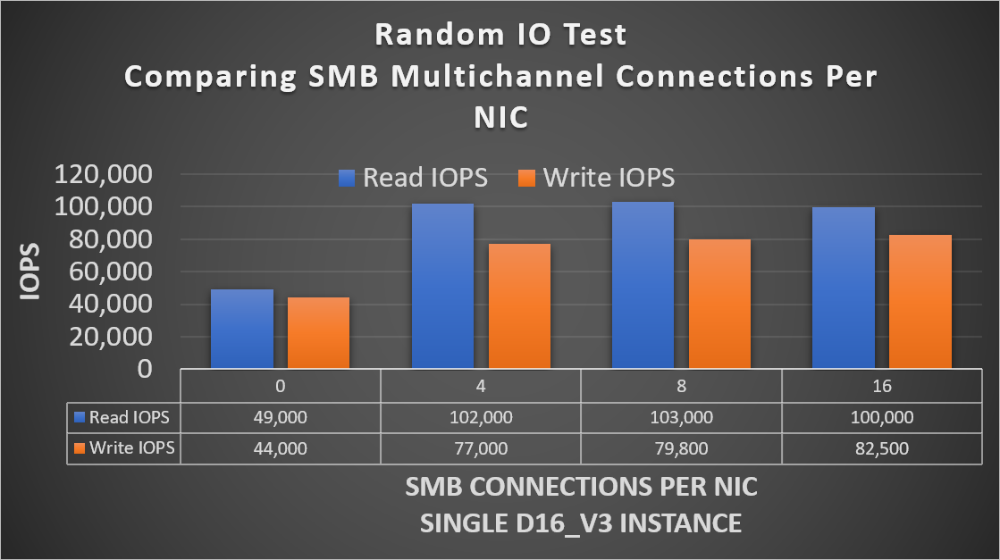
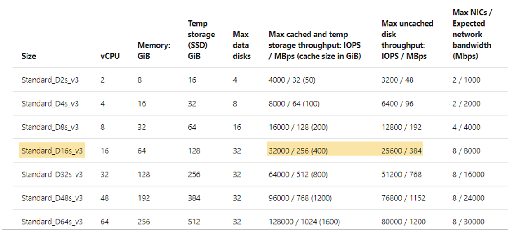
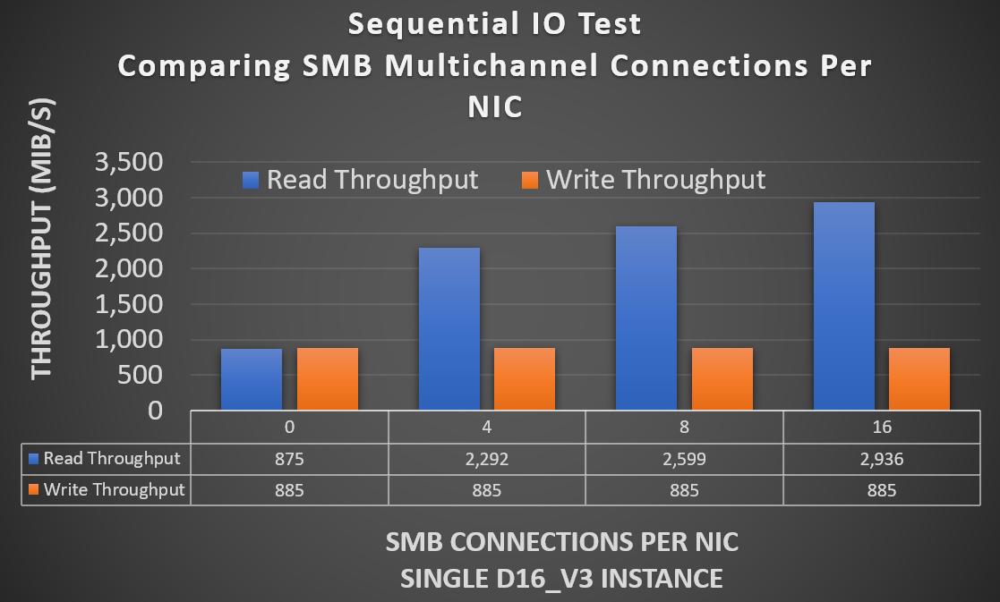
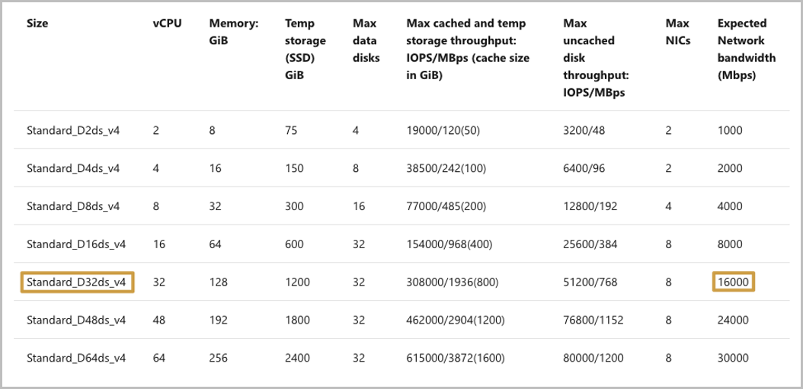
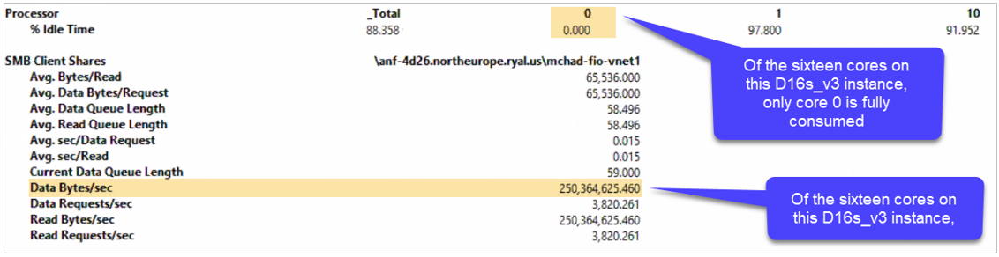

# FAQs about SMB performance for Azure NetApp Files

This article answers frequently asked questions (FAQs) about SMB performance best practices for Azure NetApp Files.

## Is SMB Multichannel enabled in SMB shares? 

Yes, SMB Multichannel is enabled by default, a change put in place in early January 2020. All SMB shares pre-dating existing SMB volumes have had the feature enabled, and all newly created volumes will also have the feature enabled at time of creation. 

Any SMB connection established before the feature enablement will need to be reset to take advantage of the SMB Multichannel functionality. To reset, you can disconnect and reconnect the SMB share.

## Is RSS supported?

Yes, Azure NetApp Files supports receive-side-scaling (RSS).

With SMB Multichannel enabled, an SMB3 client establishes multiple TCP connections to the Azure NetApp Files SMB server over a network interface card (NIC) that is single RSS capable. 

## Which Windows versions support SMB Multichannel?

Windows has supported SMB Multichannel since Windows 2012 to enable best performance.  See [Deploy SMB Multichannel](https://docs.microsoft.com/previous-versions/windows/it-pro/windows-server-2012-r2-and-2012/dn610980(v%3Dws.11)) and [The basics of SMB Multichannel](https://blogs.technet.microsoft.com/josebda/2012/06/28/the-basics-of-smb-multichannel-a-feature-of-windows-server-2012-and-smb-3-0/) for details. 

## Does my Azure virtual machine support RSS?

To see if your Azure virtual machine NICs support RSS, run the command
`Get-SmbClientNetworkInterface` as follows and check the field `RSS Capable`: 

## Does Azure NetApp Files support SMB Direct?

No, Azure NetApp Files does not support SMB Direct. 

## What is the benefit of SMB Multichannel? 

The SMB Multichannel feature enables an SMB3 client to establish a pool of connections over a single network interface card (NIC) or multiple NICs and to use them to send requests for a single SMB session. In contrast, by design, SMB1 and SMB2 require the client to establish one connection and send all the SMB traffic for a given session over that connection. This single connection limits the overall protocol performance that can be achieved from a single client.

## Should I configure multiple NICs on my client for SMB?

No. The SMB client will match the NIC count returned by the SMB server.  Each storage volume is accessible from one and only one storage endpoint.  That means that only one NIC will be used for any given SMB relationship.  

As the output of `Get-SmbClientNetworkInterace` below shows, the virtual machine has two network interfaces --  15 and 12.  As shown below under the command `Get-SmbMultichannelConnection`, even though there are two RSS-capable NICS, only interface 12 is used in connection with the SMB share; interface 15 is not in use.

## Is NIC Teaming supported in Azure?

NIC Teaming is not supported in Azure. Although multiple network interfaces are supported on Azure virtual machines, they represent a logical rather than a physical construct. As such, they provide no fault tolerance.  Also, the bandwidth available to an Azure virtual machine is calculated for the machine itself and not any individual network interface.

## What’s the performance like for SMB Multichannel?

The following tests and graphs demonstrate the power of SMB Multichannel on single-instance workloads.

### Random I/O  

With SMB Multichannel disabled on the client, pure 8-KiB read and write tests were performed using FIO and a 40-GiB working set.  The SMB share was detached between each test, with increments of the SMB client connection count per RSS network interface settings of `1`,`4`,`8`,`16`, `set-SmbClientConfiguration -ConnectionCountPerRSSNetworkInterface <count>`. The tests show that the default setting of `4` is sufficient for I/O intensive workloads; incrementing to `8` and `16` had no effect. 

The command `netstat -na | findstr 445` proved that additional connections were established with increments from `1` to `4` to `8` and to `16`.  Four CPU cores were fully utilized for SMB during each test, as confirmed by the perfmon `Per Processor Network Activity Cycles` statistic (not included in this article.)

The Azure virtual machine does not affect SMB (nor NFS) storage I/O limits.  As shown below, the D16 instance type has a limited rate of 32,000 for cached storage IOPS and 25,600 for uncached storage IOPS.  However, the graph above shows significantly more I/O over SMB.

### Sequential IO 

Tests similar to the random I/O tests described above were performed with 64-KiB sequential I/O. Although the increases in client connection count per RSS network interface beyond 4’ had no noticeable effect on random I/O, the same does not apply to sequential I/O. As the following graph shows, each increase is associated with a corresponding increase in read throughput. Write throughput remained flat due to network bandwidth restrictions placed by Azure for each instance type/size. 

Azure places network rate limits on each virtual machine type/size. The rate limit is imposed on outbound traffic only. The number of NICs present on a virtual machine has no bearing on the total amount of bandwidth available to the machine.  For example, the D16 instance type has an imposed network limit of 8000 Mbps (1,000 MiB/s).  As the sequential graph above shows, the limit affects the outbound traffic (writes) but not multichannel reads.

## Is advanced networking recommended?

For maximum performance, it is recommended that you configure advanced networking where possible. Keep the following considerations in mind:  

* The Azure portal enables advanced networking by default for virtual machines supporting this feature.  However, other deployment methods such as Ansible and similar configuration tools may not.  Failure to enable advanced networking can hobble the performance of a machine.  
* If advanced networking is not enabled on the network interface of a virtual machine due to its lack of support for an instance type or size, it will remain disabled with larger instance types. You will need manual intervention in those cases.

## Are jumbo frames supported?

Jumbo frames are not supported with Azure virtual machines.

## Is SMB Signing supported? 

The SMB protocol provides the basis for file and print sharing and other networking operations such as remote Windows administration. To prevent man-in-the-middle attacks that modify SMB packets in transit, the SMB protocol supports the digital signing of SMB packets. 

SMB Signing is supported for all SMB protocol versions that are supported by Azure NetApp Files. 

## What is the performance impact of SMB Signing?  

SMB Signing has a deleterious effect upon SMB performance. Among other potential causes of the performance degradation, the digital signing of each packet consumes additional client-side CPU as the perfmon output below shows. In this case, Core 0 appears responsible for SMB, including SMB Signing.  A comparison with the non-multichannel sequential read throughput numbers in the previous section shows that SMB Signing reduces overall throughput from 875MiB/s to approximately 250MiB/s. 

## Next steps  

- [FAQs About Azure NetApp Files](azure-netapp-files-faqs.md)
- See the [Azure NetApp Files: Managed Enterprise File Shares for SMB Workloads](https://cloud.netapp.com/hubfs/Resources/ANF%20SMB%20Quickstart%20doc%20-%2027-Aug-2019.pdf?__hstc=177456119.bb186880ac5cfbb6108d962fcef99615.1550595766408.1573471687088.1573477411104.328&__hssc=177456119.1.1573486285424&__hsfp=1115680788&hsCtaTracking=cd03aeb4-7f3a-4458-8680-1ddeae3f045e%7C5d5c041f-29b4-44c3-9096-b46a0a15b9b1) about using SMB file shares with Azure NetApp Files.