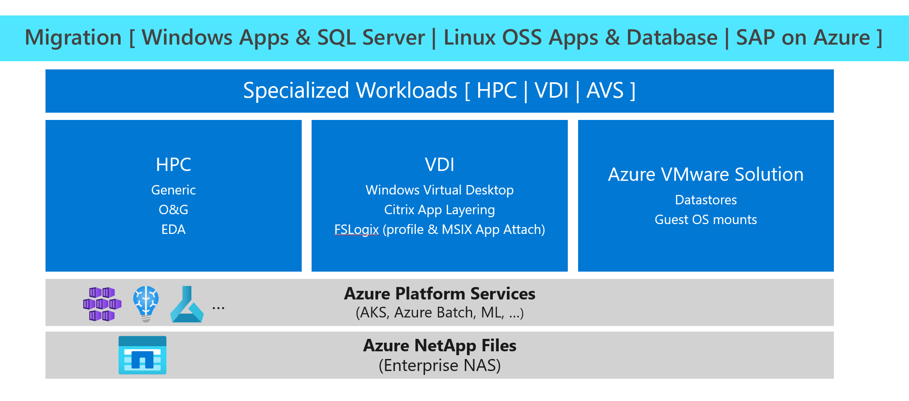

# Solution architectures using Azure NetApp Files
This article provides references to best practices that can help you understand the solution architectures for using Azure NetApp Files.  

The following diagram summarizes the categories of solution architectures that Azure NetApp Files offers:

## Linux OSS Apps and Database solutions

This section provides references for solutions for Linux OSS applications and databases. 

### Oracle

* [Oracle database performance on Azure NetApp Files single volumes](performance-oracle-single-volumes.md)
* [Oracle on Azure deployment best practice guide using Azure NetApp Files](https://www.netapp.com/us/media/tr-4780.pdf)
* [Oracle VM images and their deployment on Microsoft Azure: Shared storage configuration options](../virtual-machines/workloads/oracle/oracle-vm-solutions.md#shared-storage-configuration-options)
* [Benefits of using Azure NetApp Files with Oracle Database](solutions-benefits-azure-netapp-files-oracle-database.md)

## Windows Apps and SQL Server solutions

This section provides references for Windows applications and SQL Server solutions.

### File sharing and Global File Caching

* [Build Your Own Azure NFS? Wrestling Linux File Shares into Cloud](https://cloud.netapp.com/blog/ma-anf-blg-build-your-own-linux-nfs-file-shares)
* [Global File Cache / Azure NetApp Files Deployment](https://youtu.be/91LKb1qsLIM)

### SQL Server

* [Deploy SQL Server Over SMB with Azure NetApp Files](https://www.youtube.com/watch?v=x7udfcYbibs)
<!-- * [Deploy SQL Server Always-On Failover Cluster over SMB with Azure NetApp Files](https://www.youtube.com/watch?v=zuNJ5E07e8Q) --> 
<!-- * [Deploy Always-On Availability Groups with Azure NetApp Files](https://www.youtube.com/watch?v=y3VQmzzeyvc) --> 

## SAP on Azure solutions

This section provides references to SAP on Azure solutions. 

### Generic SAP and SAP Netweaver 

* [SAP applications on Microsoft Azure using Azure NetApp Files](https://www.netapp.com/us/media/tr-4746.pdf)
* [High availability for SAP NetWeaver on Azure VMs on SUSE Linux Enterprise Server with Azure NetApp Files for SAP applications](../virtual-machines/workloads/sap/high-availability-guide-suse-netapp-files.md)
* [High availability for SAP NetWeaver on Azure VMs on Red Hat Enterprise Linux with Azure NetApp Files for SAP applications](../virtual-machines/workloads/sap/high-availability-guide-rhel-netapp-files.md)
* [High availability for SAP NetWeaver on Azure VMs on Windows with Azure NetApp Files (SMB) for SAP applications](../virtual-machines/workloads/sap/high-availability-guide-windows-netapp-files-smb.md)
* [High availability for SAP NetWeaver on Azure VMs on Red Hat Enterprise Linux for SAP applications multi-SID guide](../virtual-machines/workloads/sap/high-availability-guide-rhel-multi-sid.md)

### SAP HANA 

* [SAP HANA Azure virtual machine storage configurations](../virtual-machines/workloads/sap/hana-vm-operations-storage.md)
* [High availability of SAP HANA Scale-up with Azure NetApp Files on Red Hat Enterprise Linux](../virtual-machines/workloads/sap/sap-hana-high-availability-netapp-files-red-hat.md)
* [SAP HANA scale-out with standby node on Azure VMs with Azure NetApp Files on SUSE Linux Enterprise Server](../virtual-machines/workloads/sap/sap-hana-scale-out-standby-netapp-files-suse.md)
* [SAP HANA scale-out with standby node on Azure VMs with Azure NetApp Files on Red Hat Enterprise Linux](../virtual-machines/workloads/sap/sap-hana-scale-out-standby-netapp-files-rhel.md)

### SAP tech community and blog posts 

* [Azure NetApp Files – SAP HANA backup in seconds](https://blog.netapp.com/azure-netapp-files-sap-hana-backup-in-seconds/)
* [Azure NetApp Files – Restore your HANA database from a snapshot backup](https://blog.netapp.com/azure-netapp-files-backup-sap-hana)
* [Azure NetApp Files – SAP HANA offloading backup with Cloud Sync](https://blog.netapp.com/azure-netapp-files-sap-hana)
* [Speed up your SAP HANA system copies using Azure NetApp Files](https://blog.netapp.com/sap-hana-faster-using-azure-netapp-files/)
* [Cloud Volumes ONTAP and Azure NetApp Files: SAP HANA system migration made easy](https://blog.netapp.com/cloud-volumes-ontap-and-azure-netapp-files-sap-hana-system-migration-made-easy/)

## Virtual Desktop Infrastructure solutions

This section provides references for Virtual Desktop infrastructure solutions.

### Windows Virtual Desktop

* [Benefits of using Azure NetApp Files with Windows Virtual Desktop](solutions-windows-virtual-desktop.md)
* [Storage options for FSLogix profile containers in Windows Virtual Desktop](../virtual-desktop/store-fslogix-profile.md#azure-platform-details)
* [Create an FSLogix profile container for a host pool using Azure NetApp Files](../virtual-desktop/create-fslogix-profile-container.md)
* [Windows Virtual Desktop at enterprise scale](/azure/architecture/example-scenario/wvd/windows-virtual-desktop)

## HPC solutions

This section provides references for High Performance Computing (HPC) solutions. 

### Generic HPC

* [Azure NetApp Files: Getting the most out of your cloud storage](https://cloud.netapp.com/hubfs/Resources/ANF%20PERFORMANCE%20TESTING%20IN%20TEMPLATE.pdf)
* [Run MPI workloads with Azure Batch and Azure NetApp Files](https://azure.microsoft.com/resources/run-mpi-workloads-with-azure-batch-and-azure-netapp-files/)
* [Azure Cycle Cloud: CycleCloud HPC environments on Azure NetApp Files](/azure/cyclecloud/overview)

### Oil and gas

* [High performance computing (HPC): Oil and gas in Azure](https://techcommunity.microsoft.com/t5/azure-global/high-performance-computing-hpc-oil-and-gas-in-azure/ba-p/824926)
* [Run reservoir simulation software on Azure](/azure/architecture/example-scenario/infrastructure/reservoir-simulation)

### Electronic design automation (EDA)

* [Benefits of using Azure NetApp Files for electronic design automation](solutions-benefits-azure-netapp-files-electronic-design-automation.md)
* [Azure CycleCloud: EDA HPC Lab with Azure NetApp Files](https://github.com/Azure/cyclecloud-hands-on-labs/blob/master/EDA/README.md)

### Analytics

* [Azure NetApp Files: A new shared file system to use with SAS Grid on Microsoft Azure](https://communities.sas.com/t5/Architecture/Azure-NetApp-Files-A-new-shared-file-system-to-use-with-SAS-Grid/m-p/606978)
* [Best Practices for Using Microsoft Azure with SAS®](https://communities.sas.com/t5/Administration-and-Deployment/Best-Practices-for-Using-Microsoft-Azure-with-SAS/m-p/676833#M19680)

## Azure platform services solutions

This section provides solutions for Azure platform services. 

### Azure Kubernetes Services and Kubernetes

* [Integrate Azure NetApp Files with Azure Kubernetes Service](../aks/azure-netapp-files.md)
* [Out-of-This-World Kubernetes performance on Azure with Azure NetApp Files](https://cloud.netapp.com/blog/ma-anf-blg-configure-kubernetes-openshift)
* [Trident - Storage Orchestrator for Containers](https://netapp-trident.readthedocs.io/en/stable-v20.04/kubernetes/operations/tasks/backends/anf.html)

### Azure Batch

* [Run MPI workloads with Azure Batch and Azure NetApp Files](https://azure.microsoft.com/resources/run-mpi-workloads-with-azure-batch-and-azure-netapp-files/)
