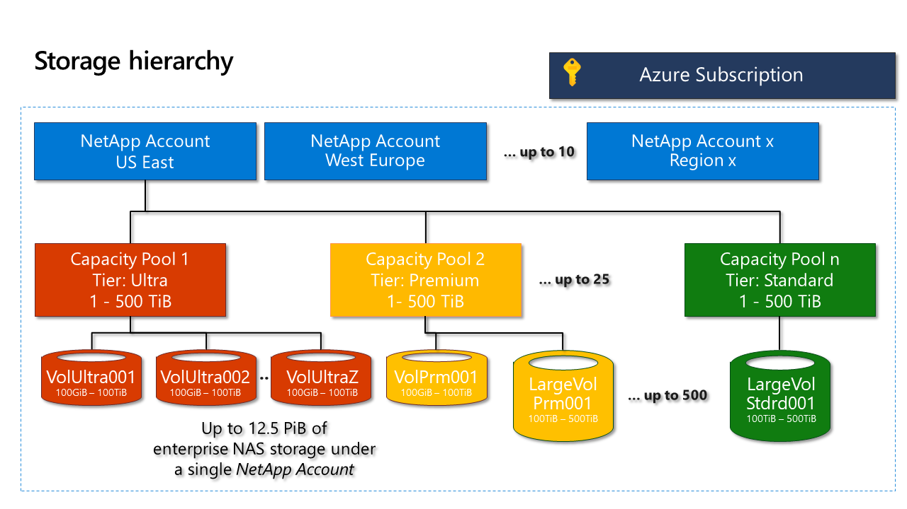

# What is the storage hierarchy of Azure NetApp Files

Before creating a volume in Azure NetApp Files, you must purchase and set up a pool for provisioned capacity.  To set up a capacity pool, you must have a NetApp account. Understanding the storage hierarchy helps you set up and manage your Azure NetApp Files resources.

## NetApp accounts

- A NetApp account serves as an administrative grouping of the constituent capacity pools.  
- A NetApp account is not the same as your general Azure storage account. 
- A NetApp account is regional in scope.   
- You can have multiple NetApp accounts in a region, but each NetApp account is tied to only a single region.

## Capacity pools

- A capacity pool is measured by its provisioned capacity.  
- The capacity is provisioned by the fixed SKUs that you purchased (for example, a 4-TiB capacity).
- A capacity pool can have only one service level.  
- Each capacity pool can belong to only one NetApp account. However, you can have multiple capacity pools within a NetApp account.  
- A capacity pool cannot be moved across NetApp accounts.   
  For example, in the [Conceptual diagram of storage hierarchy](#conceptual_diagram_of_storage_hierarchy) below, Capacity Pool 1 cannot be moved from US East NetApp account to US West 2 NetApp account.  
- A capacity pool cannot be deleted until all volumes within the capacity pool have been deleted.

## Volumes

- A volume is measured by logical capacity consumption and is scalable. 
- A volume's capacity consumption counts against its pool's provisioned capacity.
- Each volume belongs to only one pool, but a pool can contain multiple volumes. 
- A volume cannot be moved across capacity pools. <!--Within the same NetApp account, you can move a volume across pools.  -->   
  For example, in the [Conceptual diagram of storage hierarchy](#conceptual_diagram_of_storage_hierarchy) below, you cannot move the volumes from Capacity Pool 1 to Capacity Pool 2.
- A volume cannot be deleted until all its snapshots have been deleted.

## Conceptual diagram of storage hierarchy 
The following example shows the relationships of the Azure subscription, NetApp accounts, capacity pools,  and volumes.   

## Next steps

- [Resource limits for Azure NetApp Files](azure-netapp-files-resource-limits.md)
- [Register for Azure NetApp Files](azure-netapp-files-register.md)
