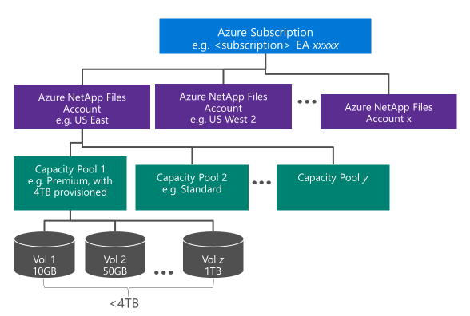

# Understand storage hierarchy of Azure NetApp Files

 Understanding storage hierarchy helps you set up and manage your Azure NetApp Files resources. 
 
 Creating a volume enables you to store data.  Before creating a volume, you must set up a pool for provisioned capacity through purchase. To set up a capacity pool, you must have an Azure NetApp Files account.

In this article:

- [Azure NetApp Files accounts](#azure_netapp_files_account)  
- [Capacity pools](#capacity_pools)  
- [Volumes](#volumes)
- [Conceptual diagram of storage hierarchy](#conceptual_diagram_of_storage_hierarchy)

## Azure NetApp Files accounts

- An Azure subscription is required before you can create an Azure NetApp Files account.   
    However, an Azure NetApp Files account is not the same as your general Azure storage account.
- The Azure NetApp Files account serves as an administrative level grouping of the constituent capacity pools.   
- An Azure NetApp is regional in scope.  
    You can have multiple Azure NetApp Files accounts in a region, but each Azure NetApp Files account is tied to only a single region.

## Capacity pools

- A capacity pool is measured by its provisioned capacity.  
    The capacity is provisioned by purchasing fixed SKUs (for example, a 4TB capacity)
- A capacity pool can have only one service level:  the premium or the service level.
- A capacity pool belongs to only one Azure NetApp Files account.
- A capacity pool cannot be moved across NetApp Azure Files accounts.  
    For example, in the [Conceptual diagram of storage hierarchy](#conceptual_diagram_of_storage_hierarchy) below, Capacity Pool 1 cannot be moved from the US East Azure NetApp Files account to the US West 2 Azure NetApp Files account.  

## Volumes

- A volume is measured by the logical capacity consumption and is scalable up to 100 TB per volume.
- A volume's capacity consumption counts against its pool's provisioned capacity.
- Each volume belongs to only one pool, but a pool can contain multiple volumes. 
- Within the same Azure NetApp Files account, you can move a volume across capacity pools.   
    For example, in the [Conceptual diagram of storage hierarchy](#conceptual_diagram_of_storage_hierarchy) below, you can move the volumes from the premium capacity pool to the standard capacity pool.)
- A volume can present multiple mount targets.

## Conceptual diagram of storage hierarchy 
The following example shows the relationships of the Azure subscription, Azure NetApp Files accounts, capacity pools, and volumes.  
    

