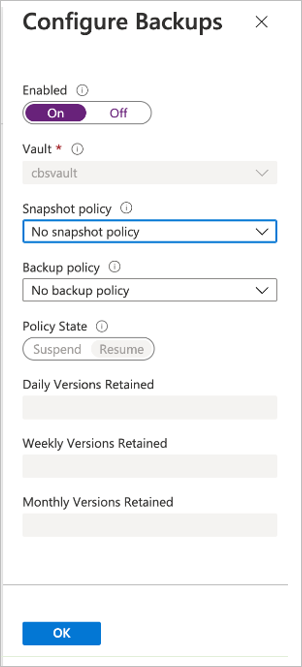
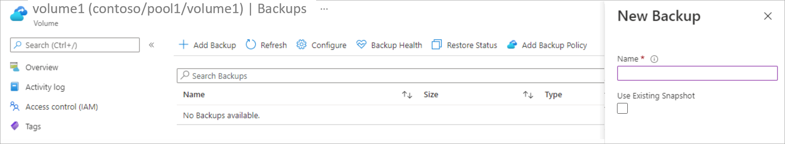

# Configure manual backups for Azure NetApp Files 

Azure NetApp Files backup supports *policy-based* (scheduled) backups and *manual* (on-demand) backups at the volume level. You can use both types of backups in the same volume. During the configuration process, you will enable the backup feature for an Azure NetApp Files volume before policy-based backups or manual backups can be taken. 

This article shows you how to configure manual backups. For policy-based backup configuration, see [Configure policy-based backups](backup-configure-policy-based.md).  

> [!IMPORTANT]
> The Azure NetApp Files backup feature is currently in preview. You need to submit a waitlist request for accessing the feature through the **[Azure NetApp Files Backup Public Preview](https://aka.ms/anfbackuppreviewsignup)** page. Wait for an official confirmation email from the Azure NetApp Files team before using the Azure NetApp Files backup feature.

## About manual backups  

Every Azure NetApp Files volume must have the backup functionality enabled before any backups (policy-based or manual) can be taken.   

After you enable the backup functionality, you can choose to manually back up a volume. A manual backup takes a point-in-time snapshot of the active file system and backs up   that snapshot to the Azure storage account.

The following list summarizes manual backup behaviors:  

* You can create manual backups on a volume even if the volume is already backup-enabled and configured with backup policies.  However, there can be only one outstanding manual-backup request for the volume. If you assign a backup policy and if the baseline transfer is still in progress, then the creation of a manual backup will be blocked until the baseline transfer is complete.

* Unless you specify an existing snapshot to use for a backup, creating a manual backup automatically generates a snapshot on the volume. The snapshot is then transferred to Azure storage. The snapshot created on the volume will be retained until the next manual backup is created. During the subsequent manual backup operation, older snapshots will be cleaned up. You can't delete the snapshot generated for the latest manual backup. 

## Requirements

* Azure NetApp Files now requires you to create a backup vault before enabling backup functionality. If you have not configured a backup, refer to [Manage backup vaults](backup-vault-manage.md) for more information.
* [!INCLUDE [consideration regarding deleting backups after deleting resource or subscription](includes/disable-delete-backup.md)]

## Enable backup functionality

If you haven’t done so, enable the backup functionality for the volume before creating manual backups: 

1. Go to **Volumes** and select the specific volume for which you want to enable backup.
2. Select **Configure**.
3. In the Configure Backup page, toggle the **Enabled** setting to **On**.   
4. Select **OK**.   

## Create a manual backup for a volume

1. Go to **Volumes** and select the volume for which you want to create a manual backup.
2. Select **Add Backup**.
3. In the New Backup window that appears:   

    1. Specify a backup name in the **Name** field.   
    
        * Manual backup names must be 3 to 256 characters in length.   
        * As a best practice, prepend a prefix in the following format before the actual backup name. Doing so helps you identify the manual backup if the volume is deleted (with backups retained).   

            `NetAppAccountName-CapacityPoolName-VolumeName`   

            For example, assume that the NetApp account is `account1`, the capacity pool is `pool1`, the volume name is `vol1`. A manual backup can be named as follows:    

            `account1-pool1-vol1-backup1`   

            If you are using a shorter form for the backup name, ensure that it still includes information that identifies the NetApp account, capacity pool, and volume name for display in the backup list.
            
    2. If you want to use an existing snapshot for the backup, select the **Use Existing Snapshot** option.  When you use this option, ensure that the Name field matches the existing snapshot name that is being used for the backup. 

4. Select **Create**. 

    When you create a manual backup, a snapshot is also created on the volume using the same name you specified for the backup. This snapshot represents the current state of the active file system. It is transferred to Azure storage. Once the backup completes, the manual backup entry appears in the list of backups for the volume.

## Next steps  

* [Understand Azure NetApp Files backup](backup-introduction.md)
* [Requirements and considerations for Azure NetApp Files backup](backup-requirements-considerations.md)
* [Resource limits for Azure NetApp Files](azure-netapp-files-resource-limits.md)
* [Configure policy-based backups](backup-configure-policy-based.md)
* [Manage backup policies](backup-manage-policies.md)
* [Search backups](backup-search.md)
* [Restore a backup to a new volume](backup-restore-new-volume.md)
* [Disable backup functionality for a volume](backup-disable.md)
* [Delete backups of a volume](backup-delete.md)
* [Volume backup metrics](azure-netapp-files-metrics.md#volume-backup-metrics)
* [Azure NetApp Files backup FAQs](faq-backup.md)

