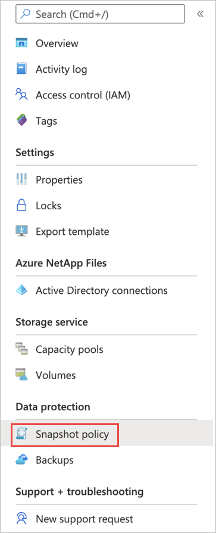
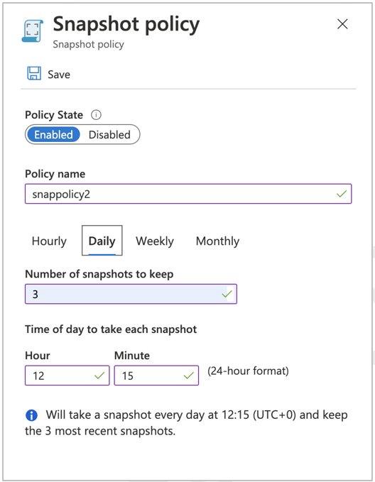
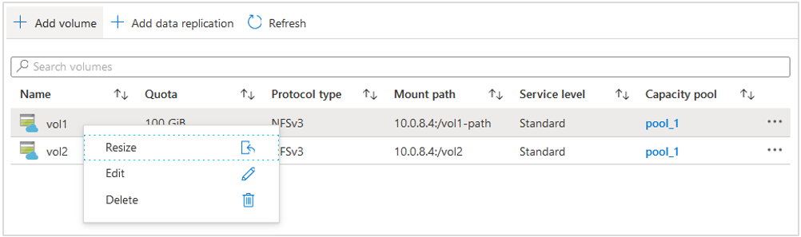
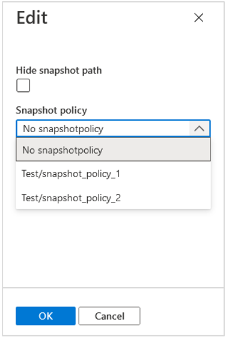

# Configure policy-based backups for Azure NetApp Files 

Azure NetApp Files backup supports *policy-based* (scheduled) backups and *manual* (on-demand) backups at the volume level. You can use both types of backups in the same volume. During the configuration process, you will enable the backup feature for an Azure NetApp Files volume before policy-based backups or manual backups can be taken. 

This article shows you how to configure policy-based backups.  For manual backup configuration, see [Configure manual backups](backup-configure-manual.md).  

> [!IMPORTANT]
> The Azure NetApp Files backup feature is currently in preview. You need to submit a waitlist request for accessing the feature through the **[Azure NetApp Files Backup Public Preview](https://aka.ms/anfbackuppreviewsignup)** page. Wait for an official confirmation email from the Azure NetApp Files team before using the Azure NetApp Files backup feature.

## About policy-based backups  

A volume needs to have the following two types of policies for the policy-based backup feature to work:  

* A *snapshot policy* that controls when snapshots are created for the volume.
* A *backup policy* that controls which snapshots to use for backing up to Azure storage.

A snapshot policy handles creating snapshots on the volume. It is used by the backup functionality to back up the snapshots to Azure storage.   

Backups are long-running operations. The system schedules backups based on the primary workload (which is given a higher priority) and runs backups in the background. Depending on the size of the volume being backed up, a backup can run in background for hours. There is no option to select the start time for backups. The service performs the backups based on the internal scheduling and optimization logic. 

Assigning a policy creates a baseline snapshot that is the current state of the volume and transfers the snapshot to Azure storage. The baseline snapshot is created with a name starting with `snapmirror`. This baseline snapshot will be deleted automatically when the first scheduled backup is complete (based on the policy). If the backup policy is attached to a volume, the backup list will be empty until the baseline snapshot is transferred. When the backup is complete, the baseline backup entry will appear in the list of backups for the volume. After the baseline transfer, the list will be updated daily based on the policy. An empty list of backups indicates that the baseline backup is in progress. If a volume already has existing manual backups before you assign a backup policy, the baseline snapshot is not created. A baseline snapshot is created only when the volume has no prior backups.

## Configure and apply a snapshot policy  

You need to create a snapshot policy and associate the snapshot policy to the volume that you want to back up. A single snapshot policy can be attached to multiple volumes. Changes in the snapshot policy can affect the backup functionality of a volume. 

1. Sign in to the Azure portal and navigate to **Azure NetApp Files**.    
2. Select your Azure NetApp Files account.   
3. Select **Snapshot policy**.   

       

4.	Click **Add snapshot policy**.
5.	In the Snapshot policy page that appears, specify the number of snapshots to keep and the schedule for creating snapshots for the volume. Click **Save**.  

    Currently, the backup functionality can back up only daily, weekly, and monthly snapshots. (Hourly backups are not supported).   

    * For a *daily* snapshot configuration, specify the time of the day when you want the snapshot created. 
    * For a *weekly* snapshot configuration, specify the day of the week and time of the day when you want the snapshot created. 
    * For a *monthly* snapshot configuration, specify the day of the month and time of the day when you want the snapshot created.  
  
        > [!IMPORTANT] 
        > Be sure to specify a day that will work for all intended months.  If you intend for the monthly snapshot configuration to work for all months in the year, pick a day of the month between 1 and 28.  For example, if you specify `31` (day of the month), the monthly snapshot configuration is skipped for the months that have less than 31 days.  
        
    * For each snapshot configuration, specify the number of snapshots that you want to keep.

    For example, if you want to have daily backups, you must configure a snapshot policy with a daily snapshot schedule and snapshot count, and then apply that daily snapshot policy to the volume. If you change the snapshot policy or delete the daily snapshot configuration, new daily snapshots will not be created, resulting in daily backups not taking place. The same process and behavior apply to weekly and monthly backups.  

    Ensure that each snapshot has a unique snapshot schedule configuration. By design, Azure NetApp Files prevents you from deleting the latest backup. If multiple snapshots have the same time (for example, the same daily and weekly schedule configuration), Azure NetApp Files considers them as the latest snapshots, and deleting those backups is prevented.  

    The following example shows a daily snapshot policy configuration: 

    

6.	Apply the snapshot policy to the volume that you want to back up:  

    1. Go to the **Volumes** page, right-click the volume that you want to apply the snapshot policy to, and select **Edit**.   
           

    2. In the Edit window, under **Snapshot policy**, select the policy to apply. Click **OK**.   
            

## Configure a backup policy

A backup policy enables a volume to be protected on a regularly scheduled interval.  

You need to create a backup policy and associate the backup policy to the volume that you want to back up. A single backup policy can be attached to multiple volumes. Backups can be temporarily suspended either by disabling the policy or by disabling backups at the volume level. Backups can also be completely disabled at the volume level, resulting in the clean-up of all the associated data in the Azure storage. A backup policy cannot be deleted if it is attached to any volumes.

To enable a policy-based (scheduled) backup: 

1. Sign in to the Azure portal and navigate to **Azure NetApp Files**. 
2. Select your Azure NetApp Files account.
3. Select **Backups**. 

  :::image type="content" source="../media/azure-netapp-files/backup-navigate.png" alt-text="Screenshot that shows how to navigate to Backups option." lightbox="../media/azure-netapp-files/backup-navigate.png":::

4. Select **Backup Policies**.
5. Select **Add**. 
6. In the **Backup Policy** page, specify the backup policy name.  Enter the number of backups that you want to keep for daily, weekly, and monthly backups. Click **Save**.

    :::image type="content" source="../media/azure-netapp-files/backup-policy-window-daily.png" alt-text="Screenshot that shows the Backup Policy window." lightbox="../media/azure-netapp-files/backup-policy-window-daily.png":::
    
    * If you configure and attach a backup policy to the volume without attaching a snapshot policy, the backup does not function properly. There will be only a baseline snapshot transferred to the Azure storage. 
    * For each backup policy that you configure (for example, daily backups), ensure that you have a corresponding snapshot policy configuration (for example, daily snapshots).
    * Backup policy has a dependency on snapshot policy. If you haven’t created snapshot policy yet, you can configure both policies at the same time by selecting the **Create snapshot policy** checkbox on the Backup Policy window.   

    :::image type="content" source="../media/azure-netapp-files/backup-policy-snapshot-policy-option.png" alt-text="Screenshot that shows the Backup Policy window with Snapshot Policy selected." lightbox="../media/azure-netapp-files/backup-policy-snapshot-policy-option.png":::

 
### Example of a valid configuration

The following example configuration shows you how to configure a data protection policy on the volume with 5 latest daily snapshots, 4 latest weekly snapshots, and 3 latest monthly snapshots on the volume. This configuration results in backing up 15 latest daily snapshots, 6 latest weekly snapshots, and 4 latest monthly snapshots.

* Snapshot policy:   
    Daily: `Number of Snapshots to Keep = 5`   
    Weekly: `Number of Snapshots to Keep = 4`   
    Monthly: `Number of Snapshots to Keep = 3`
* Backup policy:   
    Daily: `Daily Backups to Keep = 15`   
    Weekly: `Weekly Backups to Keep = 6`   
    Monthly: `Monthly Backups to Keep = 4`

### Example of an invalid configuration

The following example configuration has a backup policy configured for daily backups, but the snapshot policy does not have a corresponding configuration. As a result, no daily snapshots are created to be backed up by the backup policy. This configuration would back up only weekly and monthly snapshots.

* Snapshot policy:   
    Weekly: `Number of Snapshots to Keep = 4`   
    Monthly: `Number of Snapshots to Keep = 3`   
* Backup policy:   
    Daily: `Daily Backups to Keep = 15`   
    Weekly: `Weekly Backups to Keep = 6`   
    Monthly: `Monthly Backups to Keep = 4`   

## Enable backup functionality for a volume and assign a backup policy

Every Azure NetApp Files volume must have the backup functionality enabled before any backups (policy-based or manual) can be taken. 

After you enable the backup functionality, you need to assign a backup policy to a volume for policy-based backups to take effects. (For manual backups, a backup policy is optional.)

To enable the backup functionality for a volume:  

1. Go to **Volumes** and select the volume for which you want to enable backup.
2. Select **Configure**.
3. In the Configure Backups page, toggle the **Enabled** setting to **On**.
4. In the **Snapshot Policy** drop-down menu, assign the snapshot policy to use for the volume. 
5. In the **Backup Policy** drop-down menu, assign the backup policy to use for the volume. Click **OK**.

    The Vault information is pre-populated.  

    :::image type="content" source="../media/azure-netapp-files/backup-configure-window.png" alt-text="Screenshot that shows Configure Backups window." lightbox="../media/azure-netapp-files/backup-configure-window.png":::

## Next steps  

* [Understand Azure NetApp Files backup](backup-introduction.md)
* [Requirements and considerations for Azure NetApp Files backup](backup-requirements-considerations.md)
* [Resource limits for Azure NetApp Files](azure-netapp-files-resource-limits.md)
* [Configure manual backups](backup-configure-manual.md)
* [Manage backup policies](backup-manage-policies.md)
* [Search backups](backup-search.md)
* [Restore a backup to a new volume](backup-restore-new-volume.md)
* [Disable backup functionality for a volume](backup-disable.md)
* [Delete backups of a volume](backup-delete.md)
* [Volume backup metrics](azure-netapp-files-metrics.md#volume-backup-metrics)
* [Azure NetApp Files backup FAQs](faq-backup.md)

