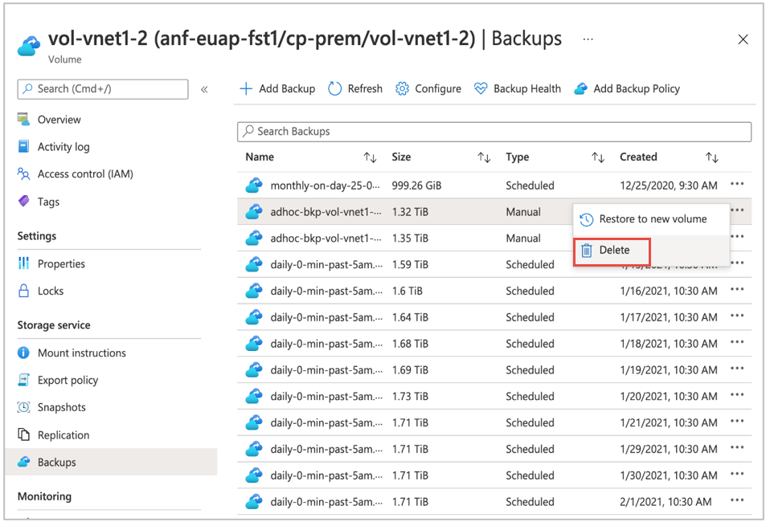

# Delete backups of a volume 

You can delete individual backups that you no longer need to keep for a volume. Deleting backups will delete the associated objects in your Azure Storage account, resulting in space saving.  

By design, Azure NetApp Files prevents you from deleting the latest backup. If the latest backup consists of multiple snapshots taken at the same time (for example, the same daily and weekly schedule configuration), they are all considered as the latest snapshot, and deleting those is prevented.

Deleting the latest backup is permitted only when both of the following conditions are met:

*    The volume has been deleted.
*    The latest backup is the only remaining backup for the deleted volume.

If you need to delete backups to free up space, select an older backup from the **Backups** list to delete.

## Steps

>[!IMPORTANT]
>You will not be able to perform any operations on a backup until you have migrate to backup vaults. For more information about this procedure, see [Manage backup vaults](backup-vault-manage.md).

1. Select **Volumes**. <!-- is this -->
2. Navigate to **Backups**.
3. From the backup list, select the backup to delete. Click the three dots (`…`) to the right of the backup, then click **Delete** from the Action menu.

    

## Next steps  

* [Understand Azure NetApp Files backup](backup-introduction.md)
* [Requirements and considerations for Azure NetApp Files backup](backup-requirements-considerations.md)
* [Resource limits for Azure NetApp Files](azure-netapp-files-resource-limits.md)
* [Configure policy-based backups](backup-configure-policy-based.md)
* [Configure manual backups](backup-configure-manual.md)
* [Manage backup policies](backup-manage-policies.md)
* [Search backups](backup-search.md)
* [Restore a backup to a new volume](backup-restore-new-volume.md)
* [Disable backup functionality for a volume](backup-disable.md)
* [Volume backup metrics](azure-netapp-files-metrics.md#volume-backup-metrics)
* [Azure NetApp Files backup FAQs](faq-backup.md)
