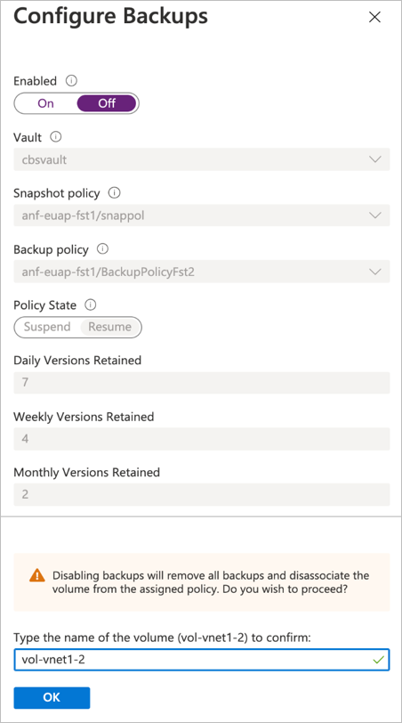

# Disable backup functionality for a volume 

You can disable the backup functionality for a volume if you no longer need the backup protection. 

> [!IMPORTANT]
> Disabling backups for a volume will delete all the backups stored in the Azure storage for that volume.

If a volume is deleted but the backup policy wasn’t disabled before the volume deletion, all the backups related to the volume are retained in the Azure storage and will be listed under the associated NetApp account. 

## Steps

>[!IMPORTANT]
>Existing backups not assigned to a backup vault must be migrated. You cannot perform any operations on a backup until it has been migrated to a backup vault. To learn how to migrate, see [Manage backup vaults](backup-vault-manage.md#migrate-backups-to-a-backup-vault).

1. Select **Volumes**.
2. Select the specific volume whose backup functionality you want to disable.
3. Select **Configure**.
4. In the Configure Backups page, toggle the **Enabled** setting to **Off**. Enter the volume name to confirm, and click **OK**.

    

## Next steps  

* [Understand Azure NetApp Files backup](backup-introduction.md)
* [Requirements and considerations for Azure NetApp Files backup](backup-requirements-considerations.md)
* [Resource limits for Azure NetApp Files](azure-netapp-files-resource-limits.md)
* [Configure policy-based backups](backup-configure-policy-based.md)
* [Configure manual backups](backup-configure-manual.md)
* [Manage backup policies](backup-manage-policies.md)
* [Search backups](backup-search.md)
* [Restore a backup to a new volume](backup-restore-new-volume.md)
* [Delete backups of a volume](backup-delete.md)
* [Volume backup metrics](azure-netapp-files-metrics.md#volume-backup-metrics)
* [Azure NetApp Files backup FAQs](faq-backup.md)
