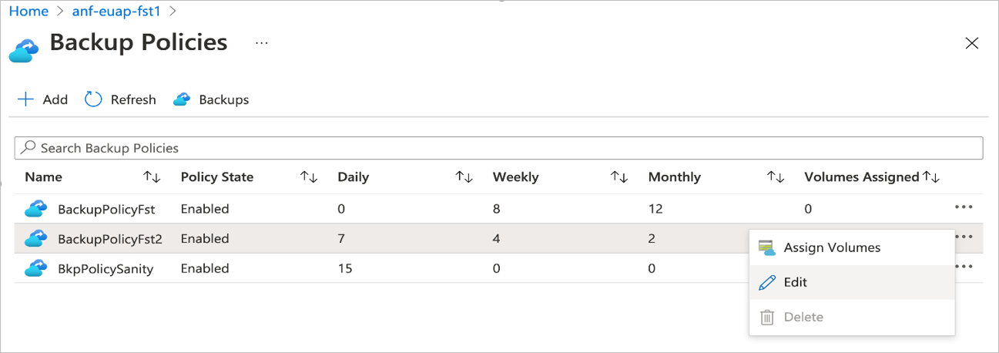
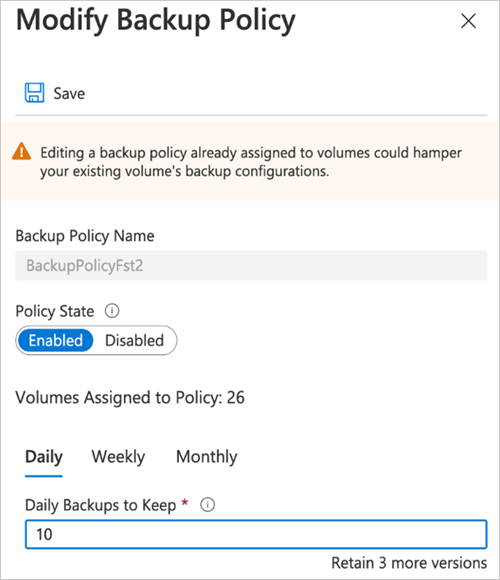
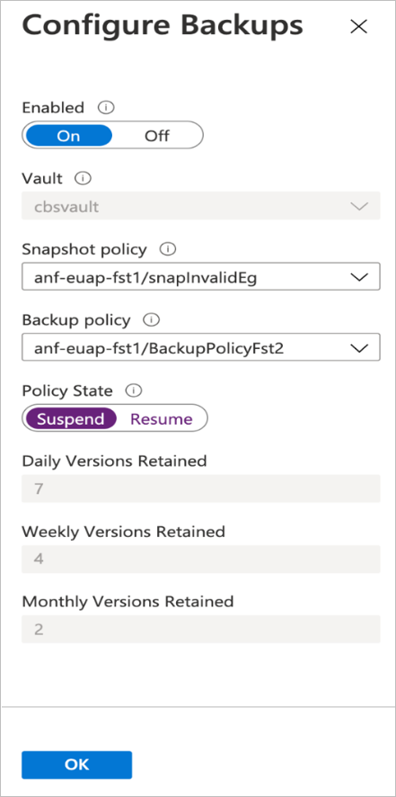

# Manage backup policies for Azure NetApp Files 

A snapshot policy configuration is required for Azure NetApp Files [policy-based backups](backup-configure-policy-based.md) to automatically back up a volume. After you have set up Azure NetApp Files backups using a backup policy, you can modify or suspend a backup policy as needed.  

Manual backups are not affected by changes in the backup policy.

## Modify a backup policy   

You can modify an existing Azure NetApp Files backup policy as needed to ensure that you have proper backup coverage for Azure NetApp Files volumes.  For example, if you need to change the number of retained backups that are protected by the service, you can modify the Azure NetApp Files backup policy for the volume to revise the number of restores to keep. 

To modify the backup policy settings:   

1. Navigate to **Backups**.  

2. Select **Backup Policies**, click the three dots (`…`) to the right of a backup policy, then click **Edit**.

    

3. In the Modify Backup Policy window, update the number of restores you want to keep for daily, weekly, and monthly backups. Enter the backup policy name to confirm the action. Click **Save**.  

    

    > [!NOTE] 
    > After backups are enabled and have taken effect for the scheduled frequency, you cannot change the backup retention count to `0`. A minimum number of `1` retention is required for the backup policy. See [Resource limits for Azure NetApp Files](azure-netapp-files-resource-limits.md) for details.  

## Suspend a backup policy  

A backup policy can be suspended so that it does not perform any new backup operations against the associated volumes. This action enables you to temporarily suspend backups, in the event that existing backups need to be maintained but not retired because of versioning.   

### Suspend a backup policy for all volumes associated with the policy

1. Navigate to **Backups**.

2. Select **Backup Policies**, click the three dots (`…`) to the right of a backup policy, and click **Edit**. 

3. Toggle **Policy State** to **Disabled**, enter the policy name to confirm, and click **Save**. 

    

### Suspend a backup policy for a specific volume 

1. Go to **Volumes**. 
2. Select the specific volume whose backups you want to suspend.
3. Select **Configure**.
4. In the Configure Backups page, toggle **Policy State** to **Suspend**, enter the volume name to confirm, and click **OK**.   

    

## Next steps  

* [Understand Azure NetApp Files backup](backup-introduction.md)
* [Requirements and considerations for Azure NetApp Files backup](backup-requirements-considerations.md)
* [Resource limits for Azure NetApp Files](azure-netapp-files-resource-limits.md)
* [Configure policy-based backups](backup-configure-policy-based.md)
* [Configure manual backups](backup-configure-manual.md)
* [Search backups](backup-search.md)
* [Restore a backup to a new volume](backup-restore-new-volume.md)
* [Disable backup functionality for a volume](backup-disable.md)
* [Delete backups of a volume](backup-delete.md)
* [Volume backup metrics](azure-netapp-files-metrics.md#volume-backup-metrics)
* [Azure NetApp Files backup FAQs](faq-backup.md)

