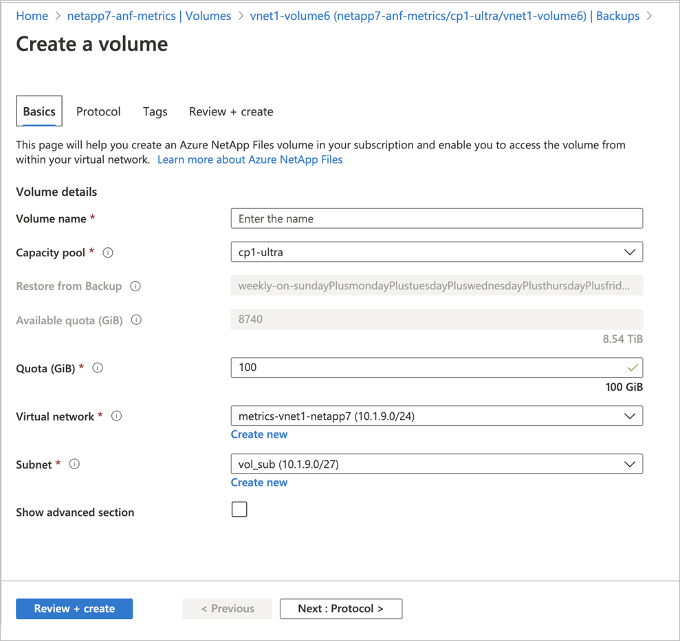

# Restore a backup to a new volume

Restoring a backup creates a new volume with the same protocol type. This article explains the restore operation. 

## Considerations

* You can restore backups only within the same NetApp account. Restoring backups across NetApp accounts are not supported. 

* You can restore backups to a different capacity pool within the same NetApp account.

* You can restore a backup only to a new volume.  You cannot overwrite the existing volume with the backup. 

* The new volume created by the restore operation cannot be mounted until the restore completes. 

* You should trigger the restore operation when there are no baseline backups. Otherwise, the restore might increase the load on the Azure Blob account where your data is backed up. 

* For large volumes (greater than 10 TB), it can take multiple hours to transfer all the data from the backup media.

* Restoring a backup to a new volume is not dependent on the networking type used by the source volume. You can restore the backup of a volume configured with Basic networking to a volume configured with Standard networking and vice versa.

* In the Volume overview page, refer to the **Originated from** field to see the name of the snapshot used to create the volume. 

* See [Restoring volume backups from vaulted snapshots](snapshots-introduction.md#restoring-volume-backups-from-vaulted-snapshots) for more information. 

> [!IMPORTANT]
> Running multiple concurrent volume restores using Azure NetApp Files backup may increase the time it takes for each individual, in-progress restore to complete. As such, if time is a factor to you, you should prioritize and sequentialize the most important volume restores and wait until the restores are complete before starting another, lower priority, volume restores.  

See [Requirements and considerations for Azure NetApp Files backup](backup-requirements-considerations.md) for more considerations about using Azure NetApp Files backup.

## Steps

>[!IMPORTANT]
>All backups must be migrated to backup vaults. You will not be able to perform any operation on or with a backup until you have migrated the backup to a vault. For more information about this procedure, see [Manage backup vaults](backup-vault-manage.md).

1. Select **Backup Vault**. Navigate to **Backups**.
<!-- 
    > [!NOTE]
    > If a volume is deleted but the backup policy wasn’t disabled before the volume deletion, all the backups related to the volume are retained in the Azure storage, and you can find them under the associated NetApp account. -->

2. From the backup list, select the backup to restore. Select the three dots (`…`) to the right of the backup, then select **Restore to new volume** from the Action menu.   

    :::image type="content" source="../media/azure-netapp-files/backup-restore-new-volume.png" alt-text="Screenshot of selecting restore backup to new volume." lightbox="../media/azure-netapp-files/backup-restore-new-volume.png":::

3. In the Create a Volume page that appears, provide information for the fields in the page as applicable, and select **Review + Create** to begin restoring the backup to a new volume.   

    * The **Protocol** field is pre-populated from the original volume and cannot be changed.    
        However, if you restore a volume from the backup list at the NetApp account level, you need to specify the Protocol field. The Protocol field must match the protocol of the original volume. Otherwise, the restore operation fails with the following error:  
        `Protocol Type value mismatch between input and source volume of backupId <backup-id of the selected backup>. Supported protocol type : <Protocol Type of the source volume>`

    * The **Quota** value must be greater than or equal to the size of the backup from which the restore is triggered (minimum 100 GiB).

    * The **Capacity pool** that the backup is restored into must have sufficient unused capacity to host the new restored volume. Otherwise, the restore operation fails.   

    

4. The Volumes page displays the new volume. In the Volumes page, the **Originated from** field identifies the name of the snapshot used to create the volume.

## Next steps  

* [Understand Azure NetApp Files backup](backup-introduction.md)
* [Requirements and considerations for Azure NetApp Files backup](backup-requirements-considerations.md)
* [Resource limits for Azure NetApp Files](azure-netapp-files-resource-limits.md)
* [Configure policy-based backups](backup-configure-policy-based.md)
* [Configure manual backups](backup-configure-manual.md)
* [Manage backup policies](backup-manage-policies.md)
* [Search backups](backup-search.md)
* [Disable backup functionality for a volume](backup-disable.md)
* [Delete backups of a volume](backup-delete.md)
* [Volume backup metrics](azure-netapp-files-metrics.md#volume-backup-metrics)
* [Azure NetApp Files backup FAQs](faq-backup.md)
* [How Azure NetApp Files snapshots work](snapshots-introduction.md)
