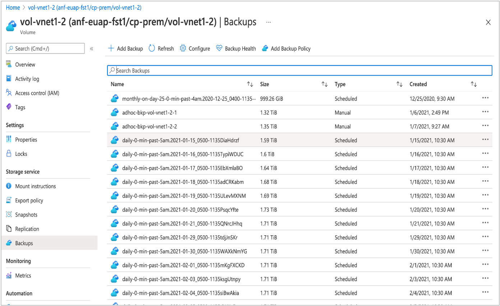
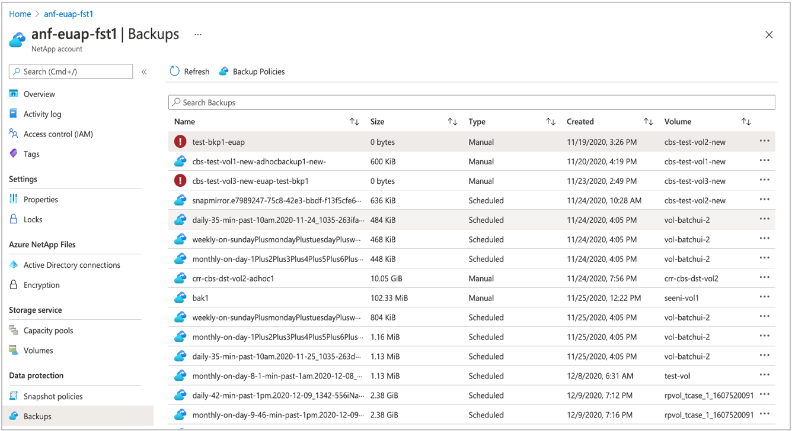

# Search backups of Azure NetApp Files volumes

You can display backups and search for a particular backup at the volume level or the NetApp account level.

The names used for snapshots are preserved when the snapshots are backed up. Snapshot names include the prefix `daily`, `weekly`, or `monthly`. They also include the timestamp when the snapshot was created. The first snapshot when the backup feature is enabled is called a *baseline snapshot*, and its name includes the prefix `snapmirror`.

If a volume is deleted, its backups are still retained. The backups will be listed in the associated NetApp accounts, under the Backups section. This list will include all backups within the subscription (across NetApp accounts) in the region. It can be used to restore a backup to a volume in another NetApp account under the same subscription.

## Search backups at volume level    

You can display and search backups at the volume level:

1. Select **Volumes**.

2. Navigate to **Backups** to display backups for the volume.   
    The **Type** column shows whether the backup is generated by a *Scheduled* (policy-based) or a *manual* backup.

3. In the **Search Backups** field, enter the backup name that you want to search for.  

    A partial search is supported; you don’t have to specify the entire backup name. The search filters the backups based on the search string.

    

## Search backups at NetApp account level 

You can display and search backups that are associated with a subscription under all NetApp accounts in a region of a subscription.   

1. Select **NetApp account**.

2. Navigate to **Backups**.
    The **Type** column shows whether the backup is generated by a *Scheduled* (policy-based) or a *manual* backup. 

3. In the **Search Backups** box, enter the backup name that you want to search for.

    * The backup list includes all backups of all volumes (both active and deleted) that belong to all NetApp accounts of a subscription.

    * The backup list can be used for restoring a backup to a new volume and also for deleting a backup. The workflow for restoring a backup is the same as [volume-level backup restore](backup-restore-new-volume.md). The workflow for deleting a backup is same as [volume-level backup deletion](backup-delete.md).

    * The best practice suggested for [manual backup](backup-configure-manual.md) naming convention helps you identify which volume the backup belongs to. This practice is especially useful in a case where the backup belongs to a volume that has been deleted (with backups retained).

    

## Next steps  

* [Understand Azure NetApp Files backup](backup-introduction.md)
* [Requirements and considerations for Azure NetApp Files backup](backup-requirements-considerations.md)
* [Resource limits for Azure NetApp Files](azure-netapp-files-resource-limits.md)
* [Configure policy-based backups](backup-configure-policy-based.md)
* [Configure manual backups](backup-configure-manual.md)
* [Manage backup policies](backup-manage-policies.md)
* [Restore a backup to a new volume](backup-restore-new-volume.md)
* [Disable backup functionality for a volume](backup-disable.md)
* [Delete backups of a volume](backup-delete.md)
* [Volume backup metrics](azure-netapp-files-metrics.md#volume-backup-metrics)
* [Azure NetApp Files backup FAQs](faq-backup.md)
