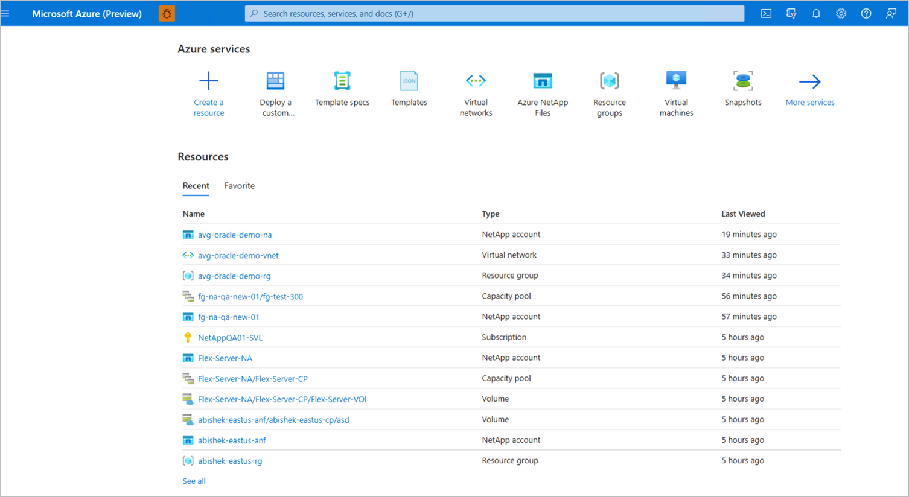
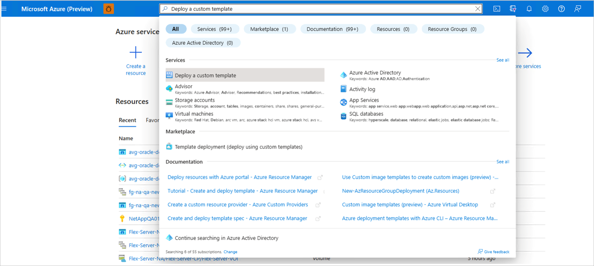
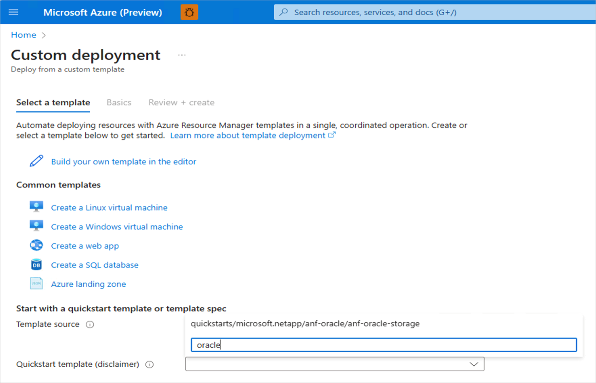
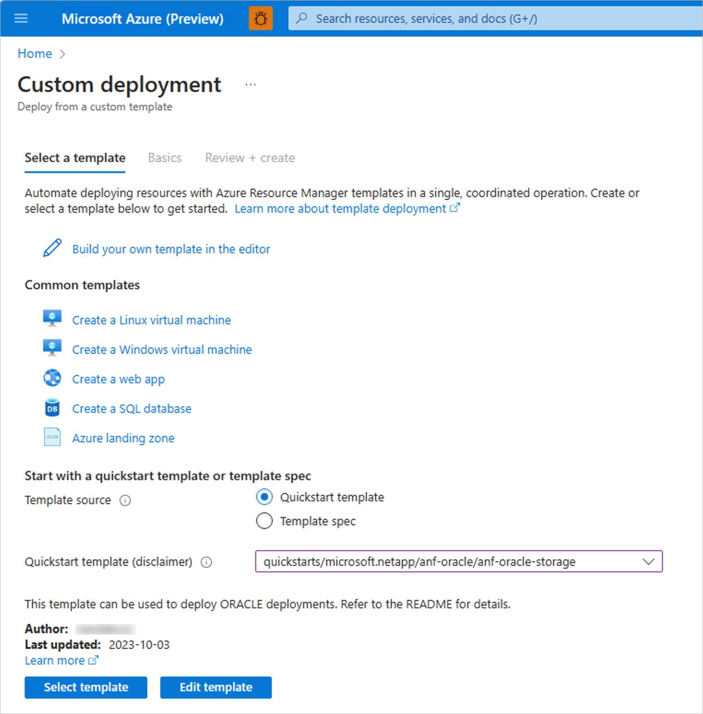
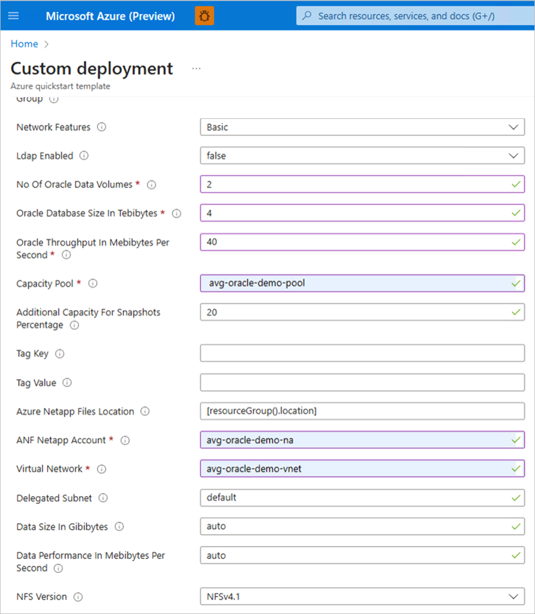
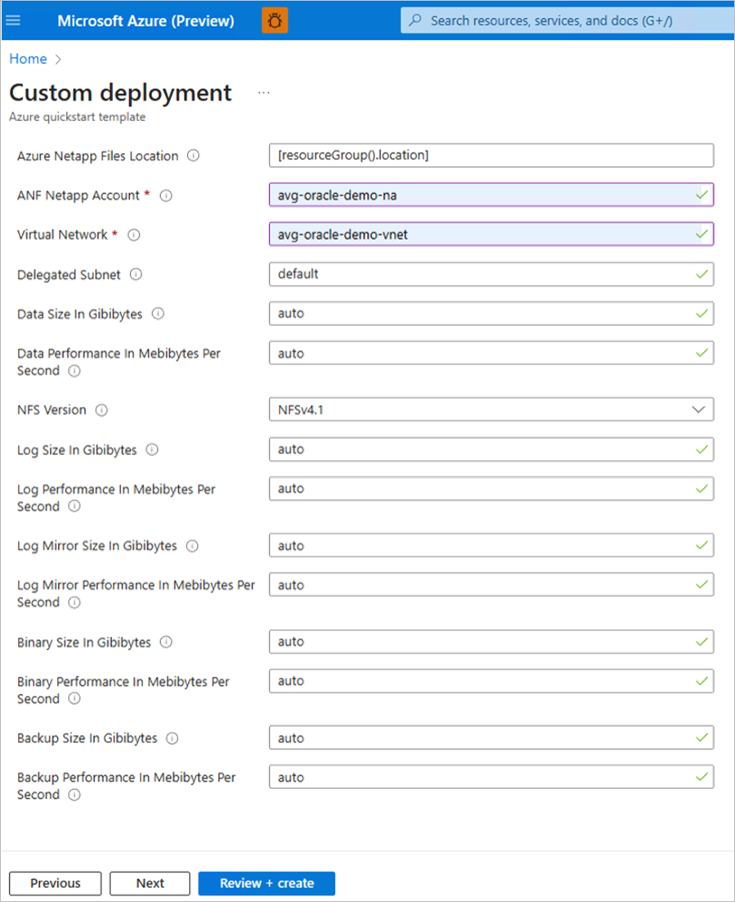
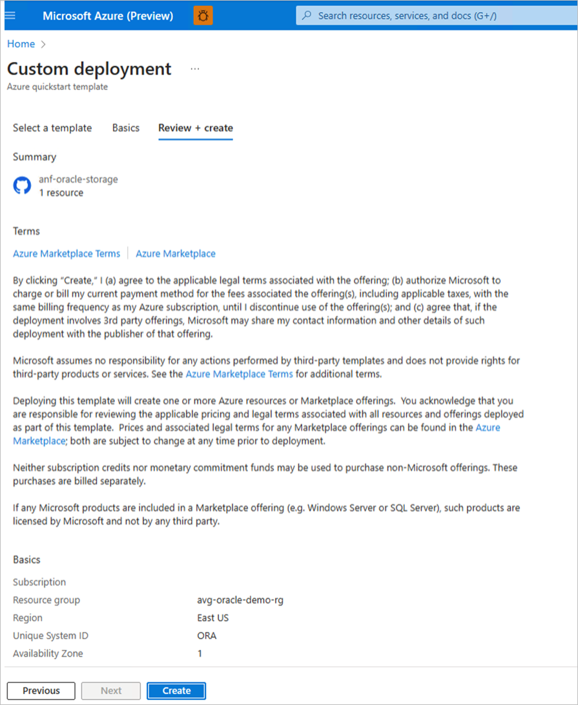

# Deploy application volume group for Oracle using Azure Resource Manager

This article describes how to use an Azure Resource Manager (ARM) template to deploy Azure NetApp Files application volume group for Oracle. 

For detailed documentation on how to use the ARM template, see [ORACLE Azure NetApp Files storage](https://github.com/Azure/azure-quickstart-templates/blob/master/quickstarts/microsoft.netapp/anf-oracle/anf-oracle-storage/README.md). 

## Prerequisites and restrictions using the ARM template

* In order to use the ARM template, you need to ensure that resource group, NetApp account, capacity pool, and virtual network resources are available for deployment. 

* All object such as the NetApp account, capacity pools, vNet, and subnet need to be in the same resource group.

* As the application volume group is designed for larger Oracle databases, the database size must be specified in TiB. When you request more than one data volume, the size is distributed. The calculation is done in integer arithmetic and may lead to lower-than-expected sizes or even errors as the resulting size of each data volume being 0. To prevent this situation, instead of using the automatic calculation, you can select size and throughput for each of the data volume by changing the fields **Data size** and **Data performance** to numerical values instead of **auto**. Doing so prevents the automatic calculation.

## Steps

1.	Log in to the [Azure portal](https://portal.azure.com/).

     

2.	Search for service **Deploy a custom template**.

     

    
3.	Type `oracle` in the **Quickstart template** the search dropdown.

     
 

4.	Select template `quickstart/microsoft.netapp/anf-oracle/anf-oracle-storage` from the dropdown menu. 
     
 
5. Choose **Select template** to deploy. 

6. Select **Subscription**, **Resource Group** and **Availability Zone** from the dropdown menu. 
    **Proximity Placement Group Name**  and **Proximity Placement Group Resource Name** must be blank if the **Availability Zone** option selected.

      

7. Enter values for **Number Of Oracle Data Volumes**, **Oracle Throughput**, **Capacity Pool**, **NetApp Account** and **Virtual Network**.

    > [!NOTE]
    > The specified throughput for the Oracle data volumes is distributed evenly across all data volumes. For all other volumes, you can choose to overwrite the default values according to your sizing. 

    > [!NOTE]
    > All volumes can be adapted in size and throughput to meet the database requirements after deployment.

       

8.	Click **Review + Create** to continue.

        

9.	The **Create** button is enabled if there are no validation errors. Click **Create** to continue. 

     

10.	The overview page denotes "Your deployment is in progress" then "Your deployment is complete."
        
12.	You can display a summary for the volume group.	You can also display the volumes in the volume group under the NetApp account.

## Next steps

* [Understand application volume group for Oracle](application-volume-group-oracle-introduction.md)
* [Requirements and considerations for application volume group for Oracle](application-volume-group-oracle-considerations.md)
* [Deploy application volume group for Oracle](application-volume-group-oracle-deploy-volumes.md)
* [Manage volumes in an application volume group for Oracle](application-volume-group-manage-volumes-oracle.md)
* [Configure application volume group for Oracle using REST API](configure-application-volume-oracle-api.md) 
* [Troubleshoot application volume group errors](troubleshoot-application-volume-groups.md)
* [Delete an application volume group](application-volume-group-delete.md)
* [Application volume group FAQs](faq-application-volume-group.md)