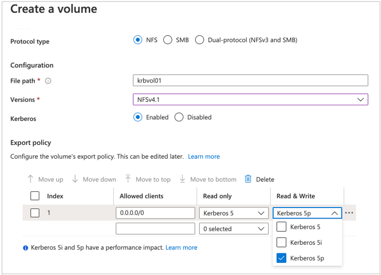
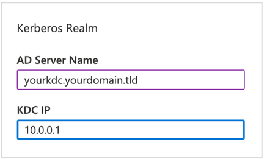

# Configure NFSv4.1 Kerberos encryption for Azure NetApp Files

Azure NetApp Files supports NFS client encryption in Kerberos modes (krb5, krb5i, and krb5p) with AES-256 encryption. This article describes the required configurations for using an NFSv4.1 volume with Kerberos encryption.

## Requirements

The following requirements apply to NFSv4.1 client encryption: 

* Active Directory Domain Services (AD DS) or Microsoft Entra Domain Services connection to facilitate Kerberos ticketing 
* DNS A/PTR record creation for both the client and Azure NetApp Files NFS server IP addresses
* A Linux client: This article provides guidance for RHEL and Ubuntu clients.  Other clients will work with similar configuration steps. 
* NTP server access: You can use one of the commonly used Active Directory Domain Controller (AD DC) domain controllers.
* To leverage Domain or LDAP user authentication, ensure that NFSv4.1 volumes are enabled for LDAP. See [Configure ADDS LDAP with extended groups](configure-ldap-extended-groups.md).
* Ensure that User Principal Names for user accounts do *not* end with a `$` symbol (for example, user$@REALM.COM). <!-- Not using 'contoso.com' in this example; per Mark, A customers REALM namespace may be different from their AD domain name space. -->   
    For [Group managed service accounts](/windows-server/security/group-managed-service-accounts/getting-started-with-group-managed-service-accounts) (gMSA), you need to remove the trailing `$` from the User Principal Name before the account can be used with the Azure NetApp Files Kerberos feature.

## Create an NFS Kerberos Volume

1.	Follow steps in [Create an NFS volume for Azure NetApp Files](azure-netapp-files-create-volumes.md) to create the NFSv4.1 volume.   

    On the Create a Volume page, set the NFS version to **NFSv4.1**, and set Kerberos to **Enabled**.

    > [!IMPORTANT] 
    > You cannot modify the Kerberos enablement selection after the volume is created.

      

2. Select **Export Policy** to match the desired level of access and security option (Kerberos 5, Kerberos 5i, or Kerberos 5p) for the volume.   

    For performance impact of Kerberos, see [Performance impact of Kerberos on NFSv4.1](#kerberos_performance).  

    You can also modify the Kerberos security methods for the volume by clicking Export Policy in the Azure NetApp Files navigation pane.

3.	Click **Review + Create** to create the NFSv4.1 volume.

## Configure the Azure portal 

1.	Follow the instructions in [Create an Active Directory connection](create-active-directory-connections.md).  

    Kerberos requires that you create at least one computer account in Active Directory. The account information you provide is used for creating the accounts for both SMB *and* NFSv4.1 Kerberos volumes. This machine is account is created automatically during volume creation.

2.	Under **Kerberos Realm**, enter the **AD Server Name** and the **KDC IP** address.

    AD Server and KDC IP can be the same server. This information is used to create the SPN computer account used by Azure NetApp Files. After the computer account is created, Azure NetApp Files will use DNS Server records to locate additional KDC servers as needed. 

    
 
3.	Click **Join** to save the configuration.

## Configure Active Directory connection 

Configuration of NFSv4.1 Kerberos creates two computer accounts in Active Directory:
* A computer account for SMB shares
* A computer account for NFSv4.1--You can identify this account by way of the prefix `NFS-`. 

After creating the first NFSv4.1 Kerberos volume, set the encryption type for the computer account by using the following PowerShell command:

`Set-ADComputer $NFSCOMPUTERACCOUNT -KerberosEncryptionType AES256`

## Configure the NFS client 

Follow instructions in [Configure an NFS client for Azure NetApp Files](configure-nfs-clients.md) to configure the NFS client.  

## Mount the NFS Kerberos volume

1. From the **Volumes** page, select the NFS volume that you want to mount.

2. Select **Mount instructions** from the volume to display the instructions.

    For example: 

      

3. Create the directory (mount point) for the new volume.  

4. Set the default encryption type to AES 256 for the computer account:  
    `Set-ADComputer $NFSCOMPUTERACCOUNT -KerberosEncryptionType AES256 -Credential $ANFSERVICEACCOUNT`

    * You need to run this command only once for each computer account.
    * You can run this command from a domain controller or from a PC with [RSAT](https://support.microsoft.com/help/2693643/remote-server-administration-tools-rsat-for-windows-operating-systems) installed. 
    * The `$NFSCOMPUTERACCOUNT` variable is the computer account created in Active Directory when you deploy the Kerberos volume. This is the account that is prefixed with `NFS-`. 
    * The `$ANFSERVICEACCOUNT` variable is a non-privileged Active Directory user account with delegated controls over the Organizational Unit where the computer account has been created. 

5. Mount the volume on the host: 

    `sudo mount -t nfs -o sec=krb5p,rw,hard,rsize=1048576,wsize=1048576,vers=4.1,tcp $ANFEXPORT $ANFMOUNTPOINT`

    * The `$ANFEXPORT` variable is the `host:/export` path found in the mount instructions.
    * The `$ANFMOUNTPOINT` variable is the user-created folder on the Linux host.

## Performance impact of Kerberos on NFSv4.1 

You should understand the security options available for NFSv4.1 volumes, the tested performance vectors, and the expected performance impact of kerberos. See [Performance impact of Kerberos on NFSv4.1 volumes](performance-impact-kerberos.md) for details.  

## Next steps  

* [Performance impact of Kerberos on NFSv4.1 volumes](performance-impact-kerberos.md)
* [Troubleshoot volume errors for Azure NetApp Files](troubleshoot-volumes.md)
* [NFS FAQs](faq-nfs.md)
* [Performance FAQs](faq-performance.md)
* [Create an NFS volume for Azure NetApp Files](azure-netapp-files-create-volumes.md)
* [Create an Active Directory connection](create-active-directory-connections.md)
* [Configure an NFS client for Azure NetApp Files](configure-nfs-clients.md) 
* [Configure ADDS LDAP with extended groups for NFS volume access](configure-ldap-extended-groups.md)
