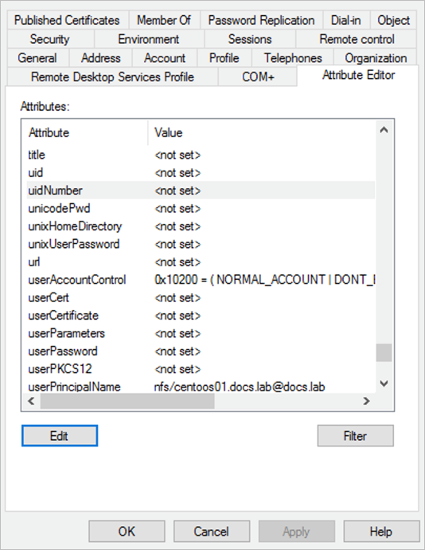
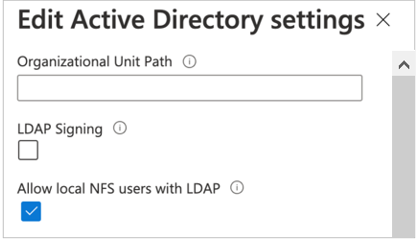
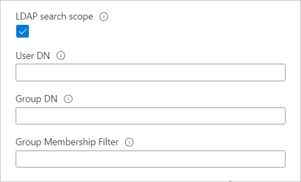

# Enable Active Directory Domain Services (AD DS) LDAP authentication for NFS volumes

When you [create an NFS volume](azure-netapp-files-create-volumes.md), you can enable the LDAP with extended groups feature (the **LDAP** option) for the volume. This feature enables Active Directory LDAP users and extended groups (up to 1024 groups) to access files and directories in the volume. You can use the LDAP with extended groups feature with both NFSv4.1 and NFSv3 volumes. 

> [!NOTE]
> By default, in Active Directory LDAP servers, the `MaxPageSize` attribute is set to a default of 1,000. This setting means that groups beyond 1,000 are truncated in LDAP queries. To enable full support with the 1,024 value for extended groups, the `MaxPageSiz`e attribute must be modified to reflect the 1,024 value. For information about how to change that value, see [How to view and set LDAP policy in Active Directory by using Ntdsutil.exe](/troubleshoot/windows-server/identity/view-set-ldap-policy-using-ntdsutil).

Azure NetApp Files supports fetching of extended groups from the LDAP name service rather than from the RPC header. Azure NetApp Files interacts with LDAP by querying for attributes such as usernames, numeric IDs, groups, and group memberships for NFS protocol operations.

When it’s determined that LDAP will be used for operations such as name lookup and fetching extended groups, the following process occurs:

1. Azure NetApp Files uses an LDAP client configuration to make a connection attempt to the AD DS or Microsoft Entra Domain Services LDAP server that is specified in the [Azure NetApp Files AD configuration](create-active-directory-connections.md).
1. If the TCP connection over the defined AD DS or Microsoft Entra Domain Services LDAP service port is successful, then the Azure NetApp Files LDAP client attempts to “bind” (sign in) to the AD DS or Microsoft Entra Domain Services LDAP server (domain controller) by using the defined credentials in the LDAP client configuration.
1. If the bind is successful, then the Azure NetApp Files LDAP client uses the RFC 2307bis LDAP schema to make an LDAP search query to the AD DS or Microsoft Entra Domain Services LDAP server (domain controller).
The following information is passed to the server in the query:
   * [Base/user DN](configure-ldap-extended-groups.md#ldap-search-scope) (to narrow search scope)
   * Search scope type (subtree)
   * Object class (`user`, `posixAccount` for users, and `posixGroup` for groups)
   * UID or username 
   * Requested attributes (`uid`, `uidNumber`, `gidNumber` for users, or `gidNumber` for groups) 
1. If the user or group isn’t found, the request fails, and access is denied.
1. If the request is successful, then user and group attributes are [cached for future use](configure-ldap-extended-groups.md#considerations). This operation improves the performance of subsequent LDAP queries associated with the cached user or group attributes. It also reduces the load on the AD DS or Microsoft Entra Domain Services LDAP server.

## Considerations

* You can enable the LDAP with extended groups feature only during volume creation. This feature can't be retroactively enabled on existing volumes.  

* LDAP with extended groups is supported only with Active Directory Domain Services (AD DS) or Microsoft Entra Domain Services. OpenLDAP or other third-party LDAP directory services are not supported. 

* LDAP over TLS must *not* be enabled if you are using Microsoft Entra Domain Services.  

* You can't modify the LDAP option setting (enabled or disabled) after you've created the volume.  

* The following table describes the Time to Live (TTL) settings for the LDAP cache. You need to wait until the cache is refreshed before trying to access a file or directory through a client. Otherwise, an access or permission denied message appears on the client. 

    | Cache |  Default Timeout |
    |-|-|
    | Group membership list  | 24-hour TTL  |
    | Unix groups  | 24-hour TTL, 1-minute negative TTL  |
    | Unix users  | 24-hour TTL, 1-minute negative TTL  |

    Caches have a specific timeout period called *Time to Live*. After the timeout period, entries age out so that stale entries don't linger. The *negative TTL* value is where a lookup that has failed resides to help avoid performance issues due to LDAP queries for objects that might not exist.
    
* The **Allow local NFS users with LDAP** option in Active Directory connections intends to provide occasional and temporary access to local users. When this option is enabled, user authentication and lookup from the LDAP server stop working, and the number of group memberships that Azure NetApp Files will support will be limited to 16.  As such, you should keep this option *disabled* on Active Directory connections, except for the occasion when a local user needs to access LDAP-enabled volumes. In that case, you should disable this option as soon as local user access is no longer required for the volume. See [Allow local NFS users with LDAP to access a dual-protocol volume](create-volumes-dual-protocol.md#allow-local-nfs-users-with-ldap-to-access-a-dual-protocol-volume) about managing local user access.

## Steps

1. LDAP volumes require an Active Directory configuration for LDAP server settings. Follow instructions in [Requirements for Active Directory connections](create-active-directory-connections.md#requirements-for-active-directory-connections) and [Create an Active Directory connection](create-active-directory-connections.md#create-an-active-directory-connection) to configure Active Directory connections on the Azure portal.  

    > [!NOTE]
    > Ensure that you have configured the Active Directory connection settings. A computer account will be created in the organizational unit (OU) that is specified in the Active Directory connection settings. The settings are used by the LDAP client to authenticate with your Active Directory.

2. Ensure that the Active Directory LDAP server is up and running on the Active Directory. 

3. LDAP NFS users need to have certain POSIX attributes on the LDAP server. Set the attributes for LDAP users and LDAP groups as follows: 

    * Required attributes for LDAP users:   
        `uid: Alice`,  
        `uidNumber: 139`,  
        `gidNumber: 555`,  
        `objectClass: user, posixAccount`
    * Required attributes for LDAP groups:   
        `objectClass: group, posixGroup`,  
        `gidNumber: 555`

    The values specified for `objectClass` are separate entries. For example, in Multi-valued String Editor, `objectClass` would have separate values (`user` and `posixAccount`) specified as follows for LDAP users:   

    >[!NOTE]
    >If the POSIX attributes are not set up correctly, user and group lookup operations may fail, and users may be squashed to `nobody` when accessing NFS volumes. 

     

    You can manage POSIX attributes by using the Active Directory Users and Computers MMC snap-in. The following example shows the Active Directory Attribute Editor. See [Access Active Directory Attribute Editor](create-volumes-dual-protocol.md#access-active-directory-attribute-editor) for details.  

     

4. If you want to configure an LDAP-integrated NFSv4.1 Linux client, see [Configure an NFS client for Azure NetApp Files](configure-nfs-clients.md).

5. If your LDAP-enabled volumes use NFSv4.1, follow instructions in [Configure NFSv4.1 ID domain](azure-netapp-files-configure-nfsv41-domain.md#configure-nfsv41-id-domain-in-nfs-clients) to configure the `/etc/idmapd.conf` file.

    You need to set `Domain` in `/etc/idmapd.conf` to the domain that is configured in the Active Directory Connection on your NetApp account. For instance, if `contoso.com` is the configured domain in the NetApp account, then set `Domain = contoso.com`.

    Then you need to restart the `rpcbind` service on your host or reboot the host. 

6. Follow steps in [Create an NFS volume for Azure NetApp Files](azure-netapp-files-create-volumes.md) to create an NFS volume. During the volume creation process, under the **Protocol** tab, enable the **LDAP** option.   

      

7. Optional - You can enable local NFS client users not present on the Windows LDAP server to access an NFS volume that has LDAP with extended groups enabled. To do so, enable the **Allow local NFS users with LDAP** option as follows:
    1. Select **Active Directory connections**.  On an existing Active Directory connection, select the context menu (the three dots `…`), and select **Edit**.  
    2. On the **Edit Active Directory settings** window that appears, select the **Allow local NFS users with LDAP** option.  

      

8. Optional - If you have large topologies, and you use the Unix security style with a dual-protocol volume or LDAP with extended groups, you can use the **LDAP Search Scope** option to avoid "access denied" errors on Linux clients for Azure NetApp Files.  

    The **LDAP Search Scope** option is configured through the **[Active Directory Connections](create-active-directory-connections.md#create-an-active-directory-connection)** page.

    To resolve the users and group from an LDAP server for large topologies, set the values of the **User DN**, **Group DN**, and **Group Membership Filter** options on the Active Directory Connections page as follows:

    * Specify nested **User DN** and **Group DN** in the format of `OU=subdirectory,OU=directory,DC=domain,DC=com`. 
    * Specify **Group Membership Filter** in the format of `(gidNumber=*)`. 
    * If a user is a member of more than 256 groups, only 256 groups will be listed. 
    * Refer to [errors for LDAP volumes](troubleshoot-volumes.md#errors-for-ldap-volumes) if you run into errors.

      

## Next steps  

* [Create an NFS volume for Azure NetApp Files](azure-netapp-files-create-volumes.md)
* [Create and manage Active Directory connections](create-active-directory-connections.md)
* [Configure NFSv4.1 domain](azure-netapp-files-configure-nfsv41-domain.md)
* [Configure an NFS client for Azure NetApp Files](configure-nfs-clients.md)
* [Troubleshoot volume errors for Azure NetApp Files](troubleshoot-volumes.md)
* [Modify Active Directory connections for Azure NetApp Files](modify-active-directory-connections.md)
* [Understand NFS group memberships and supplemental groups](network-file-system-group-memberships.md)
