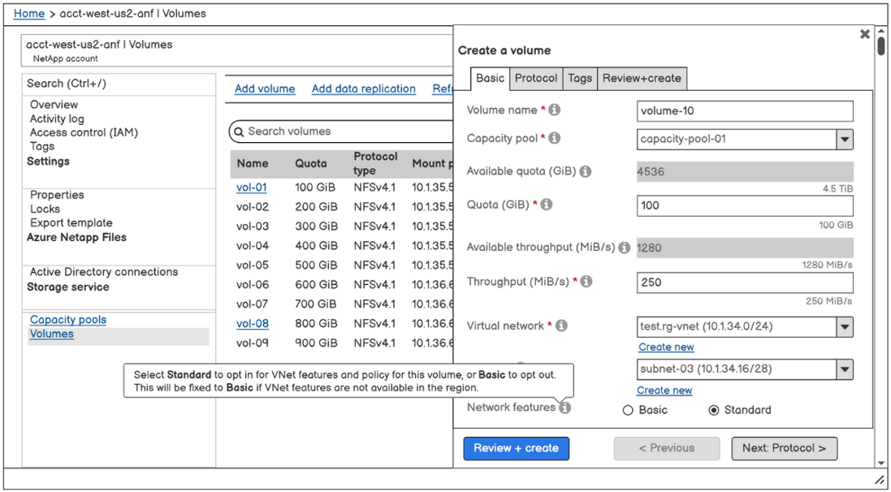
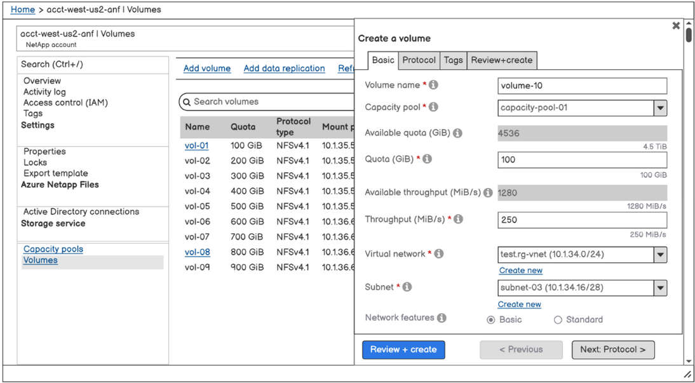
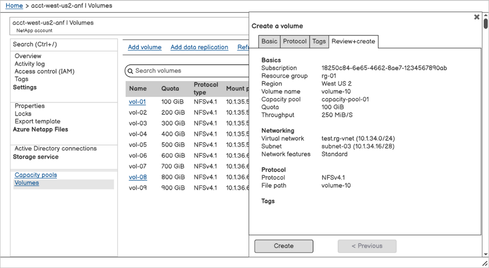
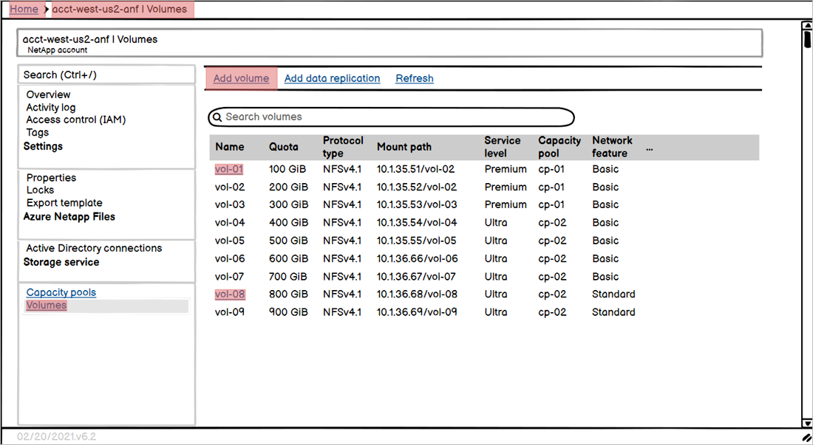

# Configure network features for an Azure NetApp Files volume

The **Network Features** functionality enables you to indicate whether you want to use VNet features for an Azure NetApp Files volume. With this functionality, you can set the option to ***Standard*** or ***Basic***. You can specify the setting when you create a new NFS, SMB, or dual-protocol volume. You can also modify the network features option on existing volumes. See [Guidelines for Azure NetApp Files network planning](azure-netapp-files-network-topologies.md) for details about network features.

This article helps you understand the options and shows you how to configure network features.

The **Network Features** functionality isn't available in Azure Government regions. See [supported regions](azure-netapp-files-network-topologies.md#supported-regions) for a full list. 

## Options for network features 

Two settings are available for network features: 

* ***Standard***  
    This setting enables VNet features for the volume.  

    If you need higher IP limits or VNet features such as [network security groups](../virtual-network/network-security-groups-overview.md), [user-defined routes](../virtual-network/virtual-networks-udr-overview.md#user-defined), or additional connectivity patterns, you should set **Network Features** to *Standard*.

* ***Basic***  
    This setting provides reduced IP limits (<1000) and no additional VNet features for the volumes.

    You should set **Network Features** to *Basic* if you don't require VNet features.  

## Considerations

* Regardless of the network features option you set (*Standard* or *Basic*), an Azure VNet can only have one subnet delegated to Azure NetApp files. See [Delegate a subnet to Azure NetApp Files](azure-netapp-files-delegate-subnet.md#considerations). 
 
* You can create or modify volumes with the Standard network features only if the corresponding [Azure region supports the Standard volume capability](azure-netapp-files-network-topologies.md#supported-regions). 

    * If the Standard volume capability is supported for the region, the Network Features field of the Create a Volume page defaults to *Standard*. You can change this setting to *Basic*. 
    * If the Standard volume capability isn't available for the region, the Network Features field of the Create a Volume page defaults to *Basic*, and you can't modify the setting.

* The ability to locate storage compatible with the desired type of network features depends on the VNet specified. If you can't create a volume because of insufficient resources, you can try a different VNet for which compatible storage is available.

* You can create Basic volumes from Basic volume snapshots and Standard volumes from Standard volume snapshots. Creating a Basic volume from a Standard volume snapshot isn't supported. Creating a Standard volume from a Basic volume snapshot isn't supported.

* When you restore a backup to a new volume, you can configure the new volume with Basic or Standard network features.

* When you change the network features option of existing volumes from Basic to Standard network features, access to existing Basic networking volumes might be lost if your UDR or NSG implementations prevent the Basic networking volumes from connecting to DNS and domain controllers. You might also lose the ability to update information, such as the site name, in the Active Directory connector if all volumes can’t communicate with DNS and domain controllers. For guidance about UDRs and NSGs, see [Configure network features for an Azure NetApp Files volume](azure-netapp-files-network-topologies#udrs-and-nsgs).

## <a name="set-the-network-features-option"></a>Set network features option during volume creation

This section shows you how to set the network features option when you create a new volume. 

1. During the process of creating a new [NFS](azure-netapp-files-create-volumes.md), [SMB](azure-netapp-files-create-volumes-smb.md), or [dual-protocol](create-volumes-dual-protocol.md) volume, you can set the **Network Features** option to **Basic** or **Standard** under the Basic tab of the Create a Volume screen.

    The following screenshot shows a volume creation example for a region that supports the Standard network features capabilities: 

    

    The following screenshot shows a volume creation example for a region that does *not* support the Standard network features capabilities: 

    

2. Before completing the volume creation process, you can display the specified network features setting in the **Review + Create** tab of the Create a Volume screen. Select **Create** to complete the volume creation.

    

3. You can select **Volumes** to display the network features setting for each volume:

    [ ](../media/azure-netapp-files/network-features-volume-list.png#lightbox)

## Edit network features option for existing volumes

You can edit the network features option of existing volumes from *Basic* to *Standard* network features. The change you make applies to all volumes in the same *network sibling set* (or *siblings*). Siblings are determined by their network IP address relationship. They share the same NIC for mounting the volume to the client or connecting to the SMB share of the volume. At the creation of a volume, its siblings are determined by a placement algorithm that aims for reusing the IP address where possible.

You can also revert the option from *Standard* back to *Basic* network features, but considerations apply and require careful planning. For example, you might need to change configurations for Network Security Groups (NSGs), user-defined routes (UDRs), and IP limits if you revert. See [Guidelines for Azure NetApp Files network planning](azure-netapp-files-network-topologies.md#constraints) for constraints and supported network topologies about Standard and Basic network features.

See [regions supported for this feature](azure-netapp-files-network-topologies.md#regions-edit-network-features).

This feature currently doesn't support SDK.

> [!IMPORTANT]
> The option to edit network features is currently in preview. You need to submit a waitlist request for accessing the feature through the **[Azure NetApp Files standard networking features (edit volumes) Public Preview Request Form](https://aka.ms/anfeditnetworkfeaturespreview)**. This feature is expected to be enabled within a week after you submit the waitlist request. You can check the status of feature registration by using the following command: 
>
> ```azurepowershell-interactive
> Get-AzProviderFeature -ProviderNamespace Microsoft.NetApp -FeatureName ANFBasicToStdNetworkFeaturesUpgrade                                                      
> 
> FeatureName                         ProviderName     RegistrationState   
> -----------                         ------------     -----------------   
> ANFBasicToStdNetworkFeaturesUpgrade Microsoft.NetApp Registered
> ```

> [!IMPORTANT]
> Updating the network features option might cause a network disruption on the volumes for up to 5 minutes. 

1. Navigate to the volume that you want to change the network features option. 
1. Select **Change network features**. 
1. The **Edit network features** window displays the volumes that are in the same network sibling set. Confirm whether you want to modify the network features option. 

    :::image type="content" source="../media/azure-netapp-files/edit-network-features.png" alt-text="Screenshot showing the Edit Network Features window." lightbox="../media/azure-netapp-files/edit-network-features.png":::

## Next steps  

* [Guidelines for Azure NetApp Files network planning](azure-netapp-files-network-topologies.md)
* [Create an NFS volume for Azure NetApp Files](azure-netapp-files-create-volumes.md)
* [Create an SMB volume for Azure NetApp Files](azure-netapp-files-create-volumes-smb.md) 
* [Create a dual-protocol volume for Azure NetApp Files](create-volumes-dual-protocol.md) 
* [Configure Virtual WAN for Azure NetApp Files](configure-virtual-wan.md)
