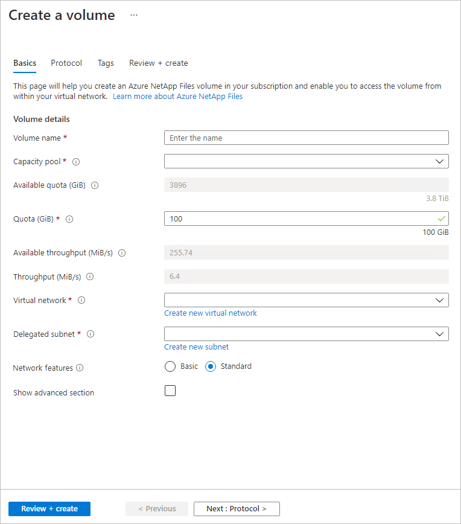

# Configure network features for an Azure NetApp Files volume

The **Network Features** functionality enables you to indicate whether you want to use VNet features for an Azure NetApp Files volume. With this functionality, you can set the option to ***Standard*** or ***Basic***. You can specify the setting when you create a new NFS, SMB, or dual-protocol volume. You can also modify the network features option on existing volumes. See [Guidelines for Azure NetApp Files network planning](azure-netapp-files-network-topologies.md) for details about network features.

## Options for network features 

Two settings are available for network features: 

* ***Standard***  
    This setting enables VNet features for the volume. The default and preferred setting is Standard network features. 

    If you need higher IP limits or VNet features such as [network security groups (NSGs)](../virtual-network/network-security-groups-overview.md), [user-defined routes](../virtual-network/virtual-networks-udr-overview.md#user-defined), or additional connectivity patterns, set **Network Features** to *Standard*.

* ***Basic***  
    This setting provides reduced IP limits (less than 1,000 IP addresses) and no additional VNet features for the volumes.

    You should set **Network Features** to *Basic* if you don't require VNet features.  

## Considerations

* Regardless of the network features option you set (*Standard* or *Basic*), an Azure VNet can only have one subnet delegated to Azure NetApp files. See [Delegate a subnet to Azure NetApp Files](azure-netapp-files-delegate-subnet.md#considerations). 

* The ability to locate storage compatible with the desired type of network features depends on the VNet specified. If you can't create a volume because of insufficient resources, you can try a different VNet for which compatible storage is available.

* You can create Basic volumes from Basic volume snapshots and Standard volumes from Standard volume snapshots. Creating a Basic volume from a Standard volume snapshot isn't supported. Creating a Standard volume from a Basic volume snapshot isn't supported.

* When you restore a backup to a new volume, you can configure the new volume with Basic or Standard network features.

* When you change the network features option of existing volumes from Basic to Standard network features, access to existing Basic networking volumes might be lost if your UDR or NSG implementations prevent the Basic networking volumes from connecting to DNS and domain controllers. You might also lose the ability to update information, such as the site name, in the Active Directory connector if all volumes can’t communicate with DNS and domain controllers. For guidance about UDRs and NSGs, see [Configure network features for an Azure NetApp Files volume](azure-netapp-files-network-topologies.md#udrs-and-nsgs).

>[!NOTE]
> The networking features of the data protection volume aren't affected by changing the source volume from Basic to Standard network features.

## <a name="set-the-network-features-option"></a>Set network features option during volume creation

This section shows you how to set the network features option when you create a new volume. 

1. During the process of creating a new [NFS](azure-netapp-files-create-volumes.md), [SMB](azure-netapp-files-create-volumes-smb.md), or [dual-protocol](create-volumes-dual-protocol.md) volume, you can set the **Network Features** option to **Basic** or **Standard** under the Basic tab of the Create a volume screen.

    

2. Before completing the volume creation process, you can display the specified network features setting in the **Review + Create** tab of the Create a volume screen. Select **Create** to complete the volume creation.

    

3. You can select **Volumes** to display the network features setting for each volume:

    [ ](./media/configure-network-features/network-features-volume-list.png#lightbox)

## Edit network features for existing volumes

You can edit the network features option of existing volumes from *Basic* to *Standard* network features. The change you make applies to all volumes in the same *network sibling set* (or *siblings*). Siblings are determined by their network IP address relationship. They share the same network interface card (NIC) for mounting the volume to the client or connecting to the remote share of the volume. At the creation of a volume, its siblings are determined by a placement algorithm that aims for reusing the IP address where possible.

### Considerations when editing networking features 

* <a name="no-downtime"></a> Azure NetApp Files supports a non-disruptive upgrade to Standard network features and a revert to Basic network features. This operation is expected to take at least 15 minutes. You can't create a regular or data protection volume or application volume group in the targeted network sibling set while the operation completes.    
* If you revert from Standard to Basic network features, considerations apply and require careful planning. See [Guidelines for Azure NetApp Files network planning](azure-netapp-files-network-topologies.md#constraints) for constraints and supported network topologies about Standard and Basic network features. 

### Register the feature

Before upgradeing from Basic to Standard network features, you need to register the feature.

1.  Register the feature:

    ```azurepowershell-interactive
    Register-AzProviderFeature -ProviderNamespace Microsoft.NetApp -FeatureName ANFBasicToStdNetworkFeaturesUpgrade 
    ```

2. Check the status of the feature registration: 

    > [!NOTE]
    > The **RegistrationState** can remain in the `Registering` state for up to 60 minutes before changing to `Registered`. Wait until the status is `Registered` before continuing.

    ```azurepowershell-interactive
    Get-AzProviderFeature -ProviderNamespace Microsoft.NetApp -FeatureName ANFBasicToStdNetworkFeaturesUpgrade 
    ```

You can also use [Azure CLI commands](/cli/azure/feature) `az feature register` and `az feature show` to register the feature and display the registration status. 


> [!NOTE]
> To revert from *Standard* to *Basic* network features, you must also register the feature. 
> Submit a waitlist request through the **[Azure NetApp Files standard networking features (edit volumes) Request Form](https://aka.ms/anfeditnetworkfeatures)**. The revert capability can take approximately one week to be enabled after you submit the waitlist request. Check the status of the registration with the following command. 
>
> ```azurepowershell-interactive
> Get-AzProviderFeature -ProviderNamespace Microsoft.NetApp -FeatureName ANFStdToBasicNetworkFeaturesRevert   
>```                                                   
> 
> When the `RegistrationState` displays Registered, the feature is approved for use. 
>
> If you revert, considerations apply and require careful planning. See [Guidelines for Azure NetApp Files network planning](azure-netapp-files-network-topologies.md#constraints) for constraints and supported network topologies about Standard and Basic network features. 

### <a name="edit"></a> Edit network features

# [Portal](#tab/portal)

1. Navigate to the volume for which you want to change the network features option. 
1. Select **Change network features**. 
1. The Edit network features window displays the volumes that are in the same network sibling set. Select **Save** to proceed with the operation. 
1. Select **Yes** to confirm you want to modify the network features option.

# [Azure CLI](#tab/cli)

You should be running the latest version of the Azure CLI. Confirm the version with the `az version` command. If necessary, see [How to update the Azure CLI](/cli/azure/update-azure-cli).

1. List volumes in the capacity pool. Capture the network sibling set ID of the volume whose network features you want to update. 

    ```azurecli-interactive
    az netappfiles volume list --account-name <account> --resource-group <resourceGroup> --pool-name <capacityPool> 
    ```

1. Query the network sibling set. Capture the network sibling set state ID for the network sibling set you want to update. 

    ```azurecli-interactive
    az netappfiles query-network-sibling-set --network-sibling-set-id <networkSiblingSetID> --subnet-id <subnetID> 
    ```

1. Run the following command to update the network features on a volume:

    ```azurecli-interactive
    az netappfiles update-network-sibling-set --network-sibling-set-id <networkSiblingSetID> --network-sibling-set-state-id=<stateID> --subnet-id <subnetID> --location <location> --network-features Standard|Basic 
    ```

1. Confirm the operation succeeded by checking the network features of the volume:

    ```azurecli
    az netappfiles volume show -g <resourceGroup> --account-name <account> --pool-name <capacityPool> --name <volumeName>
    ```

# [PowerShell](#tab/powershell)

1. List the volumes in the capacity pool. Capture the network sibling set ID of the volume whose network features you want to update. 

    ```azurepowershell-interactive
    Get-AzNetAppFilesVolume -ResourceGroupName "<resourceGroup> -AccountName "<accountName>" -PoolName "<capacityPool>" -Name "<volume>" 
    ```

1. Query the network sibling set. Capture the network sibling set state ID for the network sibling set you want to update. 

    ```azurepowershell-interactive
    Get-AzNetAppFilesNetworkSiblingSet -Location "<location>" -SubnetId "<subnetID>" -NetworkSiblingSetId "<networkSiblingSetID>"
    ```

1. Update the network sibling set.

    ```azurepowershell-interactive
    Update-AzNetAppFilesNetworkSiblingSet -Location "<location>" -SubnetId "<subscription>" -NetworkSiblingSetId "<networkSiblingSetID>" -NetworkSiblingSetStateId "<networkSiblingSetID>" -NetworkFeature "<Standard|Basic>" 
    ```

1. Confirm the volume has the correct network features setting.

    ```azurepowershell-interactive
    Get-AzNetAppFilesVolume -ResourceGroupName "<resourceGroup> -AccountName "<accountName>" -PoolName "<capacityPool>" -Name "<volume>" 
    ```

# [REST API](#tab/rest-api)

You should be using the [latest version of the Azure NetApp Files REST API](/rest/api/netapp/operation-groups). 

1. Query the network sibling set. Take note of the network sibling set ID and network sibling set state ID. 

    ```http
    GET https://management.azure.com/subscriptions/{subscriptionId}/providers/Microsoft.NetApp/locations/{location}/queryNetworkSiblingSet?api-version=2025-03-01
    ```

1. Send a PATCH request to update the network features. Set the "networkFeatures" property to Basic or Standard. 

    ```http
    PATCH https://management.azure.com/subscriptions/{subscriptionId}/providers/Microsoft.NetApp/locations/{location}/updateNetworkSiblingSet
    ```

    ```json
    {
        "networkSiblingSetId": "<networkSiblingSetID>",
        "subnetId": "<subnetID>",
        "networkSiblingSetStateId": "<siblingSetStateID>",
        "networkFeatures": "<Basic|Standard>"
    }
    ```

1. Confirm the network features changed with a GET request. 

---
<!-- terraform
### <a name="terraform"></a> Update Terraform-managed Azure NetApp Files volume from Basic to Standard 

If your Azure NetApp Files volume is managed using Terraform, editing the network features requires additional steps. Terraform-managed Azure resources store their state in a local file, which is in your Terraform module or in Terraform Cloud. 

Updating the network features of your volume alters the underlying network sibling set of the NIC utilized by that volume. This NIC can be utilized by other volumes you own, and other NICs can share the same network sibling set. **If performed incorrectly, updating the network features of one Terraform-managed volume can inadvertently update the network features of several other volumes.**

>[!IMPORTANT]
>A discontinuity between state data and remote Azure resource configurations--notably, in the `network_features` argument--can result in the destruction of one or more volumes and possible data loss upon running `terraform apply`. Carefully follow the workaround outlined here to safely update the network features from Basic to Standard of Terraform-managed volumes. 

>[!NOTE]
>A Terraform module usually consists solely of all top level `*.tf` and/or `*.tf.json` configuration files in a directory, but a Terraform module can make use of module calls to explicitly include other modules into the configuration. You can [learn more about possible module structures](https://developer.hashicorp.com/terraform/language/files). To update all configuration files in your module that refer to Azure NetApp Files volumes, be sure to look at all possible sources where your module can reference configuration files.

The name of the state file in your Terraform module is `terraform.tfstate`. It contains the arguments and the values of all deployed resources in the module. The following image shows the `terraform.tfstate` file for an Azure NetApp Files volume, highlighting the `network_features` argument with value "Basic":

:::image type="content" source="./media/configure-network-features/terraform-module.png" alt-text="Screenshot of Terraform module." lightbox="./media/configure-network-features/terraform-module.png":::

Do ***not*** manually update the `terraform.tfstate` file. Likewise, the `network_features` argument in the `*.tf` and `*.tf.json` configuration files should also not be updated until you follow the steps outlined here as this would cause a mismatch in the arguments of the remote volume and the local configuration file representing that remote volume. When Terraform detects a mismatch between the arguments of remote resources and local configuration files representing those remote resources, Terraform can destroy the remote resources and reprovision them with the arguments in the local configuration files. This can cause data loss in a volume.

>[!NOTE]
> It's recommended to always use the latest Terraform version and the latest version of the `azurerm` Terraform module.

#### Determine affected volumes 

Changing the network features for an Azure NetApp Files volume can impact the network features of other Azure NetApp Files volumes. Volumes in the same network sibling set must have the same network features setting. Therefore, before you change the network features of one volume, you must determine all volumes affected by the change using the Azure portal.

1. Sign in to the Azure portal. 
1. Navigate to the volume for which you want to change the network features option.
1. Select the **Change network features**. ***Do **not** select Save.***
1. Record the paths of the affected volumes then select **Cancel**. 

:::image type="content" source="./media/configure-network-features/affected-volumes-network-features.png" alt-text="Screenshot of volumes affected by change network features." lightbox="./media/configure-network-features/affected-volumes-network-features.png":::

All Terraform configuration files that define these volumes need to be updated, meaning you need to find the Terraform configuration files that define these volumes. The configuration files representing the affected volumes might not be in the same Terraform module.

>[!IMPORTANT]
>With the exception of the single volume you know is managed by Terraform, additional affected volumes might not be managed by Terraform. Another volume that's listed as being in the same network sibling set doesn't mean this other volume is managed by Terraform.

#### Modify the affected volumes’ configuration files

You must modify the configuration files for each affected volume managed by Terraform that you discovered. Failing to update the configuration file can destroy the volume or result in data loss. 

>[!IMPORTANT]
>Depending on your volume’s lifecycle configuration block settings in your Terraform configuration file, your volume can be destroyed, including possible data loss upon running `terraform apply`. Ensure you know which affected volumes are managed by Terraform.

1. Locate the affected Terraform-managed volumes configuration files.
1. Add or modify the `lifecycle` block in the volume’s configuration to include the `ignore_changes = [network_features]`. The `lifecycle` configuration block must include the following settings: 
    ```
    lifecycle {
        prevent_destroy = true
        ignore_changes = [network_features]
    }
    ```
    :::image type="content" source="./media/configure-network-features/terraform-lifecycle.png" alt-text="Screenshot of the lifecycle configuration." lightbox="./media/configure-network-features/terraform-lifecycle.png":::

1. Repeat for each affected Terraform-managed volume. 
 
The `ignore_changes` feature is intended to be used when a resource’s reference to data might change after the resource is created. Adding the `ignore_changes` feature to the `lifecycle` block allows the network features of the volumes to be changed in the Azure portal without Terraform trying to fix this argument of the volume on the next run of `terraform apply`. You can [learn more about the `ignore_changes` feature](https://developer.hashicorp.com/terraform/language/meta-arguments/lifecycle). 

#### Update the volumes' network features

1. In the Azure portal, navigate to the Azure NetApp Files volume for which you want to change network features. 
1. Select the **Change network features**.
1. In the **Action** field, confirm that it reads **Change to Standard**.

    :::image type="content" source="./media/configure-network-features/change-network-features-standard.png" alt-text="Screenshot of confirm change of network features." lightbox="./media/configure-network-features/change-network-features-standard.png":::

1. Select **Save**. 
1. Wait until you receive a notification that the network features update has completed. In your **Notifications**, the message reads "Successfully updated network features. Network features for network sibling set have successfully updated to ‘Standard’."
1. In the terminal, run `terraform plan` to view any potential changes. The output should indicate that the infrastructure matches the configuration with a message reading "No changes. Your infrastructure matches the configuration."

    :::image type="content" source="./media/configure-network-features/terraform-plan-output.png" alt-text="Screenshot of terraform plan command output." lightbox="./media/configure-network-features/terraform-plan-output.png":::

    >[!IMPORTANT]
    > As a safety precaution, execute `terraform plan` before executing `terraform apply`. The command `terraform plan` allows you to create a "plan" file, which contains the changes to your remote resources. This plan allows you to know if any of your affected volumes can be destroyed by running `terraform apply`.

1. Run `terraform apply` to update the `terraform.tfstate` file.

    Repeat for all modules containing affected volumes.

    The terraform.tfstate file doesn't reflect the change. Don't change the `network_features` parameter in the configuration file. 

    :::image type="content" source="./media/configure-network-features/updated-terraform-module.png" alt-text="Screenshot of updated Terraform module." lightbox="./media/configure-network-features/updated-terraform-module.png":::
-->

## Next steps  

* [Guidelines for Azure NetApp Files network planning](azure-netapp-files-network-topologies.md)
* [Create an NFS volume for Azure NetApp Files](azure-netapp-files-create-volumes.md)
* [Create an SMB volume for Azure NetApp Files](azure-netapp-files-create-volumes-smb.md) 
* [Create a dual-protocol volume for Azure NetApp Files](create-volumes-dual-protocol.md) 
* [Configure Virtual WAN for Azure NetApp Files](configure-virtual-wan.md)
