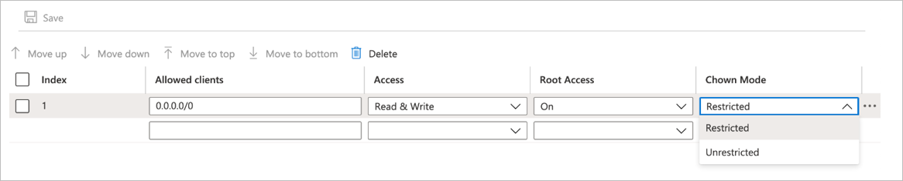

# Configure Unix permissions and change ownership mode for NFS and dual-protocol volumes

For Azure NetApp Files NFS volumes or dual-protocol volumes with the `Unix` security style, you have the option to set the **Unix permissions** and the **change ownership mode** (**`Chown Mode`**) options. You can specify these settings during volume creation or after volume creation. 

## Unix permissions   

The Azure NetApp Files **Unix Permissions** functionality enables you to specify change permissions for the mount path. The setting does not apply to the files under the mount path.   

The Unix permissions setting is set to `0770` by default. This default setting grants read, write, and execute permissions to the owner and the group, but no permissions are granted to other users. 

 You can specify a custom Unix permissions value (for example, `0755`) to give the desired permission to the owner, group, or other users.  

## Change ownership mode   

The change ownership mode (**`Chown Mode`**) functionality enables you to set the ownership management capabilities of files and directories.  You can specify or modify the setting under a volume's export policy. Two options for **`Chown Mode`** are available:   

* `Restricted` (default) - Only the root user can change the ownership of files and directories.
* `Unrestricted` - Non-root users can change the ownership for files and directories that they own.

## Considerations  

* The Unix permissions you specify apply only for the volume mount point (root directory).  
* You can modify the Unix permissions on the source volume *but not on the destination volume* that is in a cross-region replication configuration.

## Steps

1. You can specify the **Unix permissions** and change ownership mode (**`Chown Mode`**) settings under the **Protocol** tab when you [create an NFS volume](azure-netapp-files-create-volumes.md) or [create a dual-protocol volume](create-volumes-dual-protocol.md). 

    The following example shows the Create a Volume screen for an NFS volume. 

    

2. For existing NFS or dual-protocol volumes, you can set or modify **Unix permissions** and **change ownership mode** as follows:  

    1. To modify Unix permissions, right-click the **volume**, and select **Edit**. In the Edit window that appears, specify a value for **Unix Permissions**.  
        

    2. To modify the change ownership mode, click the **volume**, click **Export policy**, then modify the **`Chown Mode`** setting.  
        

## Next steps  

* [Create an NFS volume for Azure NetApp Files](azure-netapp-files-create-volumes.md)
* [Create a dual-protocol volume for Azure NetApp Files](create-volumes-dual-protocol.md) 
* [Configure export policy](azure-netapp-files-configure-export-policy.md)
