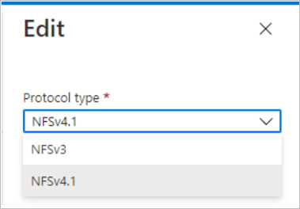

# Convert an NFS volume between NFSv3 and NFSv4.1

Azure NetApp Files provides an option that enables you to convert an NFS volume between NFSv3 and NFSv4.1.   

If an existing NFS volume that is exported through NFSv3 requires a protocol change to take advantage of NFSv4.1 features and performance, you can convert the protocol version from NFSv3 to NFSv4.1. Likewise, you can also convert an NFSv4.1 volume to NFSv3. 

Converting a volume between NFSv3 and NFSv4.1 does not require that you create a new volume and copy the data. The operation preserves the data and converts the volume export policies as part of the operation. As such, after the clients are prepared for the protocol change, they can remount the volume and access the data. 

> [!IMPORTANT]
> If you are changing the protocol of your production environment, you need to properly prepare for the conversion and test it.  
> 
> The conversion involves application downtime where clients are not able to access the volume in conversion. You need to plan for the following activities:  
>    * Before conversion, you need to unmount the volume from all clients. This operation might require shutdown of your applications that access the volume. 
>    * After successful volume conversion, you need to reconfigure each of the clients that access the volume before you can remount the volume. 
>
> If you convert from NFSv4.1 to NFSv3, all advanced NFSv4.1 features such as Access Control Lists (ACLs) and file locking will become unavailable.

## Considerations

* You cannot convert an NFSv4.1 volume with Kerberos enabled to NFSv3. 
* You cannot change the NFS version of a dual-protocol volume. 
* You cannot convert a single-protocol NFS volume to a dual-protocol volume, or the other way around. 
* You cannot convert a destination volume in a cross-region replication relationship. 
* Converting an NFSv4.1 volume to NFSv3 will cause all advanced NFSv4.1 features such as ACLs and file locking to become unavailable. 
* Converting a volume from NFSv3 to NFSv4.1 will cause the `.snapshot` directory to be hidden from NFSv4.1 clients. The directory will still be accessible.
* Converting a volume from NFSv4.1 to NFSv3 will cause the `.snapshot` directory to be visible. You can modify the properties of the volume to [hide the snapshot path](snapshots-edit-hide-path.md).

## Register the option 

The option to convert an NFS volume between NFSv3 and NFSv4.1 is currently in preview. If you are using this option for the first time, register the option before using it. 

> [!IMPORTANT]
> Until further communication, [Azure NetApp Files for Azure Government](azure-government.md) users should contact their account team to access this option instead of following the steps below.

1.  Register:

    ```azurepowershell-interactive
    Register-AzProviderFeature -ProviderNamespace Microsoft.NetApp -FeatureName ANFProtocolTypeNFSConversion
    ```

2. Check the status of the feature registration: 

    > [!NOTE]
    > The **RegistrationState** may be in the `Registering` state for up to 60 minutes before changing to `Registered`. Wait until the status is `Registered` before continuing.

    ```azurepowershell-interactive
    Get-AzProviderFeature -ProviderNamespace Microsoft.NetApp -FeatureName ANFProtocolTypeNFSConversion
    ```
You can also use [Azure CLI commands](/cli/azure/feature) `az feature register` and `az feature show` to register the feature and display the registration status. 

## Convert from NFSv3 to NFSv4.1

In this example, you have an NFSv3 volume, but you want to use NFSv4.1 features. You are not using an LDAP integration or plan to use Kerberos for NFSv4.1.  

This section shows you how to convert the NFSv3 volume to NFSv4.1. 

1. Before converting the volume, unmount it from the clients in preparation. See [Mount or unmount a volume](azure-netapp-files-mount-unmount-volumes-for-virtual-machines.md).  

    Example:   
    `sudo umount /path/to/vol1`

2. Convert the NFS version:

    1. In the Azure portal, navigate to the NFS volume that you want to convert.
    2. Select **Edit**.
    3. In the Edit window that appears, select **NSFv4.1** in the **Protocol type** pulldown.  
    
       
    
3. Wait for the conversion operation to complete. 

4. Reconfigure your Linux client to enable NFSv4.1 protocol. See [Configure NFSv4.1 default domain for Azure NetApp Files](azure-netapp-files-configure-nfsv41-domain.md).

5. On all clients, change the NFS protocol version in your mount command (that is, `/etc/fstab`) from `vers=3` to `vers=4.1`.

6. Remount the volume on the clients. See [Mount or unmount a volume](azure-netapp-files-mount-unmount-volumes-for-virtual-machines.md). 

7. On the clients, run `mount –v` and locate your volume in the list. Verify in the output that the version shows **`nfsvers=4.1`**. 

    Example:   
    `mount -v | grep /path/to/vol1`  
    `vol1:/path/to/vol1 on /path type nfs (rw,intr,tcp,nfsvers=4.1,rsize=16384,wsize=16384,addr=192.168.1.1)`

8. Verify access using root and non-root users. 

## Convert from NFSv4.1 to NFSv3

In this example, you have an existing NFSv4.1 volume that you want to convert to NFSv3.  

This section shows you how to convert the NFSv4.1 volume to NFSv3.

> [!IMPORTANT]
> Converting a volume from NFSv4.1 to NFSv3 will result in all NFSv4.1 features such as ACLs and file locking to become unavailable. 

1. Before converting the volume:
    1. Unmount it from the clients in preparation. See [Mount or unmount a volume](azure-netapp-files-mount-unmount-volumes-for-virtual-machines.md).  
        Example:   
        `sudo umount /path/to/vol1`
    2. Change the export policy to read-only. See [Configure export policy for NFS or dual-protocol volumes](azure-netapp-files-configure-export-policy.md).

2. Convert the NFS version:

    1. In the Azure portal, navigate to the NFS volume that you want to convert.
    2. Select **Edit**.
    3. In the Edit window that appears, select **NSFv3** in the **Protocol type** pulldown.  
    
       
    
3. Wait for the conversion operation to complete. 

4. On all clients, change the NFS protocol version in your mount command (that is, `/etc/fstab`) from `vers=4.1` to `vers=3`.

5. Remount the volume on the clients. See [Mount or unmount a volume](azure-netapp-files-mount-unmount-volumes-for-virtual-machines.md). 

6. On the clients, run `mount –v` and locate your volume in the list. Verify in the output that the version shows **`nfsvers=3`**. 

    Example:   
    `mount -v | grep /path/to/vol1`  
    `vol1:/path/to/vol1 on /path type nfs (rw,intr,tcp,nfsvers=3,rsize=16384,wsize=16384,addr=192.168.1.1)`.

7. Change the read-only export policy back to the original export policy. See See [Configure export policy for NFS or dual-protocol volumes](azure-netapp-files-configure-export-policy.md).

8. Verify access using root and non-root users.

## Next steps  

* [Create an NFS volume for Azure NetApp Files](azure-netapp-files-create-volumes.md)
* [Mount or unmount a volume](azure-netapp-files-mount-unmount-volumes-for-virtual-machines.md)
* [Configure access control lists on NFSv4.1 with Azure NetApp Files](configure-access-control-lists.md)
