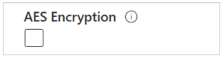
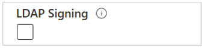
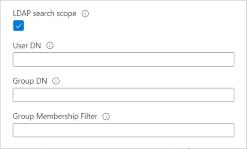
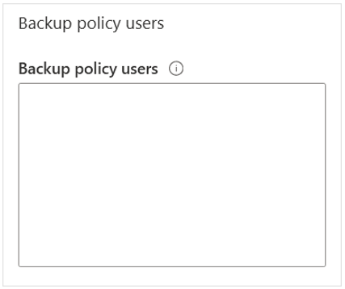
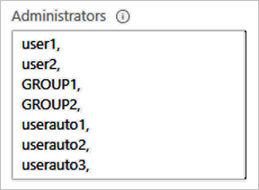

# Create and manage Active Directory connections for Azure NetApp Files

Several features of Azure NetApp Files require that you have an Active Directory connection. For example, you need to have an Active Directory connection before you can create an [SMB volume](azure-netapp-files-create-volumes-smb.md), a [NFSv4.1 Kerberos volume](configure-kerberos-encryption.md), or a [dual-protocol volume](create-volumes-dual-protocol.md). This article shows you how to create and manage Active Directory connections for Azure NetApp Files.

## <a name="requirements-for-active-directory-connections"></a>Requirements and considerations for Active Directory connections

> [!IMPORTANT]
> You must follow guidelines described in [Understand guidelines for Active Directory Domain Services site design and planning for Azure NetApp Files](understand-guidelines-active-directory-domain-service-site.md) for Active Directory Domain Services (AD DS) or Azure Active Directory Domain Services (Azure AD DS) used with Azure NetApp Files. 
> In addition, before creating the AD connection, review [Modify Active Directory connections for Azure NetApp Files](modify-active-directory-connections.md) to understand the impact of making changes to the AD connection configuration options after the AD connection has been created. Changes to the AD connection configuration options are disruptive to client access and some options cannot be changed at all.

* An Azure NetApp Files account must be created in the region where the Azure NetApp Files volumes are deployed.

* You can configure only one Active Directory (AD) connection per subscription per region. 

    Azure NetApp Files doesn’t support multiple AD connections in a single region, even if the AD connections are created in different NetApp accounts. However, you can have multiple AD connections in a single subscription if the AD connections are in different regions. If you need multiple AD connections in a single region, you can use separate subscriptions to do so. 

    The AD connection is visible only through the NetApp account it's created in. However, you can enable the Shared AD feature to allow NetApp accounts that are under the same subscription and same region to use the same AD connection. See [Map multiple NetApp accounts in the same subscription and region to an AD connection](#shared_ad). 

* The Azure NetApp Files AD connection admin account must have the following properties: 
    * It must be an AD DS domain user account in the same domain where the Azure NetApp Files computer accounts are created. 
    * It must have the permission to create computer accounts (for example, AD domain join) in the AD DS organizational unit path specified in the **Organizational unit path option** of the AD connection. 
    * It cannot be a [Group Managed Service Account](/windows-server/security/group-managed-service-accounts/group-managed-service-accounts-overview).

* The AD connection admin account supports Kerberos AES-128 and Kerberos AES-256 encryption types for authentication with AD DS for Azure NetApp Files computer account creation (for example, AD domain join operations).

* To enable the AES encryption on the Azure NetApp Files AD connection admin account, you must use an AD domain user account that is a member of one of the following AD DS groups: 

    * Domain Admins 
    * Enterprise Admins 
    * Administrators 
    * Account Operators 
    * Azure AD DS Administrators _(Azure AD DS Only)_
    * Alternatively, an AD domain user account with `msDS-SupportedEncryptionTypes` write permission on the AD connection admin account can also be used to set the Kerberos encryption type property on the AD connection admin account. 

    >[!NOTE]
    >It's _not_ recommended nor required to add the Azure NetApp Files AD admin account to the AD domain groups listed above. Nor is it recommended or required to grant `msDS-SupportedEncryptionTypes` write permission to the Azure NetApp Files AD admin account.  

    If you set both AES-128 and AES-256 Kerberos encryption on the admin account of the AD connection, the highest level of encryption supported by your AD DS will be used.

* To enable AES encryption support for the admin account in the AD connection, run the following Active Directory PowerShell commands:

    ```powershell
    Get-ADUser -Identity <ANF AD connection account username>
    Set-ADUser -KerberosEncryptionType <encryption_type>
    ```

    `KerberosEncryptionType` is a multivalued parameter that supports AES-128 and AES-256 values. 

    For more information, refer to the [Set-ADUser documentation](/powershell/module/activedirectory/set-aduser).

* If you have a requirement to enable and disable certain Kerberos encryption types for Active Directory computer accounts for domain-joined Windows hosts used with Azure NetApp Files, you must use the Group Policy  `Network Security: Configure Encryption types allowed for Kerberos`.

    Do not set the registry key `HKEY_LOCAL_MACHINE\Software\Microsoft\Windows\CurrentVersion\Policies\System\Kerberos\Parameters\SupportedEncryptionTypes`. Doing this will break Kerberos authentication with Azure NetApp Files for the Windows host where this registry key was manually set.

    >[!NOTE]
    >The default policy setting for `Network Security: Configure Encryption types allowed for Kerberos` is `Not Defined`. When this policy setting is set to `Not Defined`, all encryption types except DES will be available for Kerberos encryption. You have the option to enable support for only certain Kerberos encryption types (for example, `AES128_HMAC_SHA1` or `AES256_HMAC_SHA1`). However, the default policy should be sufficient in most cases when enabling AES encryption support with Azure NetApp Files.

    For more information, refer to [Network security: Configure encryption types allowed for Kerberos](/windows/security/threat-protection/security-policy-settings/network-security-configure-encryption-types-allowed-for-kerberos) or [Windows Configurations for Kerberos Supported Encryption Types](/archive/blogs/openspecification/windows-configurations-for-kerberos-supported-encryption-type)

* LDAP queries take effect only in the domain specified in the Active Directory connections (the **AD DNS Domain Name** field). This behavior applies to NFS, SMB, and dual-protocol volumes.

## Create an Active Directory connection

1. From your NetApp account, select **Active Directory connections**, then select **Join**.  

    

    >[!NOTE]
    >Azure NetApp Files supports only one Active Directory connection within the same region and the same subscription. 

2. In the Join Active Directory window, provide the following information, based on the Domain Services you want to use:  

    * **Primary DNS (required)**  
        This is the IP address of the primary DNS server that is required for Active Directory domain join operations, SMB authentication, Kerberos, and LDAP operations.

    * **Secondary DNS**   
        This is the IP address of the secondary DNS server that is required for Active Directory domain join operations, SMB authentication, Kerberos, and LDAP operations.
        
        >[!NOTE]
        >It is recommended that you configure a Secondary DNS server. See [Understand guidelines for Active Directory Domain Services site design and planning for Azure NetApp Files](understand-guidelines-active-directory-domain-service-site.md). Ensure that your DNS server configuration meets the requirements for Azure NetApp Files. Otherwise, Azure NetApp Files service operations, SMB authentication, Kerberos, or LDAP operations might fail.

        If you use Azure AD DS (Azure AD DS), you should use the IP addresses of the Azure AD DS domain controllers for Primary DNS and Secondary DNS respectively. 
    * **AD DNS Domain Name (required)**  
       This is the fully qualified domain name of the AD DS that will be used with Azure NetApp Files (for example, `contoso.com`).
    * **AD Site Name (required)**  
        This is the AD DS site name that will be used by Azure NetApp Files for domain controller discovery.  
        
        The default site name for both AD DS and Azure AD DS is `Default-First-Site-Name`. Follow the [naming conventions for site names](/troubleshoot/windows-server/identity/naming-conventions-for-computer-domain-site-ou#site-names) if you want to rename the site name.

         >[!NOTE]
         > See [Understand guidelines for Active Directory Domain Services site design and planning for Azure NetApp Files](understand-guidelines-active-directory-domain-service-site.md). Ensure that your AD DS site design and configuration meets the requirements for Azure NetApp Files. Otherwise, Azure NetApp Files service operations, SMB authentication, Kerberos, or LDAP operations might fail.

    * **SMB server (computer account) prefix (required)**  
        This is the naming prefix for new computer accounts created in AD DS for Azure NetApp Files SMB, dual protocol, and NFSv4.1 Kerberos volumes. 

        For example, if the naming standard that your organization uses for file services is `NAS-01`, `NAS-02`, and so on, then you would use `NAS` for the prefix. 
    
        Azure NetApp Files will create additional computer accounts in AD DS as needed. 
    
        >[!IMPORTANT]
        >Renaming the SMB server prefix after you create the Active Directory connection is disruptive. You will need to re-mount existing SMB shares after renaming the SMB server prefix. 

    * **Organizational unit path**  
        This is the LDAP path for the organizational unit (OU) where SMB server computer accounts will be created. That is, `OU=second level, OU=first level`. For example, if you want to use an OU called `ANF` created at the root of the domain, the value would be `OU=ANF`.

        If no value is provided, Azure NetApp Files will use the `CN=Computers` container. 

        If you're using Azure NetApp Files with Azure Active Directory Domain Services (Azure AD DS), the organizational unit path is `OU=AADDC Computers`

        :::image type="content" source="../media/azure-netapp-files/azure-netapp-files-join-active-directory.png" alt-text="Screenshot of the Join Active Directory input fields.":::

    * <a name="aes-encryption"></a>**AES Encryption**    
        This option enables AES encryption authentication support for the admin account of the AD connection. 

         
        
        See [Requirements for Active Directory connections](#requirements-for-active-directory-connections) for requirements.

    * <a name="ldap-signing"></a>**LDAP Signing**   

        This option enables LDAP signing. This functionality enables integrity verification for Simple Authentication and Security Layer (SASL) LDAP binds from Azure NetApp Files and the user-specified [Active Directory Domain Services domain controllers](/windows/win32/ad/active-directory-domain-services). 
        
        Azure NetApp Files supports LDAP Channel Binding if both LDAP Signing and LDAP over TLS settings options are enabled in the Active Directory Connection. For more information, see [ADV190023 | Microsoft Guidance for Enabling LDAP Channel Binding and LDAP Signing](https://portal.msrc.microsoft.com/en-us/security-guidance/advisory/ADV190023).  

        >[!NOTE]
        >DNS PTR records for the AD DS computer account(s) must be created in the AD DS **Organizational Unit** specified in the Azure NetApp Files AD connection for LDAP Signing to work.

         

    * **Allow local NFS users with LDAP**
        This option enables local NFS client users to access to NFS volumes. Setting this option disables extended groups for NFS volumes. It also limits the number of groups to 16. For more information, see [Allow local NFS users with LDAP to access a dual-protocol volume](create-volumes-dual-protocol.md#allow-local-nfs-users-with-ldap-to-access-a-dual-protocol-volume). 

    * **LDAP over TLS**   

        This option enables LDAP over TLS for secure communication between an Azure NetApp Files volume and the Active Directory LDAP server. You can enable LDAP over TLS for NFS, SMB, and dual-protocol volumes of Azure NetApp Files. 
        
        >[!NOTE]
        >LDAP over TLS must not be enabled if you're using Azure Active Directory Domain Services (Azure AD DS). Azure AD DS uses LDAPS (port 636) to secure LDAP traffic instead of LDAP over TLS (port 389). 
        
        For more information, see [Enable Active Directory Domain Services (AD DS) LDAP authentication for NFS volumes](configure-ldap-over-tls.md).

    * **Server root CA Certificate** 
        
        This option uploads the CA certificate used with LDAP over TLS. 
        
        For more information, see [Enable Active Directory Domain Services (AD DS) LDAP authentication for NFS volumes](configure-ldap-over-tls.md).  

    * **LDAP Search Scope**, **User DN**, **Group DN**, and **Group Membership Filter**  

        The **LDAP search scope** option optimizes Azure NetApp Files storage LDAP queries for use with large AD DS topologies and LDAP with extended groups or Unix security style with an Azure NetApp Files dual-protocol volume. 
        
        The **User DN** and **Group DN** options allow you to set the search base in AD DS LDAP.  
         
        The **Group Membership Filter** option allows you to create a custom search filter for users who are members of specific AD DS groups. 

        

        See [Configure AD DS LDAP with extended groups for NFS volume access](configure-ldap-extended-groups.md#ldap-search-scope) for information about these options.

    * <a name="preferred-server-ldap"></a> **Preferred server for LDAP client**

        The **Preferred server for LDAP client** option allows you to submit the IP addresses of up to two AD servers as a comma-separated list. Rather than sequentially contacting all of the discovered AD services for a domain, the LDAP client will contact the specified servers first. 

    * <a name="encrypted-smb-dc"></a> **Encrypted SMB connections to Domain Controller**
        
        **Encrypted SMB connections to Domain Controller** specifies whether encryption should be used for communication between an SMB server and domain controller. When enabled, only SMB3 will be used for encrypted domain controller connections.

        This feature is currently in preview. If this is your first time using Encrypted SMB connections to domain controller, you must register it: 

        ```azurepowershell-interactive
        Register-AzProviderFeature -ProviderNamespace Microsoft.NetApp -FeatureName  ANFEncryptedSMBConnectionsToDC 
        ```

        Check the status of the feature registration: 

        > [!NOTE]
        > The **RegistrationState** may be in the `Registering` state for up to 60 minutes before changing to`Registered`. Wait until the status is `Registered` before continuing.
        ```azurepowershell-interactive
        Get-AzProviderFeature -ProviderNamespace Microsoft.NetApp -FeatureName  ANFEncryptedSMBConnectionsToDC 
        ```

        You can also use [Azure CLI commands](/cli/azure/feature) `az feature register` and `az feature show` to register the feature and display the registration status. 

    * <a name="backup-policy-users"></a> **Backup policy users**
        This option grants addition security privileges to AD DS domain users or groups that require elevated backup privileges to support backup, restore, and migration workflows in Azure NetApp Files. The specified AD DS user accounts or groups will have elevated NTFS permissions at the file or folder level.

         

        The following privileges apply when you use the **Backup policy users**  setting:

        | Privilege | Description |
        |---|---|
        | `SeBackupPrivilege` | Back up files and directories, overriding any ACLs.  |
        | `SeRestorePrivilege` |  Restore files and directories, overriding any ACLs. <br> Set any valid user or group SID as the file owner. |
        | `SeChangeNotifyPrivilege` |  Bypass traverse checking. <br> Users with this privilege aren't required to have traversed (`x`) permissions to traverse folders or symlinks.  |

     * **Security privilege users**   <!-- SMB CA share feature -->   
        This option grants security privilege (`SeSecurityPrivilege`) to AD DS domain users or groups that require elevated privileges to access Azure NetApp Files volumes. The specified AD DS users or groups will be allowed to perform certain actions on SMB shares that require security privilege not assigned by default to domain users.

         

        The following privilege applies when you use the **Security privilege users** setting:

        |  Privilege  |  Description  |
        |---|---|
        |  `SeSecurityPrivilege`  |  Manage log operations.  |

        This feature is used for installing SQL Server in certain scenarios where a non-administrator AD DS domain account must temporarily be granted elevated security privilege.

        >[!NOTE]
        > Using the Security privilege users feature relies on the [SMB Continuous Availability Shares feature](azure-netapp-files-create-volumes-smb.md#continuous-availability). SMB Continuous Availability is **not** supported on custom applications. It is is only supported for workloads using Citrix App Laying, [FSLogix user profile containers](../virtual-desktop/create-fslogix-profile-container.md), and Microsoft SQL Server (not Linux SQL Server).

        > [!IMPORTANT]
        > Using the **Security privilege users** feature requires that you submit a waitlist request through the **[Azure NetApp Files SMB Continuous Availability Shares Public Preview waitlist submission page](https://aka.ms/anfsmbcasharespreviewsignup)**. Wait for an official confirmation email from the Azure NetApp Files team before using this feature.  
        >This feature is optional and supported only with SQL server. The AD DS domain account used for installing SQL server must already exist before you add it to the **Security privilege users** option. When you add the SQL Server installer account to **Security privilege users** option, the Azure NetApp Files service might validate the account by contacting an AD DS domain controller. This action might fail if Azure NetApp Files cannot contact the AD DS domain controller.
        
        For more information about `SeSecurityPrivilege` and SQL Server, see [SQL Server installation fails if the Setup account doesn't have certain user rights](/troubleshoot/sql/install/installation-fails-if-remove-user-right).

    * <a name="administrators-privilege-users"></a>**Administrators privilege users** 

        This option grants additional security privileges to AD DS domain users or groups that require elevated privileges to access the Azure NetApp Files volumes. The specified accounts will have elevated permissions at the file or folder level.

         

        The following privileges apply when you use the **Administrators privilege users** setting:

        |  Privilege  |  Description  |
        |---|---|
        |  `SeBackupPrivilege`  |  Back up files and directories, overriding any ACLs. |  
        |  `SeRestorePrivilege`  |  Restore files and directories, overriding any ACLs. <br> Set any valid user or group SID as the file owner.  |  
        |  `SeChangeNotifyPrivilege`  |  Bypass traverse checking. <br> Users with this privilege aren't required to have traverse (`x`) permissions to traverse folders or symlinks.  |  
        |  `SeTakeOwnershipPrivilege`  |  Take ownership of files or other objects. |  
        |  `SeSecurityPrivilege`  |  Manage log operations. |  
        |  `SeChangeNotifyPrivilege`  |  Bypass traverse checking. <br> Users with this privilege aren't required to have traverse (`x`) permissions to traverse folders or symlinks.  | 

    * Credentials, including your **username** and **password**

        

        >[!IMPORTANT]
        >Although Active Directory supports 256-character passwords, Active Directory passwords with Azure NetApp Files **cannot** exceed 64 characters. 

3. Select **Join**.  

    The Active Directory connection you created appears.

    

## <a name="shared_ad"></a>Map multiple NetApp accounts in the same subscription and region to an AD connection  

The Shared AD feature enables all NetApp accounts to share an Active Directory (AD) connection created by one of the NetApp accounts that belong to the same subscription and the same region. For example, using this feature, all NetApp accounts in the same subscription and region can use the common AD configuration to create an [SMB volume](azure-netapp-files-create-volumes-smb.md), a [NFSv4.1 Kerberos volume](configure-kerberos-encryption.md), or a [dual-protocol volume](create-volumes-dual-protocol.md). When you use this feature, the AD connection will be visible in all NetApp accounts that are under the same subscription and same region.   

This feature is currently in preview. You need to register the feature before using it for the first time. After registration, the feature is enabled and works in the background. No UI control is required. 

1. Register the feature: 

    ```azurepowershell-interactive
    Register-AzProviderFeature -ProviderNamespace Microsoft.NetApp -FeatureName ANFSharedAD
    ```

2. Check the status of the feature registration: 

    > [!NOTE]
    > The **RegistrationState** may be in the `Registering` state for up to 60 minutes before changing to`Registered`. Wait until the status is **Registered** before continuing.

    ```azurepowershell-interactive
    Get-AzProviderFeature -ProviderNamespace Microsoft.NetApp -FeatureName ANFSharedAD
    ```
You can also use [Azure CLI commands](/cli/azure/feature) `az feature register` and `az feature show` to register the feature and display the registration status. 

## <a name="reset-active-directory"></a> Reset Active Directory computer account password

If you accidentally reset the password of the AD computer account on the AD server or the AD server is unreachable, you can safely reset the computer account password to preserve connectivity to your volumes. A reset affects all volumes on the SMB server. 

### Register the feature

The reset Active Directory computer account password feature is currently in public preview. If you're using this feature for the first time, you need to register the feature first.

1. Register the **reset Active Directory computer account password** feature:   
```azurepowershell-interactive
Register-AzProviderFeature -ProviderNamespace Microsoft.NetApp -FeatureName ANFResetADAccountForVolume
```
2.   Check the status of the feature registration. The **RegistrationState** may be in the `Registering` state for up to 60 minutes before changing to`Registered`. Wait until the status is `Registered` before continuing.
```azurepowershell-interactive
Get-AzProviderFeature -ProviderNamespace Microsoft.NetApp -FeatureName ANFResetADAccountForVolume
```
You can also use [Azure CLI commands](/cli/azure/feature) `az feature register` and `az feature show` to register the feature and display the registration status.  

### Steps

1. Navigate to the volume **Overview** menu. Select **Reset Active Directory Account**.
:::image type="content" source="../media/azure-netapp-files/active-directory-reset-overview.png" alt-text="Azure Volume Overview interface with the Reset Active Directory Account button highlighted." lightbox="../media/azure-netapp-files/active-directory-reset-overview.png":::
Alternately, navigate to the **Volumes** menu. Identify the volume for which you want to reset the Active Directory account and select the three dots (`...`) at the end of the row. Select **Reset Active Directory Account**.
:::image type="content" source="../media/azure-netapp-files/active-directory-reset-list.png" alt-text="Azure volume list with the Reset Active Directory Account button highlighted." lightbox="../media/azure-netapp-files/active-directory-reset-list.png":::
2. A warning message that explains the implications of this action will pop up. Type **yes** in the text box to proceed.
:::image type="content" source="../media/azure-netapp-files/active-directory-reset-confirm.png" alt-text="Reset Active Directory Account warning message that reads: Warning! This action will reset the active directory account for the volume. This action is intended for users to regain access to volumes at their disposal and can cause data to be unreachable if executed when not needed." lightbox="../media/azure-netapp-files/active-directory-reset-confirm.png":::

## Next steps  

* [Understand guidelines for Active Directory Domain Services site design and planning for Azure NetApp Files](understand-guidelines-active-directory-domain-service-site.md)
* [Modify Active Directory connections](modify-active-directory-connections.md)
* [Create an SMB volume](azure-netapp-files-create-volumes-smb.md)
* [Create a dual-protocol volume](create-volumes-dual-protocol.md)
* [Configure NFSv4.1 Kerberos encryption](configure-kerberos-encryption.md)
* [Install a new Active Directory forest using Azure CLI](/windows-server/identity/ad-ds/deploy/virtual-dc/adds-on-azure-vm) 
* [Enable Active Directory Domain Services (AD DS) LDAP authentication for NFS volumes](configure-ldap-over-tls.md)
* [AD DS LDAP with extended groups for NFS volume access](configure-ldap-extended-groups.md)
