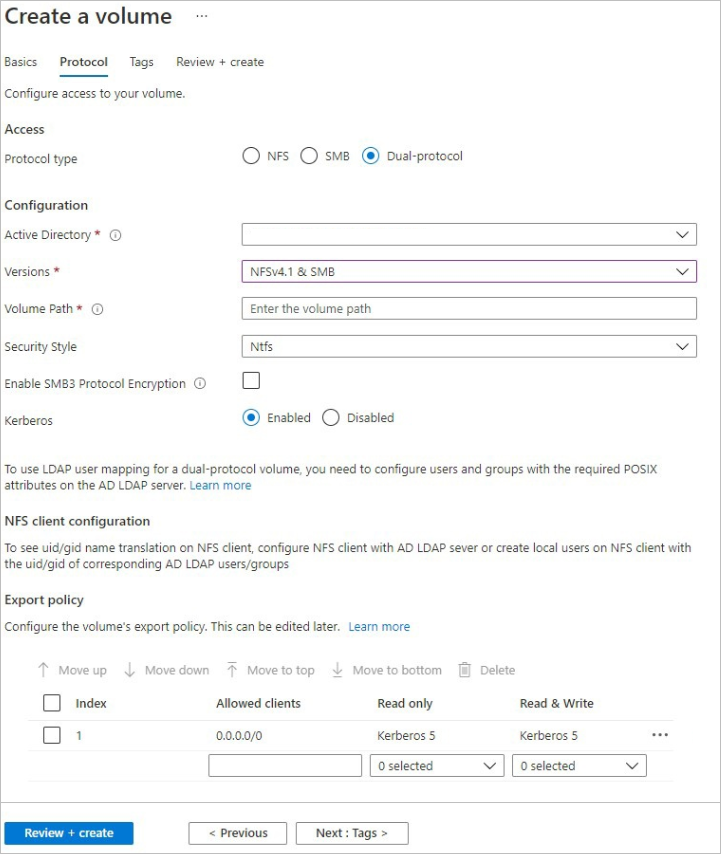

# Create a dual-protocol (NFSv3 and SMB) volume for Azure NetApp Files

Azure NetApp Files supports creating volumes using NFS (NFSv3 and NFSv4.1), SMB3, or dual protocol. This article shows you how to create a volume that uses the dual protocol of NFSv3 and SMB with support for LDAP user mapping. 

To create NFS volumes, see [Create an NFS volume](azure-netapp-files-create-volumes.md). To create SMB volumes, see [Create an SMB volume](azure-netapp-files-create-volumes-smb.md). 

## Before you begin 

* You must have already created a capacity pool.  
    See [Set up a capacity pool](azure-netapp-files-set-up-capacity-pool.md).   
* A subnet must be delegated to Azure NetApp Files.  
    See [Delegate a subnet to Azure NetApp Files](azure-netapp-files-delegate-subnet.md).

## Considerations

* Ensure that you meet the [Requirements for Active Directory connections](create-active-directory-connections.md#requirements-for-active-directory-connections). 
* Create a reverse lookup zone on the DNS server and then add a pointer (PTR) record of the AD host machine in that reverse lookup zone. Otherwise, the dual-protocol volume creation will fail.
* Ensure that the NFS client is up to date and running the latest updates for the operating system.
* Ensure that the Active Directory (AD) LDAP server is up and running on the AD. You can do so by installing and configuring the [Active Directory Lightweight Directory Services (AD LDS)](/previous-versions/windows/it-pro/windows-server-2012-r2-and-2012/hh831593(v=ws.11)) role on the AD machine.
* Dual-protocol volumes do not currently support Azure Active Directory Domain Services (AADDS). LDAP over TLS must not be enabled if you are using AADDS.
* The NFS version used by a dual-protocol volume is NFSv3. As such, the following considerations apply:
    * Dual protocol does not support the Windows ACLS extended attributes `set/get` from NFS clients.
    * NFS clients cannot change permissions for the NTFS security style, and Windows clients cannot change permissions for UNIX-style dual-protocol volumes.   

    The following table describes the security styles and their effects:  
    
    | Security style 	| Clients that can modify permissions 	| Permissions that clients can use 	| Resulting effective security style 	| Clients that can access files 	|
    |-	|-	|-	|-	|-	|
    | `Unix` 	| NFS 	| NFSv3 mode bits 	| UNIX 	| NFS and Windows	|
    | `Ntfs` 	| Windows 	| NTFS ACLs 	| NTFS 	|NFS and Windows|
* UNIX users mounting the NTFS security style volume using NFS will be authenticated as Windows user `root` for UNIX `root` and `pcuser` for all other users. Make sure that these user accounts exist in your Active Directory prior to mounting the volume when using NFS. 
* If you have large topologies, and you use the `Unix` security style with a dual-protocol volume or LDAP with extended groups, Azure NetApp Files might not be able to access all servers in your topologies.  If this situation occurs, contact your account team for assistance.  <!-- NFSAAS-15123 --> 
* You don't need a server root CA certificate for creating a dual-protocol volume. It is required only if LDAP over TLS is enabled.


## Create a dual-protocol volume

1.	Click the **Volumes** blade from the Capacity Pools blade. Click **+ Add volume** to create a volume. 

     

2.	In the Create a Volume window, click **Create**, and provide information for the following fields under the Basics tab:   
    * **Volume name**      
        Specify the name for the volume that you are creating.   

        A volume name must be unique within each capacity pool. It must be at least three characters long. You can use any alphanumeric characters.   

        You cannot use `default` or `bin` as the volume name.

    * **Capacity pool**  
        Specify the capacity pool where you want the volume to be created.

    * **Quota**  
        Specify the amount of logical storage that is allocated to the volume.  

        The **Available quota** field shows the amount of unused space in the chosen capacity pool that you can use towards creating a new volume. The size of the new volume must not exceed the available quota.  

    * **Throughput (MiB/S)**   
        If the volume is created in a manual QoS capacity pool, specify the throughput you want for the volume.   

        If the volume is created in an auto QoS capacity pool, the value displayed in this field is (quota x service level throughput).   

    * **Virtual network**  
        Specify the Azure virtual network (VNet) from which you want to access the volume.  

        The Vnet you specify must have a subnet delegated to Azure NetApp Files. The Azure NetApp Files service can be accessed only from the same Vnet or from a Vnet that is in the same region as the volume through Vnet peering. You can also access the volume from  your on-premises network through Express Route.   

    * **Subnet**  
        Specify the subnet that you want to use for the volume.  
        The subnet you specify must be delegated to Azure NetApp Files. 
        
        If you have not delegated a subnet, you can click **Create new** on the Create a Volume page. Then in the Create Subnet page, specify the subnet information, and select **Microsoft.NetApp/volumes** to delegate the subnet for Azure NetApp Files. In each Vnet, only one subnet can be delegated to Azure NetApp Files.   
 
        
    
        

    * If you want to apply an existing snapshot policy to the volume, click **Show advanced section** to expand it, specify whether you want to hide the snapshot path, and select a snapshot policy in the pull-down menu. 

        For information about creating a snapshot policy, see [Manage snapshot policies](azure-netapp-files-manage-snapshots.md#manage-snapshot-policies).

        

3. Click **Protocol**, and then complete the following actions:  
    * Select **dual-protocol (NFSv3 and SMB)** as the protocol type for the volume.   

    * Specify the **Volume path** for the volume.   
    This volume path is the name of the shared volume. The name must start with an alphabetical character, and it must be unique within each subscription and each region.  

    * Specify the **Security Style** to use: NTFS (default) or UNIX.

    * If you want to enable SMB3 protocol encryption for the dual-protocol volume, select **Enable SMB3 Protocol Encryption**.   

        This feature enables encryption for only in-flight SMB3 data. It does not encrypt NFSv3 in-flight data. SMB clients not using SMB3 encryption will not be able to access this volume. Data at rest is encrypted regardless of this setting. See [SMB Encryption FAQs](azure-netapp-files-faqs.md#smb-encryption-faqs) for additional information. 

        The **SMB3 Protocol Encryption** feature is currently in preview. If this is your first time using this feature, register the feature before using it: 

        ```azurepowershell-interactive
        Register-AzProviderFeature -ProviderNamespace Microsoft.NetApp -FeatureName ANFSMBEncryption
        ```

        Check the status of the feature registration: 

        > [!NOTE]
        > The **RegistrationState** may be in the `Registering` state for up to 60 minutes before changing to`Registered`. Wait until the status is `Registered` before continuing.

        ```azurepowershell-interactive
        Get-AzProviderFeature -ProviderNamespace Microsoft.NetApp -FeatureName ANFSMBEncryption
        ```
        
        You can also use [Azure CLI commands](/cli/azure/feature?preserve-view=true&view=azure-cli-latest) `az feature register` and `az feature show` to register the feature and display the registration status.  

    * Optionally, [configure export policy for the volume](azure-netapp-files-configure-export-policy.md).

    

4. Click **Review + Create** to review the volume details. Then click **Create** to create the volume.

    The volume you created appears in the Volumes page. 
 
    A volume inherits subscription, resource group, location attributes from its capacity pool. To monitor the volume deployment status, you can use the Notifications tab.

## Allow local NFS users with LDAP to access a dual-protocol volume 

You can enable local NFS client users not present on the Windows LDAP server to access a dual-protocol volume that has LDAP with extended groups enabled. To do so, enable the **Allow local NFS users with LDAP** option as follows:

1. Click **Active Directory connections**.  On an existing Active Directory connection, click the context menu (the three dots `…`), and select **Edit**.  

2. On the **Edit Active Directory settings** window that appears, select the **Allow local NFS users with LDAP** option.  

      


## Manage LDAP POSIX Attributes

You can manage POSIX attributes such as UID, Home Directory, and other values by using the Active Directory Users and Computers MMC snap-in.  The following example shows the Active Directory Attribute Editor:  

 

You need to set the following attributes for LDAP users and LDAP groups: 
* Required attributes for LDAP users:   
    `uid: Alice`, `uidNumber: 139`, `gidNumber: 555`, `objectClass: posixAccount`
* Required attributes for LDAP groups:   
    `objectClass: posixGroup`, `gidNumber: 555`

## Configure the NFS client 

Follow instructions in [Configure an NFS client for Azure NetApp Files](configure-nfs-clients.md) to configure the NFS client.  

## Next steps  

* [Configure an NFS client for Azure NetApp Files](configure-nfs-clients.md)
* [Troubleshoot SMB or dual-protocol volumes](troubleshoot-dual-protocol-volumes.md)
* [Troubleshoot LDAP volume issues](troubleshoot-ldap-volumes.md)
