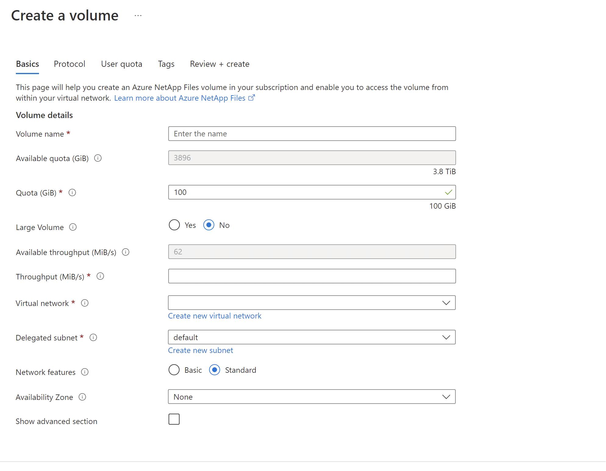

# Create a dual-protocol volume for Azure NetApp Files

Azure NetApp Files supports creating volumes using NFS (NFSv3 or NFSv4.1), SMB3, or dual protocol (NFSv3 and SMB, or NFSv4.1 and SMB). This article shows you how to create a volume that uses dual protocol with support for LDAP user mapping. 

To create NFS volumes, see [Create an NFS volume](azure-netapp-files-create-volumes.md). To create SMB volumes, see [Create an SMB volume](azure-netapp-files-create-volumes-smb.md). 

## Before you begin 

* You must have already created a capacity pool.  
    See [Create a capacity pool](azure-netapp-files-set-up-capacity-pool.md).   
* A subnet must be delegated to Azure NetApp Files.  
    See [Delegate a subnet to Azure NetApp Files](azure-netapp-files-delegate-subnet.md).

## Considerations

* Ensure that you meet the [Requirements for Active Directory connections](create-active-directory-connections.md#requirements-for-active-directory-connections). 
* Create a reverse lookup zone on the DNS server and then add a pointer (PTR) record of the AD host machine in that reverse lookup zone. Otherwise, the dual-protocol volume creation will fail.
* The **Allow local NFS users with LDAP** option in Active Directory connections intends to provide occasional and temporary access to local users. When this option is enabled, user authentication and lookup from the LDAP server stop working, and the number of group memberships that Azure NetApp Files will support will be limited to 16.  As such, you should keep this option *disabled* on Active Directory connections, except for the occasion when a local user needs to access LDAP-enabled volumes. In that case, you should disable this option as soon as local user access is no longer required for the volume. See [Allow local NFS users with LDAP to access a dual-protocol volume](#allow-local-nfs-users-with-ldap-to-access-a-dual-protocol-volume) about managing local user access.
* Ensure that the NFS client is up to date and running the latest updates for the operating system.
* Dual-protocol volumes support both Active Directory Domain Services (ADDS) and Azure Active Directory Domain Services (AADDS). 
* Dual-protocol volumes do not support the use of LDAP over TLS with AADDS. See [LDAP over TLS considerations](configure-ldap-over-tls.md#considerations).
* The NFS version used by a dual-protocol volume can be NFSv3 or NFSv4.1. The following considerations apply:
    * Dual protocol does not support the Windows ACLS extended attributes `set/get` from NFS clients.
    * NFS clients cannot change permissions for the NTFS security style, and Windows clients cannot change permissions for UNIX-style dual-protocol volumes.   

        The following table describes the security styles and their effects:  
        
        | Security style 	| Clients that can modify permissions 	| Permissions that clients can use 	| Resulting effective security style 	| Clients that can access files 	|
        |-	|-	|-	|-	|-	|
        | `Unix` 	| NFS 	| NFSv3 or NFSv4.1 mode bits 	| UNIX 	| NFS and Windows	|
        | `Ntfs` 	| Windows 	| NTFS ACLs 	| NTFS 	|NFS and Windows|

    * The direction in which the name mapping occurs (Windows to UNIX, or UNIX to Windows) depends on which protocol is used and which security style is applied to a volume. A Windows client always requires a Windows-to-UNIX name mapping. Whether a user is applied to review permissions depends on the security style. Conversely, an NFS client only needs to use a UNIX-to-Windows name mapping if the NTFS security style is in use. 

        The following table describes the name mappings and security styles:  
    
        |     Protocol          |     Security style          |     Name-mapping direction          |     Permissions applied          |
        |-|-|-|-|
        |  SMB  |  `Unix`  |  Windows to UNIX  |  UNIX (mode bits or NFSv4.x ACLs)  |
        |  SMB  |  `Ntfs`  |  Windows to UNIX  |  NTFS ACLs (based on Windows SID accessing share)  |
        |  NFSv3  |  `Unix`  |  None  |  UNIX (mode bits or NFSv4.x ACLs)     NFSv4.x ACLs can be applied using an NFSv4.x administrative client and honored by NFSv3 clients.  |
        |  NFS  |  `Ntfs`  |  UNIX to Windows  |  NTFS ACLs (based on mapped Windows user SID)  |

* The LDAP with extended groups feature supports the dual protocol of both [NFSv3 and SMB] and [NFSv4.1 and SMB] with the Unix security style. See [Configure AD DS LDAP with extended groups for NFS volume access](configure-ldap-extended-groups.md) for more information. 

* If you have large topologies, and you use the Unix security style with a dual-protocol volume or LDAP with extended groups, you should use the **LDAP Search Scope** option on the Active Directory Connections page to avoid "access denied" errors on Linux clients for Azure NetApp Files. See [Configure AD DS LDAP with extended groups for NFS volume access](configure-ldap-extended-groups.md#ldap-search-scope) for more information.

* You don't need a server root CA certificate for creating a dual-protocol volume. It is required only if LDAP over TLS is enabled.

## Create a dual-protocol volume

1.	Click the **Volumes** blade from the Capacity Pools blade. Click **+ Add volume** to create a volume. 

     

2.	In the Create a Volume window, click **Create**, and provide information for the following fields under the Basics tab:   
    * **Volume name**      
        Specify the name for the volume that you are creating.   

        Refer to [Naming rules and restrictions for Azure resources](../azure-resource-manager/management/resource-name-rules.md#microsoftnetapp) for naming conventions on volumes. Additionally, you can't use `default` or `bin` as the volume name.

    * **Capacity pool**  
        Specify the capacity pool where you want the volume to be created.

    * **Quota**  
        Specify the amount of logical storage that is allocated to the volume.  

        The **Available quota** field shows the amount of unused space in the chosen capacity pool that you can use towards creating a new volume. The size of the new volume must not exceed the available quota.  

    * **Throughput (MiB/S)**   
        If the volume is created in a manual QoS capacity pool, specify the throughput you want for the volume.   

        If the volume is created in an auto QoS capacity pool, the value displayed in this field is (quota x service level throughput).   

    * **Virtual network**  
        Specify the Azure virtual network (VNet) from which you want to access the volume.  

        The VNet you specify must have a subnet delegated to Azure NetApp Files. Azure NetApp Files can be accessed only from the same VNet or from a VNet that is in the same region as the volume through VNet peering. You can also access the volume from  your on-premises network through Express Route.   

    * **Subnet**  
        Specify the subnet that you want to use for the volume.  
        The subnet you specify must be delegated to Azure NetApp Files. 
        
        If you have not delegated a subnet, you can click **Create new** on the Create a Volume page. Then in the Create Subnet page, specify the subnet information, and select **Microsoft.NetApp/volumes** to delegate the subnet for Azure NetApp Files. In each VNet, only one subnet can be delegated to Azure NetApp Files.   
 
        
    
        

    * **Network features**  
        In supported regions, you can specify whether you want to use **Basic** or **Standard** network features for the volume. See [Configure network features for a volume](configure-network-features.md) and [Guidelines for Azure NetApp Files network planning](azure-netapp-files-network-topologies.md) for details.

    * If you want to apply an existing snapshot policy to the volume, click **Show advanced section** to expand it, specify whether you want to hide the snapshot path, and select a snapshot policy in the pull-down menu. 

        For information about creating a snapshot policy, see [Manage snapshot policies](snapshots-manage-policy.md).

        

3. Click the **Protocol** tab, and then complete the following actions:  
    * Select **Dual-protocol** as the protocol type for the volume.   

    * Specify the **Active Directory** connection to use.

    * Specify a unique **Volume Path**. This path is used when you create mount targets. The requirements for the path are as follows:  

        - It must be unique within each subnet in the region. 
        - It must start with an alphabetical character.
        - It can contain only letters, numbers, or dashes (`-`). 
        - The length must not exceed 80 characters.

    * Specify the **versions** to use for dual protocol: **NFSv4.1 and SMB**, or **NFSv3 and SMB**.

    * Specify the **Security Style** to use: NTFS (default) or UNIX.

    * If you want to enable SMB3 protocol encryption for the dual-protocol volume, select **Enable SMB3 Protocol Encryption**.   

        This feature enables encryption for only in-flight SMB3 data. It does not encrypt NFSv3 in-flight data. SMB clients not using SMB3 encryption will not be able to access this volume. Data at rest is encrypted regardless of this setting. See [SMB encryption](azure-netapp-files-smb-performance.md#smb-encryption) for more information. 

    * If you selected NFSv4.1 and SMB for the dual-protocol volume versions, indicate whether you want to enable **Kerberos** encryption for the volume.

        Additional configurations are required for Kerberos. Follow the instructions in [Configure NFSv4.1 Kerberos encryption](configure-kerberos-encryption.md).

    *  Customize **Unix Permissions** as needed to specify change permissions for the mount path. The setting does not apply to the files under the mount path. The default setting is `0770`. This default setting grants read, write, and execute permissions to the owner and the group, but no permissions are granted to other users.     
        Registration requirement and considerations apply for setting **Unix Permissions**. Follow instructions in [Configure Unix permissions and change ownership mode](configure-unix-permissions-change-ownership-mode.md).  

    * Optionally, [configure export policy for the volume](azure-netapp-files-configure-export-policy.md).

    

4. Click **Review + Create** to review the volume details. Then click **Create** to create the volume.

    The volume you created appears in the Volumes page. 
 
    A volume inherits subscription, resource group, location attributes from its capacity pool. To monitor the volume deployment status, you can use the Notifications tab.

## Allow local NFS users with LDAP to access a dual-protocol volume 

The **Allow local NFS users with LDAP** option in Active Directory connections enables local NFS client users not present on the Windows LDAP server to access a dual-protocol volume that has LDAP with extended groups enabled. 

> [!NOTE] 
> Before enabling this option, you should understand the [considerations](#considerations).   
> The **Allow local NFS users with LDAP** option is part of the **LDAP with extended groups** feature and requires registration. See [Configure AD DS LDAP with extended groups for NFS volume access](configure-ldap-extended-groups.md) for details.

1. Click **Active Directory connections**.  On an existing Active Directory connection, click the context menu (the three dots `…`), and select **Edit**.  

2. On the **Edit Active Directory settings** window that appears, select the **Allow local NFS users with LDAP** option.  

      

## Manage LDAP POSIX Attributes

You can manage POSIX attributes such as UID, Home Directory, and other values by using the Active Directory Users and Computers MMC snap-in.  The following example shows the Active Directory Attribute Editor: 

 

You need to set the following attributes for LDAP users and LDAP groups: 
* Required attributes for LDAP users:   
    `uid: Alice`,  
    `uidNumber: 139`,  
    `gidNumber: 555`,  
    `objectClass: user, posixAccount`
* Required attributes for LDAP groups:   
    `objectClass: group, posixGroup`,  
    `gidNumber: 555`
* All users and groups must have unique `uidNumber` and `gidNumber`, respectively. 

The values specified for `objectClass` are separate entries. For example, in Multi-valued String Editor, `objectClass` would have separate values (`user` and `posixAccount`) specified as follows for LDAP users:   

 

Azure Active Directory Domain Services (AADDS) doesn’t allow you to modify POSIX attributes on users and groups created in the organizational AADDC Users OU. As a workaround, you can create a custom OU and create users and groups in the custom OU.

If you are synchronizing the users and groups in your Azure AD tenancy to users and groups in the AADDC Users OU, you cannot move users and groups into a custom OU. Users and groups created in the custom OU will not be synchronized to your AD tenancy. For more information, see the [AADDS Custom OU Considerations and Limitations](../active-directory-domain-services/create-ou.md#custom-ou-considerations-and-limitations).

### Access Active Directory Attribute Editor 

On a Windows system, you can access the Active Directory Attribute Editor as follows:  

1. Click **Start**, navigate to **Windows Administrative Tools**, and then click **Active Directory Users and Computers** to open the Active Directory Users and Computers window.  
2.	Click the domain name that you want to view, and then expand the contents.  
3.	To display the advanced Attribute Editor, enable the **Advanced Features** option in the Active Directory Users Computers **View** menu.   
     
4. Double-click **Users** on the left pane to see the list of users.
5. Double-click a particular user to see its **Attribute Editor** tab.
 
## Configure the NFS client 

Follow instructions in [Configure an NFS client for Azure NetApp Files](configure-nfs-clients.md) to configure the NFS client.  

## Next steps  

* [Configure NFSv4.1 Kerberos encryption](configure-kerberos-encryption.md)
* [Configure an NFS client for Azure NetApp Files](configure-nfs-clients.md)
* [Configure Unix permissions and change ownership mode](configure-unix-permissions-change-ownership-mode.md). 
* [Configure AD DS LDAP over TLS for Azure NetApp Files](configure-ldap-over-tls.md)
* [Configure AD DS LDAP with extended groups for NFS volume access](configure-ldap-extended-groups.md)
* [Troubleshoot volume errors for Azure NetApp Files](troubleshoot-volumes.md)
