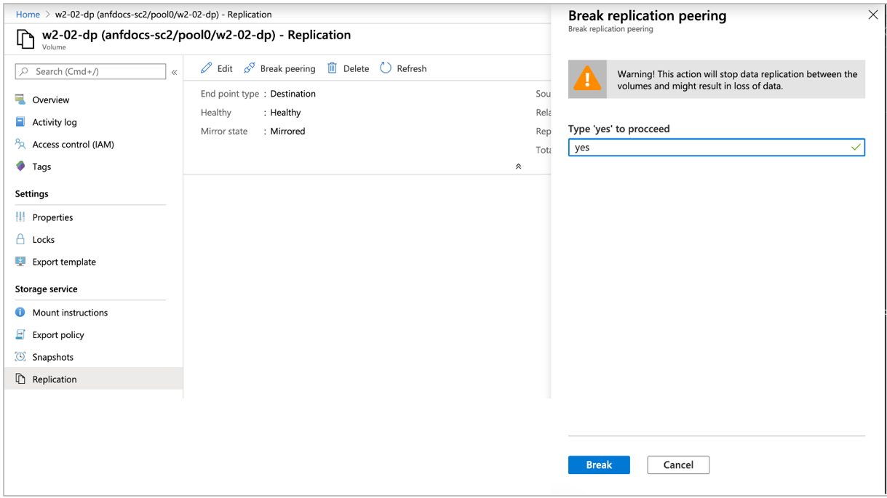
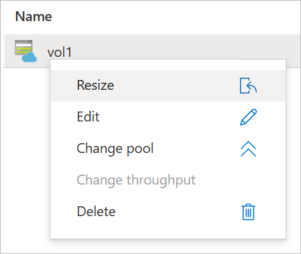

# Delete volume replications or volumes

This article describes how to delete volume replications. It also describes how to delete the source or destination volume.

## Delete volume replications

You can terminate the replication connection between the source and the destination volumes by deleting volume replication. You must delete the replication from the destination volume. The delete operation removes only authorization for replication; it does not remove the source or the destination volume. 

1. Ensure that the replication peering has been broken before you delete volume replication. To break the replication peering: 

    1. Select the *destination* volume. Click **Replication** under Storage Service.  

    2.	Check the following fields before continuing:  
        * Ensure that Mirror State shows ***Mirrored***.   
            Do not attempt to break replication peering if Mirror State shows *Uninitialized*.
        * Ensure that Relationship Status shows ***Idle***.   
            Do not attempt to break replication peering if Relationship Status shows *Transferring*.   

        See [Display health status of replication relationship](cross-region-replication-display-health-status.md). 

    3.	Click **Break Peering**.  

    4.	Type **Yes** when prompted and click **Break**. 

        

1. To delete volume replication, select **Replication** from the source or the destination volume.  

2. Click **Delete**.    

3. Confirm deletion by typing **Yes** and clicking **Delete**.   

    

## Delete source or destination volumes

If you want to delete the source or destination volume, you must perform the following steps in the described order. Otherwise, the `Volume with replication cannot be deleted` error occurs.  

1. From the destination volume, [delete the volume replication](#delete-volume-replications).   

2. Delete the destination or source volume as needed by right-clicking the volume name and select **Delete**.   

    

## Next steps  

* [Cross-region replication](cross-region-replication-introduction.md)
* [Requirements and considerations for using cross-region replication](cross-region-replication-requirements-considerations.md)
* [Display health status of replication relationship](cross-region-replication-display-health-status.md)
* [Troubleshoot cross-region-replication](troubleshoot-cross-region-replication.md)
* [Re-establish deleted volume relationship](reestablish-deleted-volume-relationships.md)
* [Manage default and individual user and group quotas for a volume](manage-default-individual-user-group-quotas.md)
