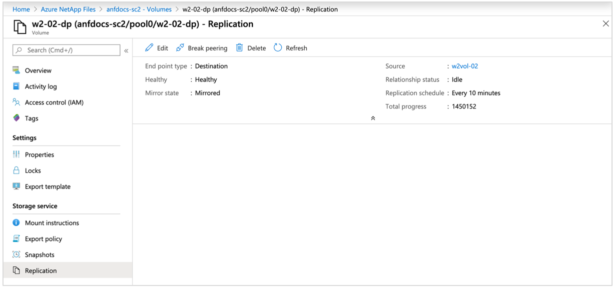

# Display health and monitor status of replication relationship 

You can view replication status on the source volume or the destination volume. You can also set alert rules in Azure Monitor to help you monitor the replication status.

## Display replication status

1. From either the source volume or the destination volume, select **Replication** under Storage Service for either volume.

    The following information about replication status and health is displayed:  
    * **End point type** – Identifies whether the volume is the source or destination of replication.
    * **Health** – Displays the health status of the replication relationship.
    * **Mirror state** – Shows one of the following values:
        * *Uninitialized*:  
            This is the initial and default state when a peering relationship is created. The state remains uninitialized until the initialization completes successfully.
        * *Mirrored*:   
            The destination volume has been initialized and is ready to receive mirroring updates.
        * *Broken*:   
            This is the state after you break the peering relationship. The destination volume is `‘RW’` and snapshots are present.
    * **Relationship status** – Shows one of the following values: 
        * *Idle*:  
            No transfer operation is in progress and future transfers aren't disabled.
        * *Transferring*:  
            A transfer operation is in progress and future transfers aren't disabled.
    * **Replication schedule** – Shows how frequently incremental mirroring updates will be performed when the initialization (baseline copy) is complete.

    * **Total progress** – Shows the total number of cumulative bytes transferred over the lifetime of the relationship. This amount is the actual bytes transferred, and it might differ from the logical space that the source and destination volumes report.  

    

> [!NOTE] 
> Replication relationship shows health status as *unhealthy* if previous replication jobs are not complete. This status is a result of large volumes being transferred with a lower transfer window (for example, a ten-minute transfer time for a large volume). In this case, the relationship status shows *transferring* and health status shows *unhealthy*.

## Set alert rules to monitor replication

Create [alert rules in Azure Monitor](../azure-monitor/alerts/alerts-overview.md) to help you monitor the status of cross-region replication:

1. In Azure Monitor, select **Alerts**.
2. From the **Alerts** window, select the **Create** dropdown then **Alert rule**.
3. From the **Scope** tab of the **Create an Alert Rule** page, choose **Select scope**. The **Select a Resource** page appears.
4. From the **Browse** tab, enter "Volumes" in the **Search to filter items...** field.
5. Select the target volume you'd like to monitor and select **Apply**.
6. From the **Condition** tab, use the **Signal name** dropdown to select **See all signals**. Identify the **Volume replication lag time** signal then select **Apply**.
7. Confirm **Greater than** is selected for the **Operator** field.
8. For the **Threshold** value field, enter the number of seconds equal to your replication schedule plus 20%. For example:
    * If your replication schedule is 10 minutes, enter 720 (10 minutes * 60 seconds * 1.2). 
    * If your replication schedule is hourly, enter 4,320 (60 minutes * 60 seconds * 1.2). 
    * If your replication schedule is daily, enter 103,680 (24 hours * 60 minutes * 60 seconds * 1.2).
9.	Select **Review + create**. The alert rule is ready for use.

:::image type="content" source="../media/azure-netapp-files/alert-config-signal-logic.png" alt-text="Screenshot of the Azure interface that shows the configure signal logic step with a backdrop of the Create alert rule page." lightbox="../media/azure-netapp-files/alert-config-signal-logic.png":::

## Next steps

* [Cross-region replication](cross-region-replication-introduction.md)
* [Manage disaster recovery](cross-region-replication-manage-disaster-recovery.md)
* [Resize a cross-region replication destination volume](azure-netapp-files-resize-capacity-pools-or-volumes.md#resize-a-cross-region-replication-destination-volume)
* [Volume replication metrics](azure-netapp-files-metrics.md#replication)
* [Delete volume replications or volumes](cross-region-replication-delete.md)
* [Troubleshoot cross-region replication](troubleshoot-cross-region-replication.md)

