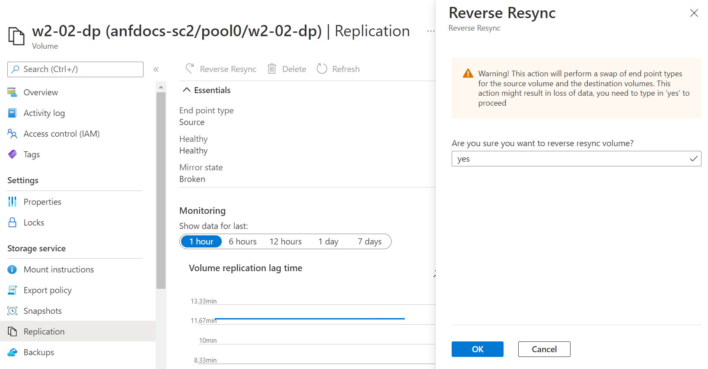

# Manage disaster recovery using cross-region replication 

An ongoing replication between the source and the destination volumes (see [Create volume replication](cross-region-replication-create-peering.md)) prepares you for a disaster recovery event. 

When such an event occurs, you can [fail over to the destination volume](#fail-over-to-destination-volume), enabling the client to read and write to the destination volume. 

After disaster recovery, you can perform a [resync](#resync-replication) operation to fail back to the source volume. You then [reestablish the source-to-destination replication](#reestablish-source-to-destination-replication) and remount the source volume for the client to access. 

The details are described below. 

## Fail over to destination volume

When you need to activate the destination volume (for example, when you want to failover to the destination region), you need to break replication peering and then mount the destination volume.  

1. To break replication peering, select the destination volume. Click **Replication** under Storage Service.  

2.	Check the following fields before continuing:  
    * Ensure that Mirror State shows ***Mirrored***.   
        Do not attempt to break replication peering if Mirror State shows *Uninitialized*.
    * Ensure that Relationship Status shows ***Idle***.   
        Do not attempt to break replication peering if Relationship Status shows *Transferring*.   

    See [Display health status of replication relationship](cross-region-replication-display-health-status.md). 

3.	Click **Break Peering**.  

4.	Type **Yes** when prompted and click the **Break** button. 

    

5.	Mount the destination volume by following the steps in [Mount or unmount a volume for Windows or Linux virtual machines](azure-netapp-files-mount-unmount-volumes-for-virtual-machines.md).   
    This step enables a client to access the destination volume.

## Resync volumes after disaster recovery

After disaster recovery, you can reactivate the source volume by performing a resync operation.  The resync operation reverses the replication process and synchronizes data from the destination volume to the source volume.  

> [!IMPORTANT] 
> The resync operation overwrites the source volume data with the destination volume data.  The UI warns you about the potential for data loss. You will be prompted to confirm the resync action before the operation starts.

1. To resync replication, select the *source* volume. Click **Replication** under Storage Service. Then click **Resync**.  

2. Type **Yes** when prompted and click **Resync**. 
 
    

3. Monitor the source volume health status by following steps in [Display health status of replication relationship](cross-region-replication-display-health-status.md).   
    When the source volume health status shows the following values, the resync operation is complete, and changes made at the destination volume are now captured on the source volume:   

    * Mirrored State: *Mirrored*  
    * Transfer State: *Idle*  

## Reestablish source-to-destination replication

After the resync operation from destination to source is complete, you need to break replication peering again to reestablish source-to-destination replication. You should also remount the source volume so that the client can access it.  

1. Break the replication peering:  
    a. Select the *destination* volume. Click **Replication** under Storage Service.  
    b. Check the following fields before continuing:   
    * Ensure that Mirror State shows ***Mirrored***.   
    Do not attempt to break replication peering if Mirror State shows *uninitialized*.  
    * Ensure that Relationship Status shows ***Idle***.   
    Do not attempt to break replication peering if Relationship Status shows *transferring*.    

        See [Display health status of replication relationship](cross-region-replication-display-health-status.md). 

    c. Click **Break Peering**.   
    d. Type **Yes** when prompted and click the **Break** button.  

2. Resync the source volume with the destination volume:  
    a. Select the *destination* volume. Click **Replication** under Storage Service. Then click **Resync**.   
    b. Type **Yes** when prompted and click the **Resync** button.

3. Remount the source volume by following the steps in [Mount or unmount a volume for Windows or Linux virtual machines](azure-netapp-files-mount-unmount-volumes-for-virtual-machines.md).  
    This step enables a client to access the source volume.

## Next steps  

* [Cross-region replication](cross-region-replication-introduction.md)
* [Requirements and considerations for using cross-region replication](cross-region-replication-requirements-considerations.md)
* [Display health status of replication relationship](cross-region-replication-display-health-status.md)
* [Resize a cross-region replication destination volume](azure-netapp-files-resize-capacity-pools-or-volumes.md#resize-a-cross-region-replication-destination-volume)
* [Volume replication metrics](azure-netapp-files-metrics.md#replication)
* [Delete volume replications or volumes](cross-region-replication-delete.md)
* [Troubleshoot cross-region replication](troubleshoot-cross-region-replication.md)

