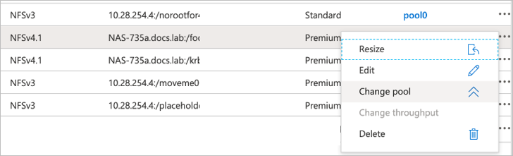
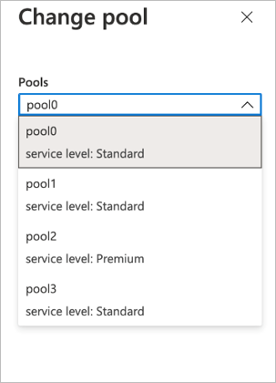

# Dynamically change the service level of a volume

You can change the service level of an existing volume by moving the volume to another capacity pool in the same NetApp account that uses the [service level](azure-netapp-files-service-levels.md) you want for the volume. This in-place service-level change for the volume does not require that you migrate data. It also does not affect access to the volume.  

This functionality enables you to meet your workload needs on demand.  You can change an existing volume to use a higher service level for better performance, or to use a lower service level for cost optimization. For example, if the volume is currently in a capacity pool that uses the *Standard* service level and you want the volume to use the *Premium* service level, you can move the volume dynamically to a capacity pool that uses the *Premium* service level.  

The capacity pool that you want to move the volume to must already exist. The capacity pool can contain other volumes.  If you want to move the volume to a brand-new capacity pool, you need to [create the capacity pool](azure-netapp-files-set-up-capacity-pool.md) before you move the volume.  

## Considerations

* This functionality is supported within the same NetApp account. You can't move the volume to a capacity pool in a different NetApp Account.

* After the volume is moved to another capacity pool, you'll no longer have access to the previous volume activity logs and volume metrics. The volume will start with new activity logs and metrics under the new capacity pool.

* If you move a volume to a capacity pool of a higher service level (for example, moving from *Standard* to *Premium* or *Ultra* service level), you must wait at least seven days before you can move that volume *again* to a capacity pool of a lower service level (for example, moving from *Ultra* to *Premium* or *Standard*). You can always change to higher service level without wait time.

* You cannot change the service level for volumes in a cross-region replication relationship. 
 
## Move a volume to another capacity pool

1.	On the Volumes page, right-click the volume whose service level you want to change. Select **Change Pool**.

    

2. In the Change pool window, select the capacity pool you want to move the volume to. 

    

3.	Select **OK**.

## Next steps  

* [Service levels for Azure NetApp Files](azure-netapp-files-service-levels.md)
* [Create a capacity pool](azure-netapp-files-set-up-capacity-pool.md)
* [Troubleshoot issues for changing the capacity pool of a volume](troubleshoot-capacity-pools.md#issues-when-changing-the-capacity-pool-of-a-volume)
