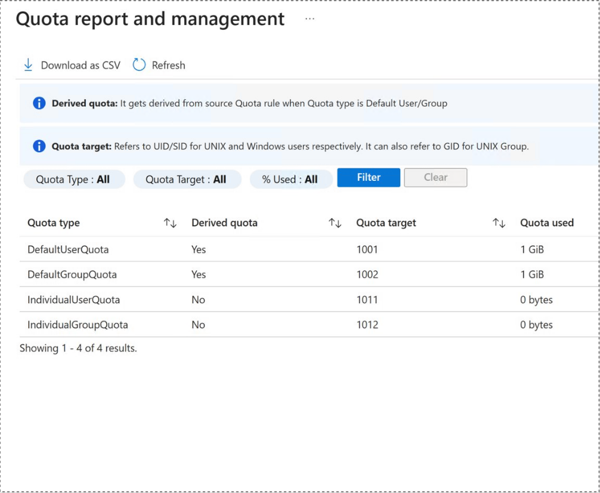
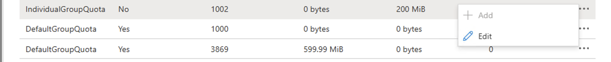
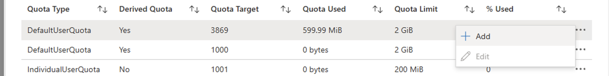

# Generate user and group quota reports for a volume

To help with capacity management on volumes shared among multiple users, individual user and group quotas restrict capacity usage on NFS, SMB, and dual-protocol volumes. 

Quota reporting in Azure NetApp Files allows administrators to generate usage reports for an existing volume with quota rules, independent of host-based tooling and without having to mount the volume.

For more information and considerations related to capacity management, see [Understand default and individual user and group quotas](default-individual-user-group-quotas-introduction.md).

## Considerations 

* Quota reporting is specific to the volume and its quota rules.
* Quota reports are supported on regular and large volumes.
* Quota reports are compiled on demand. They aren't persisted.
* Entries in the quota report are sorted by percentage used in descending order.
* The number of entries in the quota report is currently capped at 1,000 entries.
* The number of entries in the quota report can be larger than the number of quota rules on the volume. Users that are subjected to default quota are reported as individual quota report entries.
* When using quota reporting on data protection volumes:
	* Quota report is unavailable for data protection volumes when the mirror state of the replication is in a mirrored state. You can run a quota report on the source volume instead.
	* Quota reports become available when the replication relation is broken.
* On volumes without a default user/group quota, users that aren't mapped to any rules and are accessing the volume will show 0 for total disk limit and percentage used in the quota report. In this instance, consider creating a default user/group quota rule.
* When requesting quota reports for multiple volumes in the same subscription, these quota report requests are processed sequentially. When using the API, check responses (specifically percentComplete) for status. The quota report slide out in the Azure portal automatically retrieves the quota report in the background. Stay on the page until the quota report is successfully retrieved.
* Quota reports take five seconds on average to generate.
* If the quota report is an empty list or the quota report API calls fail on a volume with quota rules, retry generating the quota report after five minutes.
* If quota rules aren't aligned with 4 KiB, the quota limit is incorrectly reported in the quota report. This happens because the field is always rounded up to the nearest multiple of 4 KiB to match disk space limits, which are translated into 4-KiB chunks. 

## Generate a quota report for a volume

1. From the Azure portal, select the volume for which you want to generate a quota report.
2. Navigate to **User and group quotas**. Select the **Quota Report and Management** tab from the actions menu to generate the report. 

	> [!NOTE]
	> Only the top 1000 quota report records will be downloaded in CSV format. The complete quota report is not available for download.

	 

	The quota report is retrieved in the background. Remain on the page  until the quota report has been successfully retrieved. Retrieval takes an average of five seconds, but can take longer. The quota report lists one entry per user. The following fields are available:

	* **Quota Type**      

		Indicates which type of quota rule caused this user or group entry in the report. Possible types are default or individual quotas for users or groups.

	* **Derived Quota**

		If a user or group is subject to an explicit quota rule, this field displays "No." Conversely, if a user or group is implicitly subject to a quota rule such as a default user or group quota rule, this field displays "Yes."

	* **Quota Target**

		UID/SID/GID for user/group

	* **Quota Used**

		Total disk limit used by the user/group

	* **Quota Limit**

		Total disk limit allocated by the user/group in kilobyte

	* **% Used**
	
		Displays information with quota usage equal to or greater than the percentage used

3. You can apply filters for **Quota Target**, **Quota Type**, and **% Used** to view a specific subset of the quota report.

	> [!IMPORTANT]
	> When using the quota target filter, you must first select a quota type value. The quota target is dependent on the quota type and can't be applied independently.

	> [!NOTE]
	> You can add a new quota only for derived quotas. You can only edit non-derived quotas.

4. You can edit individual user/group quota rules for a quota target directly from the report. To edit a quota, select `…` at the end of the quota rule row, then select **Edit**.

	> [!NOTE]
	> This option is not available for derived quotas or quota targets from default user or default group quota rules.

 

5. You can add individual user/group quota rules from derived quotes in the report. To add a new quota for the default user and group quota, select `…` at the end of the quota rule row then **Add**.

	> [!NOTE]
	> This option is only available for derived quotas or quota targets that are subject to a default user or default group quota rule.

 

## Next steps

* [Understand default and individual user and group quotas](default-individual-user-group-quotas-introduction.md)
* [Manage default and individual user and group quotas for a volume](manage-default-individual-user-group-quotas.md)
