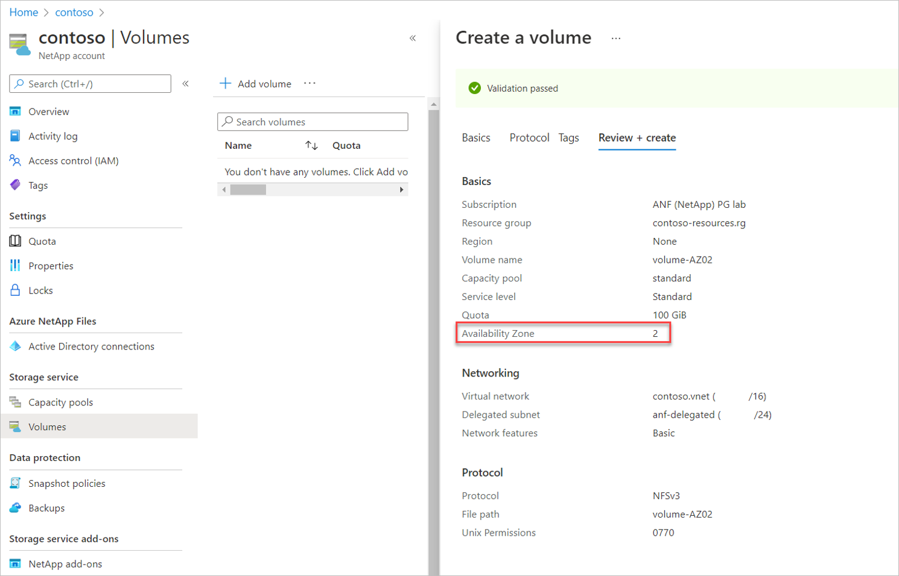

# Manage availability zone volume placement for Azure NetApp Files

You can deploy new volumes in the logical availability zone of your choice. You can also populate existing volumes with availability zone information. To better understand availability zones, see [Use availability zones for high availability](use-availability-zones.md).

## Requirements and considerations 

>[!IMPORTANT]
>If you're using availability zones with custom roles or the built-in Contributor RBAC role, ensure you have the appropriate permissions set. Not having certain permissions can cause issues in the Azure portal. For configuration details, see [Configure custom RBAC roles](#configure-custom-rbac-roles).

* This feature doesn't guarantee free capacity in the availability zone. For example, even if you can deploy a VM in availability zone 3 of the East US region, it doesn’t guarantee free Azure NetApp Files capacity in that zone. If no sufficient capacity is available, volume creation will fail.

* After a volume is created with an availability zone, the specified availability zone can’t be modified. Volumes can’t be moved between availability zones.

* NetApp accounts and capacity pools aren't bound by the availability zone. A capacity pool can contain volumes in different availability zones.  

* This feature provides zonal volume placement, with latency within the zonal latency envelopes. It ***does not*** provide proximity placement towards compute. As such, it ***does not*** provide lowest latency guarantee.

* Each data center is assigned to a physical zone. Physical zones are mapped to logical zones in your Azure subscription. Azure subscriptions are automatically assigned this mapping at the time a subscription is created. This feature aligns with the generic logical-to-physical availability zone mapping for the subscription. 

* VMs and Azure NetApp Files volumes are to be deployed separately, within the same logical availability zone to create zone alignment between VMs and Azure NetApp Files. The availability zone volume placement feature doesn't create zonal VMs upon volume creation, or vice versa.

* <a name="file-path-uniqueness"></a> For volumes in different availability zones, Azure NetApp Files allows you to create volumes with the same file path (NFS), share name (SMB), or volume path (dual-protocol). This feature is currently in preview. 

    >[!IMPORTANT]
    >Once a volume is created with the same file path as another volume in a different availability zone, the volume has the same level of support as other volumes deployed in the subscription without this feature enabled. For example, if there's an issue with other generally available features on the volume such as snapshots, it's supported because the problem is unrelated to the ability to create volumes with the same file path in different availability zones.

    You need to register the feature before using it for the first time. After registration, the feature is enabled and works in the background. No UI control is required.
    
    1. Register the feature: 
    
        ```azurepowershell-interactive
        Register-AzProviderFeature -ProviderNamespace Microsoft.NetApp -FeatureName ANFFilePathUniquenessInAz
        ```
    
    2. Check the status of the feature registration: 
    
        > [!NOTE]
        > The **RegistrationState** may be in the `Registering` state for up to 60 minutes before changing to`Registered`. Wait until the status is **Registered** before continuing.
    
        ```azurepowershell-interactive
        Get-AzProviderFeature -ProviderNamespace Microsoft.NetApp -FeatureName ANFFilePathUniquenessInAz
        ```
    You can also use [Azure CLI commands](/cli/azure/feature) `az feature register` and `az feature show` to register the feature and display the registration status. 

>[!IMPORTANT]
>It's not recommended that you use availability zones for Terraform-managed volumes. If you do, you must [add the zone property to your volume](#populate-availability-zone-for-terraform-managed-volumes).

## Create a volume with an availability zone 

1.	Select **Volumes** from your capacity pool. Then select **+ Add volume** to create a volume.

    For details about volume creation, see:   
    * [Create an NFS volume](azure-netapp-files-create-volumes.md)   
    * [Create an SMB volume](azure-netapp-files-create-volumes-smb.md)      
    * [Create a dual-protocol volume](create-volumes-dual-protocol.md)    

2.	In the **Create a Volume** page, under the **Basic** tab, select the **Availability Zone** pulldown to specify an availability zone where Azure NetApp Files resources are present.   

    > [!IMPORTANT]
    > Logical availability zones for the subscription without Azure NetApp Files presence are marked `(Unavailable)` and are greyed out.

    [  ](./media/manage-availability-zone-volume-placement/availability-zone-menu-drop-down.png#lightbox)

 
3.	Follow the UI to create the volume. The **Review + Create** page shows the selected availability zone you specified.

    [  ](./media/manage-availability-zone-volume-placement/availability-zone-display-down.png#lightbox)
 
4. Navigate to **Properties** to confirm your availability zone configuration.

    :::image type="content" source="./media/manage-availability-zone-volume-placement/availability-zone-volume-overview.png" alt-text="Screenshot of volume properties interface." lightbox="./media/manage-availability-zone-volume-placement/availability-zone-volume-overview.png":::

## <a name="populate-an-existing-volume-with-availability-zone-information"></a> Populate an existing volume with availability zone information (preview)

1. Navigate to the volume that you want to populate with availability zone information.
1. Select **Populate availability zone**.
1. The Populate Availability Zone window appears and displays the availability zone in which the Azure NetApp Files volume is deployed.
1. Select **Save** if you want to populate this availability zone to the volume, or select **Cancel** if you want to keep the volume regional.

    > [!IMPORTANT]
    > Availability zone information can only be populated as provided. You can't select an availability zone or move the volume to another availability zone by using this feature. If you want to move this volume to another availability zone, consider using [cross-zone replication](create-cross-zone-replication.md) (after populating the volume with the availability zone information). 
    >
    > :::image type="content" source="./media/manage-availability-zone-volume-placement/populate-availability-zone.png" alt-text="Screenshot of the Populate Availability Zone window." lightbox="./media/manage-availability-zone-volume-placement/populate-availability-zone.png":::

## Populate availability zone for Terraform-managed volumes

The populate availability zone features requires a `zone` property on the volume. You can set the zone property only when you create the Terraform-managed volume, but you can't modify it after the volume has been created. Adding the `zone` property after the volume has been created can cause data loss or loss of the volume if the specified zone value does not match the availability zone. 

>[!IMPORTANT]
>To prevent data loss on any Azure resource that includes volatile resources, you should use the [`prevent_destroy` lifecycle argument](https://developer.hashicorp.com/terraform/language/meta-arguments/lifecycle#prevent_destroy).

1. Navigate to the Terraform module `terraform.tfstate` file. The `"zone"` property should be an empty string. 
1. In the Terraform-managed volume's configuration file (`main.tf`), locate the lifecycle configuration block for the volume resource. Modify the block with `ignore_changes = [zone]`. If no lifecycle configuration block exists, add it:
    ```
    lifecycle {
        ignore_changes = [zone]
    }
    ```
1. In the Azure portal, locate the Terraform-managed volume. In the volume **Overview**, select **Populate availability zone** and make note of the availability zone. Do _not_ select save. 

    :::image type="content" source="./media/manage-availability-zone-volume-placement/populate-availability-zone.png" alt-text="Screenshot of the Populate Availability Zone menu." lightbox="./media/manage-availability-zone-volume-placement/populate-availability-zone.png":::
    
1. In the volume's configuration file (`main.tf`), add a value for `zone`, entering the numerical value you retrieved in the previous step. For example, if the volume's availability zone is 1, enter `zone = 1`.
1. Save the file. 
1. Return to the Azure portal. Select **Save** to populate the availability zone. 
1. Run `terraform plan` to confirm that no changes will be made to your volume. The CLI output should display: `No changes. Your infrastructure matches the configuration.`
1. Run `terraform apply` to apply the changes. You should see the same CLI output as in the previous step. 

If you need to delete and recreate the volume in a different availability zone, remove the `ignore_changes = [zone]` line in the configuration file then run `terraform plan` followed by `terraform apply`.

## Configure custom RBAC roles

If you're using a custom RBAC role or the [built-in Contributor role](../role-based-access-control/built-in-roles.md#contributor) and managing availability zones _in the Azure portal_, you might not be able to access network features and Availability Zone options in the Azure portal. To ensure you have the appropriate access, add the `Microsoft.NetApp/locations/*` permission. The wildcard encompasses the following permissions: 

* `Microsoft.NetApp/locations/{location}/checkNameAvailability`
* `Microsoft.NetApp/locations/{location}/checkFilePathAvailability`
* `Microsoft.NetApp/locations/{location}/checkQuotaAvailability`
* `Microsoft.NetApp/locations/{location}/quotaLimits`
* `Microsoft.NetApp/locations/{location}/quotaLimits/{quotaLimitName}`
* `Microsoft.NetApp/locations/{location}/regionInfo`
* `Microsoft.NetApp/locations/{location}/regionInfos`
* `Microsoft.NetApp/locations/{location}/queryNetworkSiblingSet`
* `Microsoft.NetApp/locations/{location}/updateNetworkSiblingSet`

### Steps

1. In your Azure NetApp Files subscription, select **Access control (IAM)**.
1. Select **Roles** then choose the custom role you want to modify. Select the three dots (`...`) then **Edit**. 
1. To update the custom role, select **JSON**. Modify the JSON file to include the locations wild card permission (`Microsoft.NetApp/locations/*`). For example: 

    ```json
    {
    	"properties": {
    	    "roleName": ""
    	    "description": ""
    	    "assignableScopes": ["/subscription/<subscriptionID>"
            ],
    	},
    	"permissions": [
            {
        	    "actions": [
                	"Microsoft.NetApp/locations/*",
                	"Microsoft.NetApp/netAppAccounts/read",
                	"Microsoft.NetApp/netAppAccounts/renewCredentials/action",
                    "Microsoft.NetApp/netAppAccounts/capacityPools/read",
                ]
            }]
    }
    ```

1. Select **Review + update**.
1. Sign out of your Azure account, then sign back in to confirm permissions effect has taken hold and the options are visible. 

## Next steps  

* [Use availability zones zonal placement for application high availability with Azure NetApp Files](use-availability-zones.md)
* [Create an NFS volume for Azure NetApp Files](azure-netapp-files-create-volumes.md)   
* [Create an SMB volume for Azure NetApp Files](azure-netapp-files-create-volumes-smb.md)      
* [Create a dual-protocol volume for Azure NetApp Files](create-volumes-dual-protocol.md)    
* [Understand cross-zone replication of Azure NetApp Files](cross-zone-replication-introduction.md)
* [Create cross-zone replication](create-cross-zone-replication.md)
