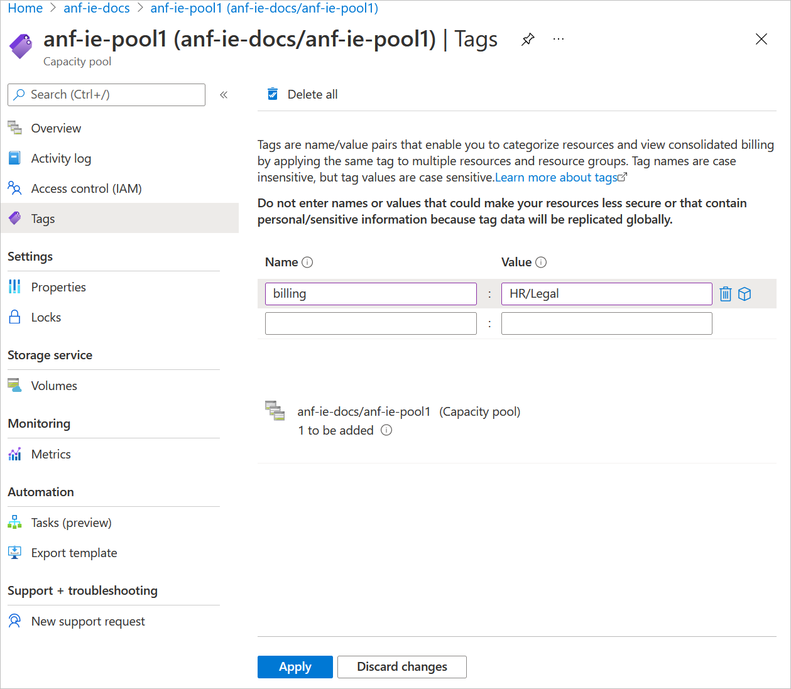

# Manage billing by using tags

Tags are name and value pairs that enable you to categorize resources and view consolidated billing. You can apply the same tag to multiple resources and resource groups.  See [Use tags to organize your Azure resources and management hierarchy](../azure-resource-manager/management/tag-resources.md) for details about tags.  

Using tags helps you manage Azure NetApp Files billing and expenses. For example, your company might have only one Azure subscription but multiple departments that use Azure resources and incur expenses. You can tag the resources with the department names at the capacity pool level. The corresponding tags would be displayed in the bill to help you see the expense incurred by each department.   

Billing tags are assigned at the capacity pool level, not volume level.

## Steps

1. To add or edit a tag on a capacity pool, go to the **capacity pool** and select **Tags**.   

2. Fill in the **Name** and **Value** pair.  Click **Apply**.

    > [!IMPORTANT] 
    > Tag data is replicated globally. As such, do not use tag names or values that could compromise the security of your resources. For example, do not use tag names that contain personal or sensitive information. 

      

## Next steps

[Cost model for Azure NetApp Files](azure-netapp-files-cost-model.md) 