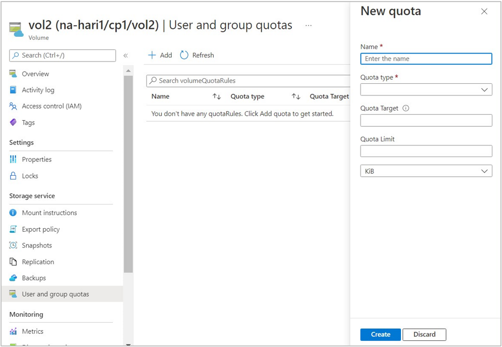
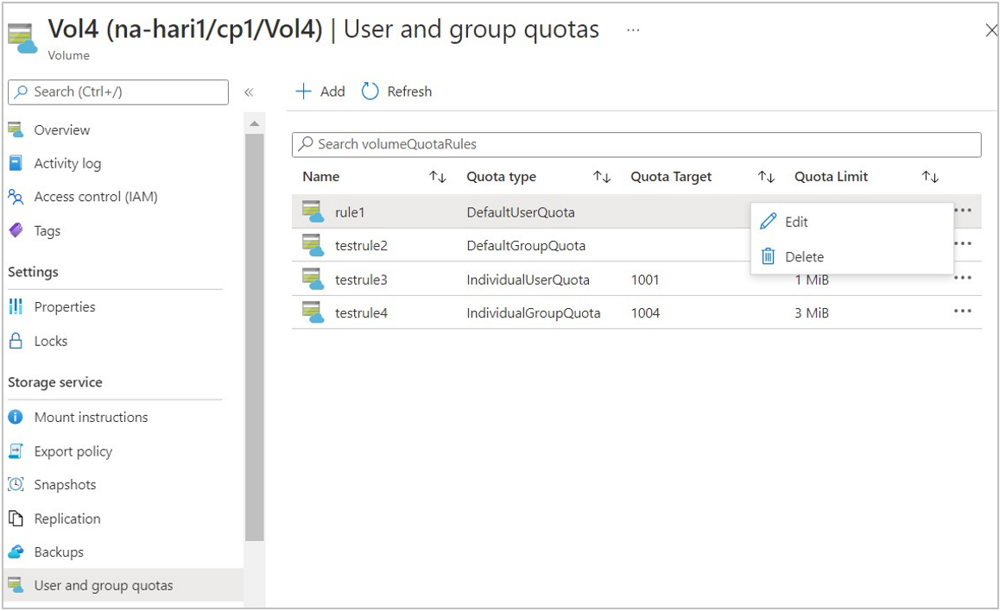
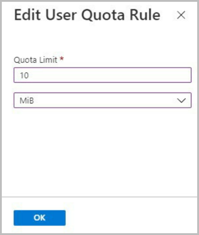

# Manage default and individual user and group quotas for a volume 

This article explains the considerations and steps for managing user and group quotas on Azure NetApp Files volumes. To understand the use cases for this feature, see [Understand default and individual user and group quotas](default-individual-user-group-quotas-introduction.md).

## Quotas in cross-region or cross-zone replication relationships

Quota rules are synced from cross-region replication (CRR) or cross-zone replication (CZR) source to destination volumes. Quota rules that you create, delete, or update on a CRR or CZR source volume automatically applies to the destination volume.

Quota rules only come into effect on the CRR/CZR destination volume after the replication relationship is deleted because the destination volume is read-only. To learn how to break the replication relationship, see [Delete volume replications](cross-region-replication-delete.md#delete-volume-replications). If source volumes have quota rules and you create a replication relationship later, all the quota rules are synced to the destination volume.

## Considerations 

* A quota rule is specific to a volume and is applied to an existing volume.  
* Deleting a volume results in deleting all the associated quota rules for that volume. 
* You can create a maximum number of 100 quota rules for a volume. You can [request limit increase](azure-netapp-files-resource-limits.md#request-limit-increase) through the portal.
* Azure NetApp Files doesn't support individual group quota and default group quota for SMB and dual protocol volumes.
* Group quotas track the consumption of disk space for files owned by a particular group. A file can only be owned by exactly one group. 
* Auxiliary groups only help in permission checks. You can't use auxiliary groups to restrict the quota (disk space) for a file.
* In a CRR/CZR setting:
    * You can't create, update, or delete quota rules on the destination volume until you [delete the replication](cross-region-replication-delete.md).  
    * If a quota rule is in the error state after you delete the replication relationship, you need to delete and re-create the quota rule on the destination volume. 
* If you're using [large volumes](large-volumes-requirements-considerations.md) (volumes larger than 100 TiB):    
    * The space and file usage in a large volume might exceed as much as five percent more than the configured hard limit before the quota limit is enforced and rejects traffic.   
    * To provide optimal performance, the space consumption may exceed configured hard limit before the quota is enforced. The additional space consumption won't exceed either the lower of 1 GB or five percent of the configured hard limit.    
    * After reaching the quota limit, if a user or administrator deletes files or directories to reduce quota usage under the limit, subsequent quota-consuming file operations may resume with a delay of up to five seconds.

## Register the feature  

The feature to manage user and group quotas is currently in preview. Before using this feature for the first time, you need to register it. 

1. Register the feature: 

    ```azurepowershell-interactive
    Register-AzProviderFeature -ProviderNamespace Microsoft.NetApp -FeatureName ANFEnableVolumeUserGroupQuota 
    ```

2. Check the status of the feature registration: 

    ```azurepowershell-interactive
    Get-AzProviderFeature -ProviderNamespace Microsoft.NetApp -FeatureName ANFEnableVolumeUserGroupQuota
    ```
    > [!NOTE]
    > The **RegistrationState** may be in the `Registering` state for up to 60 minutes before changing to `Registered`. Wait until the status is **Registered** before continuing.

You can also use [Azure CLI commands](/cli/azure/feature) `az feature register` and `az feature show` to register the feature and display the registration status. 

## Create new quota rules 

1. From the Azure portal, navigate to the volume for which you want to create a quota rule. Select **User and group quotas** in the navigation pane, then click **Add** to create a quota rule for a volume.  

     

2. In the **New quota** window that appears, provide information for the following fields, then click **Create**.

    * **Quota rule name**:   
        The name must be unique within the volume. 

    * **Quota type**:  
        Select one of the following options. For details, see [Understand default and individual user and group quotas](default-individual-user-group-quotas-introduction.md).   
        * `Default user quota`
        * `Default group quota` 
        * `Individual user quota` 
        * `Individual group quota`

    * **Quota target**:   
        * NFS volumes:  
            For individual user quota and individual group quota, specify a value in the range of `0` to `4294967295`.  
            For default quota, specify the value as `""`. 
        * SMB volumes:   
            For individual user quota, specify the range in the `^S-1-[0-59]-\d{2}-\d{8,10}-\d{8,10}-\d{8,10}-[1-9]\d{3}` format.  
        * Dual-protocol volumes:   
            For individual user quota using the SMB protocol, specify the range in the `^S-1-[0-59]-\d{2}-\d{8,10}-\d{8,10}-\d{8,10}-[1-9]\d{3}` format.  
            For individual user quota using the NFS protocol, specify a value in the range of `0` to `4294967295`.

    * **Quota limit**:    
        Specify the limit in the range of `1` to `1125899906842620`.  
        Select `KiB`, `MiB`, `GiB`, or `TiB` from the pulldown. The minimum configurable quota limit is 4 KiB.

## Edit or delete quota rules

1. On the Azure portal, navigate to the volume whose quota rule you want to edit or delete.  Select `…` at the end of the quota rule row, then select **Edit** or **Delete** as appropriate. 

     

    1. If you're editing a quota rule, update **Quota Limit** in the Edit User Quota Rule window that appears.
    
         

    1. If you're deleting a quota rule, confirm the deletion by selecting **Yes**.  
    
         

## Next steps 
* [Understand default and individual user and group quotas](default-individual-user-group-quotas-introduction.md)
* [Resource limits for Azure NetApp Files](azure-netapp-files-resource-limits.md)
