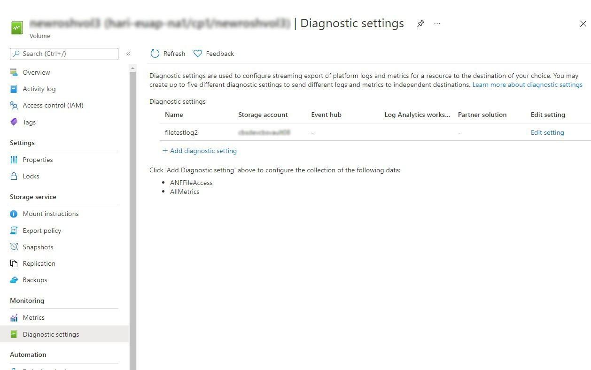
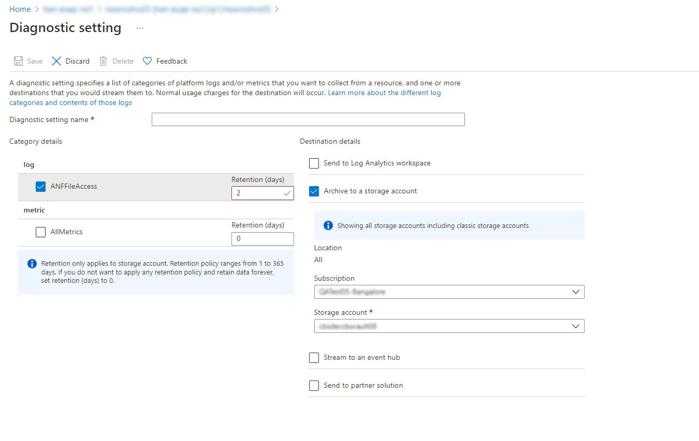

# Manage file access logs in Azure NetApp Files

File access logs provide file access logging for individual volumes, capturing file system operations on selected volumes. Standard file system operations will be captured in the logs. File access logs are provided on top of the platform logging captured in [Azure Activity Logs](azure/azure-monitor/essentials/activity-log). This article describes how to manage file access logs using Azure NetApp Files. 

## Considerations

* File access logs supports SMB and NFSv4.1 protocols. 
* Once file access logs are enabled on a volume, they can take a maximum of five minutes to become visible. 
* File access logs occasionally create duplicate logs that must be manually filtered. 
* Deleting any diagnostic settings configured for ANFFileAccess causes any file access logs for any volumes with that setting to be disabled. 
* Before enabling file access logs on a volume, either ACLs or Audit ACEs need to be set on a file or directory. This needs to be done after mounting a volume.  
* File access logs provide no explicit or implicit expectations or guarantees around logging for auditing and compliance purposes. 

## Register the feature

The file access logs feature is currently in preview. If you are using this feature for the first time, you need to register the feature first. 
1. Register the feature: `Register-AzProviderFeature -ProviderNamespace Microsoft.NetApp -FeatureName ANFFileAccessLogs`
2. Check the status: `Get-AzProviderFeature -ProviderNamespace Microsoft.NetApp -FeatureName ANFFileAccessLogs`

You can also use [Azure CLI commands](/cli/azure/feature) `az feature register` and `az feature show` to register the feature and display the registration status.

## Enable file access logs

1. Select the volume you want to enable file access logs for. 
2. Select **Diagnostic settings** from the left-hand pane.

3. In the **Diagnostic settings** page, provide a diagnostic setting name, select *ANFFileAccess* and then set the retention period of the logs. 

4. Select one of the four destinations for the logs:
    * Send to Log Analytics workspace
    * Archive to a storage account
    * Stream to an event hub
    * Send to a partner solution
5. Save the settings

## Disable file access logs

1. Select the volume on which you want to disable file access logs.
2. Select the **Diagnostic setting** menu from the left-hand pane. 
3. In the **Diagnostic settings** page, deselect **ANFFileAccess**.
4. Save the settings.
 
## Next Steps

* [Security FAQs](faq-security.md) 
* [Azure resource logs](..\azure-monitor\essentials\resource-logs.md)