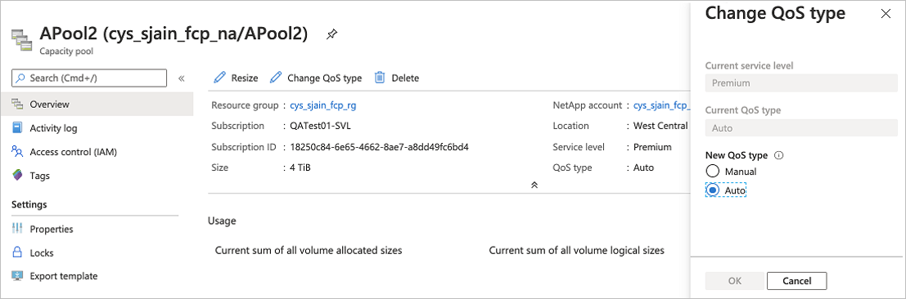
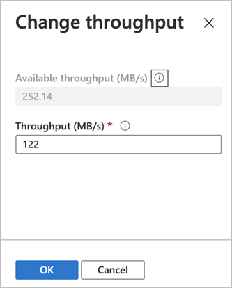

# Manage a manual QoS capacity pool

This article describes how to manage a capacity pool that uses the manual QoS type.  

See [Storage hierarchy of Azure NetApp Files](azure-netapp-files-understand-storage-hierarchy.md) and [Performance considerations for Azure NetApp Files](azure-netapp-files-performance-considerations.md) to understand the considerations about QoS types.  

## Set up a new manual QoS capacity pool 

To create a new capacity pool using the manual QoS type:

1. Follow steps in [Create a capacity pool](azure-netapp-files-set-up-capacity-pool.md).  

2. In the New Capacity Pool window, select the **Manual QoS** type.  

## Change a capacity pool to use manual QoS

You can change a capacity pool that currently uses the auto QoS type to use the manual QoS type.  

> [!IMPORTANT]
> Setting the capacity type to manual QoS is a permanent change. You cannot convert a manual QoS type capacity tool to an auto QoS capacity pool.  
> At conversion time, throughput levels might be capped to conform to the throughput limits for volumes of the manual QoS type. See [Resource limits for Azure NetApp Files](azure-netapp-files-resource-limits.md#resource-limits).

1. From the management blade for your NetApp account, click **Capacity pools** to display existing capacity pools.   
 
2.	Click the capacity pool that you want to change to using manual QoS.

3.	Click **Change QoS type**. Then set **New QoS Type** to **Manual**. Click **OK**. 

## Monitor the throughput of a manual QoS capacity pool  

Metrics are available to help you monitor the read and write throughput of a volume.  See [Metrics for Azure NetApp Files](azure-netapp-files-metrics.md).  

## Modify the allotted throughput of a manual QoS volume 

If a volume is contained in a manual QoS capacity pool, you can modify the allotted volume throughput as needed.

1. From the **Volumes** page, select the volume whose throughput you want to modify.   

2. Click **Change throughput**. Specify the **Throughput (MiB/S)** that you want. Click **OK**. 

    

## Next steps  

* [Create a capacity pool](azure-netapp-files-set-up-capacity-pool.md)
* [Metrics for Azure NetApp Files](azure-netapp-files-metrics.md)
* [Performance considerations for Azure NetApp Files](azure-netapp-files-performance-considerations.md)
* [Troubleshoot capacity pool issues](troubleshoot-capacity-pools.md)
* [Storage hierarchy of Azure NetApp Files](azure-netapp-files-understand-storage-hierarchy.md)
* [Service levels for Azure NetApp Files](azure-netapp-files-service-levels.md)
* [Cost model for Azure NetApp Files](azure-netapp-files-cost-model.md)
* [Resource limits for Azure NetApp Files](azure-netapp-files-resource-limits.md)
* [Create an NFS volume](azure-netapp-files-create-volumes.md)
* [Create an SMB volume](azure-netapp-files-create-volumes-smb.md)
* [Create a dual-protocol volume](create-volumes-dual-protocol.md)
