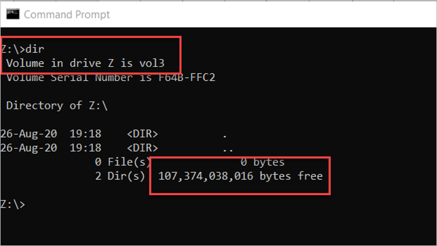
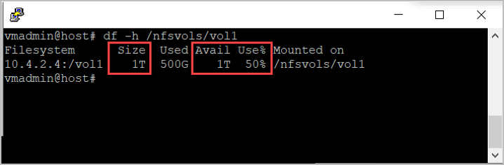

# Monitor the capacity of a volume  

This article describes ways to monitor the capacity utilization of an Azure NetApp Files volume.  

## Using Windows or Linux clients

This section shows how to use a Windows or Linux client to monitor the volume capacity. The scenarios described in this section assume a volume configured at 1 TiB size (quota) on a 4 TiB Ultra service-level capacity pool. 

### Windows (SMB) clients

You can use Windows clients to check the used and available capacity of a volume through the network mapped drive properties. You can use one of the following two methods: 

* Go to File Explorer, right-click the mapped drive, and select **Properties** to display capacity.  

    

* Use the `dir` command at the command prompt: 

     

The *available space* is accurate using File Explorer or the `dir` command. However, the *consumed/used space* will be an estimate when snapshots are generated on the volume. The [consumed snapshot capacity](azure-netapp-files-cost-model.md#capacity-consumption-of-snapshots) counts towards the total consumed space on the volume. To get the absolute volume consumption, including the capacity used by snapshots, use the [Azure NetApp Metrics](azure-netapp-files-metrics.md#volumes) in the Azure portal. 

### Linux (NFS) clients 

Linux clients can check the used and available capacity of a volume using the [df command](https://linux.die.net/man/1/df).  

The `-h` option shows the size, including used and available space in human readable format (using M, G and T unit sizes).

The following snapshot shows volume capacity reporting in Linux:

 

The *available space* is accurate using the `df` command. However, the *consumed/used space* will be an estimate when snapshots are generated on the volume. The [consumed snapshot capacity](azure-netapp-files-cost-model.md#capacity-consumption-of-snapshots) counts towards the total consumed space on the volume. To get the absolute volume consumption, including the capacity used by snapshots, use the [Azure NetApp Metrics](azure-netapp-files-metrics.md#volumes) in the Azure portal. 

> [!NOTE]
> The `du` command doesn’t account for the space used by snapshots generated in the volume. As such, it’s not recommended for determining the available capacity in a volume.

## Using Azure portal
Azure NetApp Files leverages the standard [Azure Monitor](../azure-monitor/overview.md) functionality. As such, you can use Azure Monitor to monitor Azure NetApp Files volumes.  

## Using Azure CLI  

You can use the [`az netappfiles volume`](/cli/azure/netappfiles/volume) commands of the [Azure command line (CLI) tools](azure-netapp-files-sdk-cli.md) to monitor a volume.
 
## Using REST API  

See [REST API for Azure NetApp Files](azure-netapp-files-develop-with-rest-api.md) and [REST API using PowerShell for Azure NetApp Files](develop-rest-api-powershell.md). 

The REST API specification and example code for Azure NetApp Files are available through the [resource-manager GitHub directory](https://github.com/Azure/azure-rest-api-specs/tree/main/specification/netapp/resource-manager/Microsoft.NetApp/stable). 

## Next steps

* [Understand volume quota](volume-quota-introduction.md)
* [Cost model for Azure NetApp Files](azure-netapp-files-cost-model.md)
* [Resize the capacity pool or a volume](azure-netapp-files-resize-capacity-pools-or-volumes.md)
* [Capacity management FAQs](faq-capacity-management.md)
