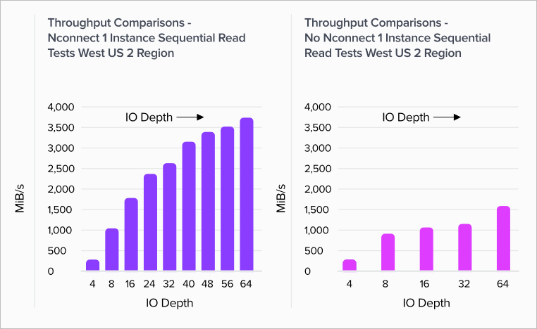

# Azure NetApp Files regular volume performance benchmarks for Linux

This article describes performance benchmarks Azure NetApp Files delivers for Linux with a [regular volume](azure-netapp-files-understand-storage-hierarchy.md#volumes).

## Whole file streaming workloads (scale-out benchmark tests)

The intent of a scale-out test is to show the performance of an Azure NetApp File volume when scaling out (or increasing) the number of clients generating simultaneous workload to the same volume. These tests are generally able to push a volume to the edge of its performance limits and are indicative of workloads such as media rendering, AI/ML, and other workloads that utilize large compute farms to perform work. 

High IOP scale out benchmark configuration 

These benchmarks used the following: 
- A single Azure NetApp Files 100-TiB regular volume with a 1-TiB data set using the Ultra performance tier 
- [FIO (with and without setting randrepeat=0)](testing-methodology.md)
- 4-KiB and 8-KiB block sizes 
- 6 D32s_v5 virtual machines running RHEL 9.3 
- NFSv3  
- [Manual QoS](manage-manual-qos-capacity-pool.md)
- Mount options: rw,nconnect=8,hard,rsize=262144,wsize=262144,vers=3,tcp,bg 

## High throughput scale-out benchmark configuration 

These benchmarks used the following: 

- A single Azure NetApp Files regular volume with a 1-TiB data set using the Ultra performance tier 
FIO (with and without setting randrepeat=0) 
- [FIO (with and without setting randrepeat=0)](testing-methodology.md)
- 64-KiB and 256-KiB block size 
- 6 D32s_v5 virtual machines running RHEL 9.3 
- NFSv3  
- [Manual QoS](manage-manual-qos-capacity-pool.md)
- Mount options: rw,nconnect=8,hard,rsize=262144,wsize=262144,vers=3,tcp,bg 

<!-- -->

## Linux scale-out

This section describes performance benchmarks of Linux workload throughput and workload IOPS.

### Linux workload throughput  

This graph represents a 64 kibibyte (KiB) sequential workload and a 1 TiB working set. It shows that a single Azure NetApp Files volume can handle between ~1,600 MiB/s pure sequential writes and ~4,500 MiB/s pure sequential reads.  

The graph illustrates decreases in 10% at a time, from pure read to pure write. It demonstrates what you can expect when using varying read/write ratios (100%:0%, 90%:10%, 80%:20%, and so on).

  

### Linux workload IOPS  

The following graph represents a 4-KiB random workload and a 1 TiB working set. The graph shows that an Azure NetApp Files volume can handle between ~130,000 pure random writes and ~460,000 pure random reads.  

This graph illustrates decreases in 10% at a time, from pure read to pure write. It demonstrates what you can expect when using varying read/write ratios (100%:0%, 90%:10%, 80%:20%, and so on).

  

## Linux scale-up  

The graphs in this section show the validation testing results for the client-side mount option with NFSv3. For more information, see [`nconnect` section of Linux mount options](performance-linux-mount-options.md#nconnect).

The graphs compare the advantages of `nconnect` to a non-`connected` mounted volume. In the graphs, FIO generated the workload from a single D32s_v4 instance in the us-west2 Azure region using a 64-KiB sequential workload – the largest I/O size supported by Azure NetApp Files at the time of the testing represented here. Azure NetApp Files now supports larger I/O sizes. For more information, see [`rsize` and `wsize` section of Linux mount options](performance-linux-mount-options.md#rsize-and-wsize).

### Linux read throughput  

The following graphs show 64-KiB sequential reads of ~3,500 MiB/s reads with `nconnect`, roughly 2.3X non-`nconnect`.

  

### Linux write throughput  

The following graphs show sequential writes. They indicate that `nconnect` has no noticeable benefit for sequential writes. The sequential write volume upper limit is approximately 1,500 MiB/s; the D32s_v4 instance egress limit is also approximately 1,500 MiB/s.

  

### Linux read IOPS  

The following graphs show 4-KiB random reads of ~200,000 read IOPS with `nconnect`, roughly 3X non-`nconnect`.

  

### Linux write IOPS  

The following graphs show 4-KiB random writes of ~135,000 write IOPS with `nconnect`, roughly 3X non-`nconnect`.

  

## Next steps

- [Azure NetApp Files: Getting the Most Out of Your Cloud Storage](https://cloud.netapp.com/hubfs/Resources/ANF%20PERFORMANCE%20TESTING%20IN%20TEMPLATE.pdf?hsCtaTracking=f2f560e9-9d13-4814-852d-cfc9bf736c6a%7C764e9d9c-9e6b-4549-97ec-af930247f22f)
