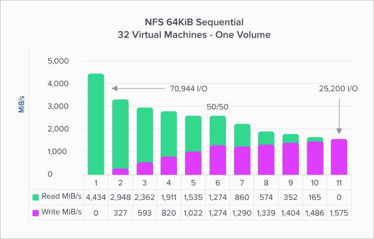
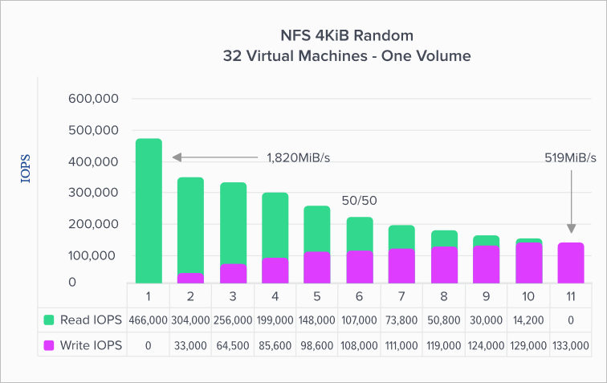
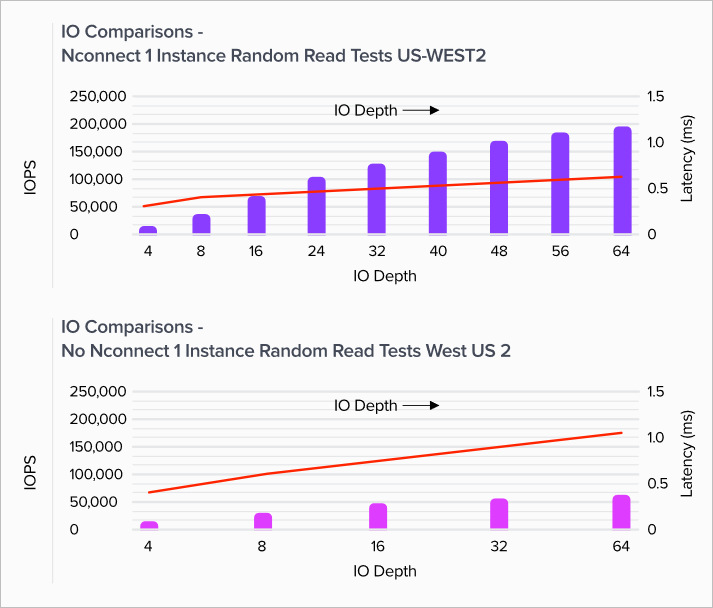

# Azure NetApp Files performance benchmarks for Linux

This article describes performance benchmarks Azure NetApp Files delivers for Linux.

## Linux scale-out

This section describes performance benchmarks of Linux workload throughput and workload IOPS.

### Linux workload throughput  

The graph below represents a 64-kibibyte (KiB) sequential workload and a 1-TiB working set. It shows that a single Azure NetApp Files volume can handle between ~1,600 MiB/s pure sequential writes and ~4,500 MiB/s pure sequential reads.  

The graph illustrates decreases in 10% at a time, from pure read to pure write. It demonstrates what you can expect when using varying read/write ratios (100%:0%, 90%:10%, 80%:20%, and so on).

  

### Linux workload IOPS  

The following graph represents a 4-kibibyte (KiB) random workload and a 1-TiB working set. The graph shows that an Azure NetApp Files volume can handle between ~130,000 pure random writes and ~460,000 pure random reads.  

This graph illustrates decreases in 10% at a time, from pure read to pure write. It demonstrates what you can expect when using varying read/write ratios (100%:0%, 90%:10%, 80%:20%, and so on).

  

## Linux scale-up  

Linux 5.3 kernel enables single-client scale-out networking for NFS-`nconnect`. The graphs in this section show the validation testing results for the client-side mount option with NFSv3. The feature is available on SUSE (starting with SLES12SP4) and Ubuntu (starting with the 19.10 release). It's similar in concept to both SMB multichannel and Oracle Direct NFS.

The graphs compare the advantages of `nconnect` to a non-connected mounted volume. In the graphs, FIO generated the workload from a single D32s_v3 instance in the us-west2 Azure region.

### Linux read throughput  

The following graphs show sequential reads of ~3,500 MiB/s reads with `nconnect`, roughly 2.3X non-`nconnect`.

  

### Linux write throughput  

The following graphs show sequential writes. They indicate that `nconnect` has no noticeable benefit for sequential writes. 1,500 MiB/s is roughly both the sequential write volume upper limit and the D32s_v3 instance egress limit.

  

### Linux read IOPS  

The following graphs show random reads of ~200,000 read IOPS with `nconnect`, roughly 3X non-`nconnect`.

  

### Linux write IOPS  

The following graphs show random writes of ~135,000 write IOPS with `nconnect`, roughly 3X non-`nconnect`.

  

## Next steps

- [Azure NetApp Files: Getting the Most Out of Your Cloud Storage](https://cloud.netapp.com/hubfs/Resources/ANF%20PERFORMANCE%20TESTING%20IN%20TEMPLATE.pdf?hsCtaTracking=f2f560e9-9d13-4814-852d-cfc9bf736c6a%7C764e9d9c-9e6b-4549-97ec-af930247f22f)
