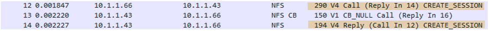
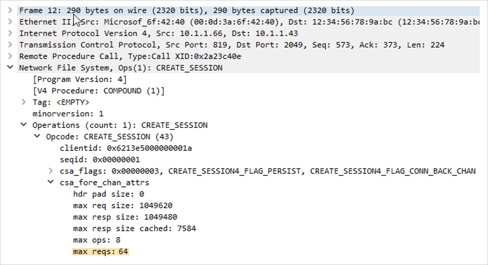
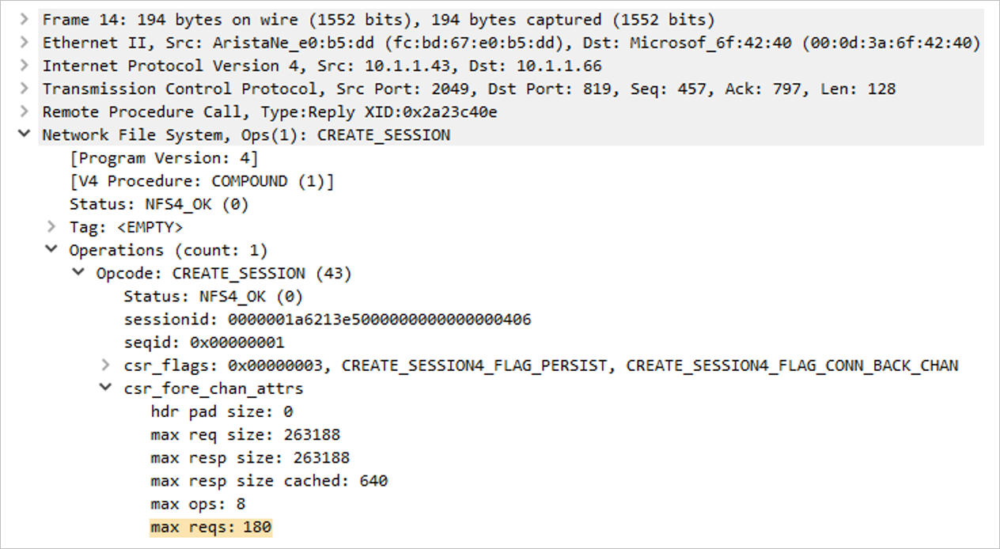

# Linux concurrency best practices for Azure NetApp Files - Session slots and slot table entries

This article helps you understand concurrency best practices for session slots and slot table entries of Azure NetApp Files NFS protocol. 

## NFSv3

NFSv3 does not have a mechanism to negotiate concurrency between the client and the server. The client and the server each defines its limit without consulting the other.  For the best performance, you should line up the maximum number of client-side `sunrpc` slot table entries with that supported without pushback on the server.  When a client overwhelms the server network stack’s ability to process a workload, the server responds by decreasing the window size for the connection, which is not an ideal performance scenario.

By default, modern Linux kernels define the per-connection `sunrpc` slot table entry size `sunrpc.tcp_max_slot_table_entries` as supporting 65,536 outstanding operations, as shown in the following table. 

| Azure NetApp Files NFSv3 server <br> Maximum execution contexts per connection | Linux client <br> Default maximum `sunrpc` slot table entries per connection |
|-|-|
| 128 | 65,536 |

These slot table entries define the limits of concurrency. Values this high are unnecessary.  For example, using a queueing theory known as *Littles Law*, you will find that the I/O rate is determined by concurrency (that is, outstanding I/O) and latency. As such, the algorithm proves that 65,536 slots are orders of magnitude higher than what is needed to drive even extremely demanding workloads.

`Littles Law: (concurrency = operation rate × latency in seconds)`

A concurrency level as low as 155 is sufficient to achieve 155,000 Oracle DB NFS operations per second using Oracle Direct NFS, which is a technology similar in concept to the `nconnect`  mount option:

* Considering a latency of 0.5 ms, a concurrency of 55 is needed to achieve 110,000 IOPS.
* Considering a latency of 1 ms, a concurrency of 155 is needed to achieve 155,000 IOPS.

  

See [Oracle database performance on Azure NetApp Files single volumes](performance-oracle-single-volumes.md) for details.

The `sunrpc.tcp_max_slot_table_entries` tunable is a connection-level tuning parameter.  *As a best practice, set this value to 128 or less per connection, not surpassing 10,000 slots environment wide.*

### Examples of slot count based on concurrency recommendation 

Examples in this section demonstrate the slot count based on concurrency recommendation.  

#### Example 1 – One NFS client, 65,536 `sunrpc.tcp_max_slot_table_entries`, and no `nconnect` for a maximum concurrency of 128 based on the server-side limit of 128

Example 1 is based on a single client workload with the default `sunrpc.tcp_max_slot_table_entry` value of 65,536 and a single network connection, that is, no `nconnect`.  In this case, a concurrency of 128 is achievable.

* `NFS_Server=10.10.10.10, NFS_Client=10.10.10.11`
    * `Connection (10.10.10.10:2049, 10.10.10.11:6543,TCP`) 
        * The client in theory can issue no more than 65,536 requests in flight to the server per connection.
        * The server will accept no more than 128 requests in flight from this single connection.

#### Example 2 – One NFS client, 128 `sunrpc.tcp_max_slot_table_entries`, and no `nconnect` for a maximum concurrency of 128

Example 2 is based on a single client workload with a `sunrpc.tcp_max_slot_table_entry` value of 128, but without the `nconnect` mount option.  With this setting, a concurrency of 128 is achievable from a single network connection.

* `NFS_Server=10.10.10.10, NFS_Client=10.10.10.11`
    * `Connection (10.10.10.10:2049, 10.10.10.11:6543,TCP) `
        * The client will issue no more than 128 requests in flight to the server per connection.
        * The server will accept no more than 128 requests in flight from this single connection.

#### Example 3 – One NFS client, 100 `sunrpc.tcp_max_slot_table_entries`, and `nconnect=8` for a maximum concurrency of 800

Example 3 is based on a single client workload, but with a lower  `sunrpc.tcp_max_slot_table_entry` value of 100.  This time, the `nconnect=8` mount option used spreading the workload across 8 connection.  With this setting, a concurrency of 800 is achievable spread across the 8 connections.  This amount is the concurrency needed to achieve 400,000 IOPS.

* `NFS_Server=10.10.10.10, NFS_Client=10.10.10.11`
    * `Connection 1 (10.10.10.10:2049, 10.10.10.11:6543,TCP), Connection 2 (10.10.10.10:2049, 10.10.10.11:6454,TCP)… Connection 8 (10.10.10.10:2049, 10.10.10.11:7321,TCP)`
    * Connection 1
        * The client will issue no more than 100 requests in flight to the server from  this connection.
        * The server is expected to accept no more than 128 requests in flight from the client for this connection.
    * Connection 2
        * The client will issue no more than 100 requests in flight to the server from  this connection.
        * The server is expected to accept no more than 128 requests in flight from the client for this connection.
    * `…`
    * `…`
    * Connection 8
        * The client will issue no more than 100 requests in flight to the server from  this connection.
        * The server is expected to accept no more than 128 requests in flight from the client for this connection.

#### Example 4 – 250 NFS clients, 8 `sunrpc.tcp_max_slot_table_entries`, and no `nconnect` for a maximum concurrency of 2000

Example 4 uses the reduced per-client `sunrpc.tcp_max_slot_table_entry` value of 8 for a 250 machine-count EDA environment. In this scenario, a concurrency of 2000 is reached environment wide, a value more than sufficient to drive 4,000 MiB/s of a backend EDA workload.

* `NFS_Server=10.10.10.10, NFS_Client1=10.10.10.11`
    * `Connection (10.10.10.10:2049, 10.10.10.11:6543,TCP)` 
        * The client will issue no more than 8 requests in flight to the server per connection.
        * The server will accept no more than 128 requests in flight from this single connection.
* `NFS_Server=10.10.10.10, NFS_Client2=10.10.10.12`
    * `Connection (10.10.10.10:2049, 10.10.10.12:7820,TCP) `
        * The client will issue no more than 8 requests in flight to the server per connection.
        * The server will accept no more than 128 requests in flight from this single connection.
* `…`
* `…`
* `NFS_Server=10.10.10.10, NFS_Client250=10.10.11.13`
    * `Connection (10.10.10.10:2049, 10.10.11.13:4320,TCP) `
        * The client will issue no more than 8 requests in flight to the server per connection.
        * The server will accept no more than 128 requests in flight from this single connection.

When using NFSv3, *you should collectively keep the storage endpoint slot count to 10,000 or less*. It is best to set the per-connection value for `sunrpc.tcp_max_slot_table_entries` to less than 128 when an application scales out across many network connections (`nconnect` and HPC in general, and EDA in particular).  

### How to calculate the best `sunrpc.tcp_max_slot_table_entries` 

Using *Littles Law*, you can calculate the total required slot table entry count. In general, consider the following factors:  

* Scale out workloads are often dominantly large sequential in nature.
* Database workloads, especially OLTP, are often random in nature. 

The following table shows a sample study of concurrency with arbitrary latencies provided:

|     I/O size    |     Latency    |     I/O or throughput    |     Concurrency    |
|-|-|-|-|
|     8 KiB    |     0.5 ms    |     110,000 IOPS \| 859 MiB/s    |     55    |
|     8 KiB    |     2 ms    |     400,000 IOPS \| 3,125 MiB/s    |     800    |
|     256 KiB    |     2 ms    |     16,000 IOPS \| 4,000 MiB/s    |     32    |
|     256 KiB    |     4 ms    |     32,000 IOPS \| 8,000 MiB/s    |     128    |

### How to calculate concurrency settings by connection count

For example, if the workload is an EDA farm and 1,250 clients all drive workload to the same storage end point (a storage end point is a storage IP address), then you calculate the required I/O rate and divide the concurrency across the farm.

Assume that the workload is 4,000 MiB/s using a 256-KiB average operation size and an average latency of 10 ms. To calculate concurrency, use the following formula:

`(concurrency = operation rate × latency in seconds)`

The calculation translates to a concurrency of 160: 
 
`(160 = 16,000 × 0.010)`

Given the need for 1,250 clients, you could safely set `sunrpc.tcp_max_slot_table_entries` to 2 per client to reach the 4,000 MiB/s.  However, you might decide to build in extra headroom by setting the number per client to 4 or even 8, keeping well under the 10,000 recommended slot ceiling. 

### How to set `sunrpc.tcp_max_slot_table_entries` on the client

1.	Add `sunrpc.tcp_max_slot_table_entries=<n>` to the `/etc/sysctl.conf` configuration file.   
    During tuning, if a value lower than 128 is found optimal, replace 128 with the appropriate number.
2.	Run the following command:   
    `$ sysctl -p`
3.	Mount (or remount) all NFS file systems, as the tunable applies only to mounts made after the tunable has been set.

## NFSv4.1 

In NFSv4.1, sessions define the relationship between the client and the server. Whether the mounted NFS file systems sit atop one connection or many (as is the case with `nconnect`), the rules for the session apply. At session setup, the client and server negotiate the maximum requests for the session, settling on the lower of the two supported values. Azure NetApp Files supports 180 outstanding requests, and Linux clients default to 64. The following table shows the session limits: 

| Azure NetApp Files NFSv4.1 server <br>  Max commands per session | Linux client <br>  Default max commands per session    | Negotiated max commands for the session |
|-|-|-|
|     180    |     64    |     64    |

Although Linux clients default to 64 maximum requests per session, the value of `max_session_slots` is tunable.  A reboot is required for changes to take effect.  Use the `systool -v -m nfs` command to see the current maximum in use by the client.  For the command to work, at least one NFSv4.1 mount must be in place:

```shell
$ systool -v -m nfs
{
Module = "nfs"
...
  Parameters:
...
    max_session_slots   = "64"
...
}
```

To tune `max_session_slots`, create a configuration file under `/etc/modprobe.d` as such.  Make sure that no “quotes” are present for the line in the file. Otherwise, the option will not take effect.

`$ sudo echo “options nfs max_session_slots=180” > /etc/modprobe.d/nfsclient.conf`
`$ sudo reboot`

Azure NetApp Files limits each session to 180 max commands. As such, consider 180 the maximum value currently configurable.  The client will be unable to achieve a concurrency greater than 128 unless the session is divided across more than one connection as Azure NetApp Files restricts each connection to 128 max NFS commands.  To get more than one connection, the `nconnect` mount option is recommended, and a value of two or greater is required.

### Examples of expected concurrency maximums

Examples in this section demonstrate the expected concurrency maximums.  

#### Example 1 – 64 `max_session_slots` and no `nconnect`

Example 1 is based on default setting of 64 `max_session_slots` and no `nconnect`. With this setting, a concurrency of 64 is achievable,  all from a single network connection.

* `NFS_Server=10.10.10.10, NFS_Client=10.10.10.11`
    * `Connection (10.10.10.10:2049, 10.10.10.11:6543,TCP)` 
        * The client will issue no more than 64 requests in flight to the server for the session.
        * The server will accept no more than 64 requests in flight from the client for the session. (64 is the negotiated value.)

#### Example 2 – 64 `max_session_slots` and `nconnect=2` 

Example 2 is based on 64 max `session_slots` but with the added mount option of `nconnect=2`.  A concurrency of 64 is achievable but divided across two connections.  Although multiple connections bring no greater concurrency in this scenario, the decreased queue depth per connection has a positive impact on latency.

With the `max_session_slots` still at 64 but `nconnect=2`, notice that maximum number of requests get divided across the connections.

* `NFS_Server=10.10.10.10, NFS_Client=10.10.10.11`
    * `Connection 1 (10.10.10.10:2049, 10.10.10.11:6543,TCP) &&  Connection 2 (10.10.10.10:2049, 10.10.10.11:6454,TCP)`
    * Connection 1
        * The client will issue no more than 32 requests in flight to the server from  this connection.
        * The server is expected to accept no more than 32 requests in flight from the client for this connection.
    * Connection 2
        * The client will issue no more than 32 requests in flight to the server from  this connection.
        * The server is expected to accept no more than 32 requests in flight from the client for this connection.

#### Example 3 – 180 `max_session_slots` and no `nconnect`

Example 3 drops the `nconnect` mount option and sets the `max_session_slots` value to 180, matching the server’s maximum NFSv4.1 session concurrency.  In this scenario, with only one connection and given the Azure NetApp Files 128 maximum outstanding operation per NFS connection, the session is limited to 128 operations in flight.

Although `max_session_slots` has been set to 180, the single network connection is limited to 128 maximum requests as such: 

* `NFS_Server=10.10.10.10, NFS_Client=10.10.10.11`
    * `Connection (10.10.10.10:2049, 10.10.10.11:6543,TCP) `
        * The client will issue no more than 180 requests in flight to the server for the session.
        * The server will accept no more than 180 requests in flight from the client for the session.
        * *The server will accept no more than 128 requests in flight for the single connection.*

#### Example 4 – 180 `max_session_slots` and `nconnect=2 ` 

Example 4 adds the `nconnect=2` mount option and reuses the 180 `max_session_slots` value. Because the overall workload is divided across two connections, 180 outstanding operations is achievable.

With two connections in play, the session supports the full allotment of 180 outstanding requests.

* `NFS_Server=10.10.10.10, NFS_Client=10.10.10.11`
    * `Connection 1 (10.10.10.10:2049, 10.10.10.11:6543,TCP) &&  Connection 2 (10.10.10.10:2049, 10.10.10.11:6454,TCP)`
    * Connection 1
        * The client is expected to maintain no more than 90 requests in flight to the server from connection one.
        * *The server is expected to maintain no more than 90 requests in flight from the client for this connection within the session.*
    * Connection 2
        * The client is expected to maintain no more than 90 requests in flight to the server from connection one.
        * *The server is expected to maintain no more than 90 requests in flight from the client for this connection within the session.*

> [!NOTE]
> For maximum concurrency, set `max_session_slots` equal to 180, which is the maximum session-level concurrency supported by Azure NetApp Files currently.

### How to check for the maximum requests outstanding for the session 

To see the `session_slot` sizes supported by the client and server, capture the mount command in a packet trace.  Look for the `CREATE_SESSION` call and `CREATE_SESSION` reply as shown in the following example.  The call originated from the client, and the reply originated from the server.

Use the following `tcpdump` command to capture the mount command:

`$ tcpdump -i eth0 -s 900 -w /tmp/write.trc port 2049`

Using Wireshark, the packets of interest are as follows:

  

Within these two packets, look at the `max_reqs` field within the middle section of the trace file.

* Network File System
    * Operations
        * `Opcode`
            * `csa_fore_channel_attrs`
            * `max reqs`

Packet 12 (client maximum requests) shows that the client had a `max_session_slots` value of 64.  In the next section, notice that the server supports a concurrency of 180 for the session.  The session ends up negotiating the lower of the two provided values.

  

The following example shows Packet 14 (server maximum requests):

 

## Next steps  

* [Linux direct I/O best practices for Azure NetApp Files](performance-linux-direct-io.md)
* [Linux filesystem cache best practices for Azure NetApp Files](performance-linux-filesystem-cache.md)
* [Linux NFS mount options best practices for Azure NetApp Files](performance-linux-mount-options.md)
* [Linux NFS read-ahead best practices](performance-linux-nfs-read-ahead.md)
* [Azure virtual machine SKUs best practices](performance-virtual-machine-sku.md) 
* [Performance benchmarks for Linux](performance-benchmarks-linux.md) 
