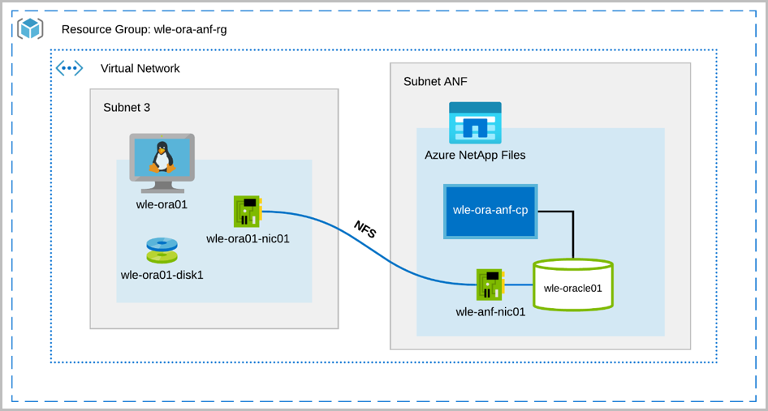
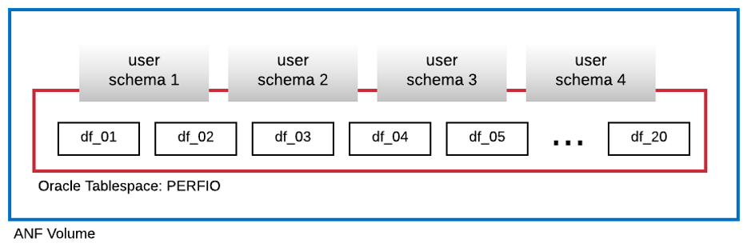
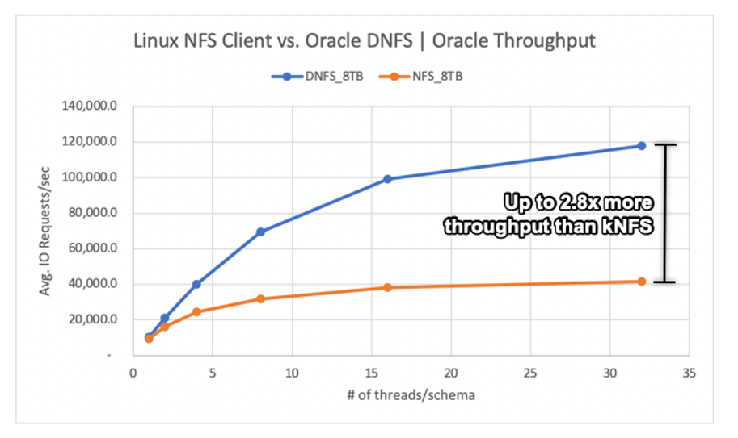
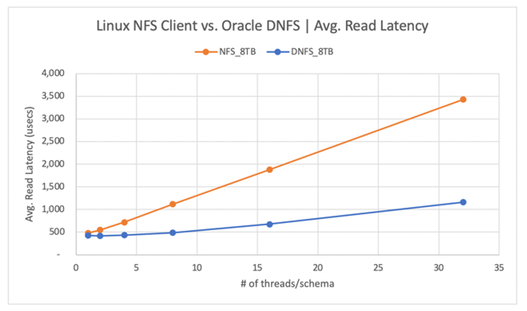
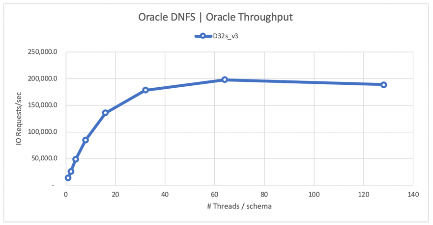

# Oracle database performance on Azure NetApp Files single volumes

This article addresses the following topics about Oracle in the cloud. These topics might be of particular interest to a database administrator, cloud architect, or storage architect:   

* When you drive an online transaction processing (OLTP) workload (mostly random I/O) or an online analytical processing (OLAP) workload (mostly sequential I/O), what does performance look like?   
* What is the difference in performance between the regular Linux kernel NFS (kNFS) client and Oracle’s own Direct NFS client?
* As far as bandwidth is concerned, is the performance of a single Azure NetApp Files volume enough?

[!INCLUDE [Oracle dNFS warning](includes/oracle-dnfs.md)]

## Testing environment and components

The following diagram illustrates the environment used for testing. For consistency and simplicity, Ansible playbooks were used to deploy all elements of the test bed.

  

### Virtual machine configuration

The tests used the following setup for the virtual machine:
* Operating system:   
    RedHat Enterprise Linux 7.8 (wle-ora01)
* Instance types:   
    Two models were used in testing – D32s_v3 and D64s_v3
* Network interface count:   
    One (1) placed in subnet 3  
* Disks:   
    Oracle binaries and OS were placed in a single premium disk

### Azure NetApp Files configuration
The tests used the following Azure NetApp Files configuration:   

* Capacity pool size:  
    Various sizes of the pool were configured: 4 TiB, 8 TiB, 16 TiB, 32 TiB 
* Service level:  
    Ultra (128 MiB/s of bandwidth per 1 TiB of allocated volume capacity)
* Volumes:  
    One and two volume tests were evaluated

### Workload generator 

The tests used workload generated SLOB 2.5.4.2. SLOB (Silly Little Oracle Benchmark) is a well-known workload generator in the Oracle space designed to stress and test the I/O subsystem with an SGA-buffered physical I/O workload.  

SLOB 2.5.4.2 does not support the pluggable database (PDB). As such, a change was added to the `setup.sh` and `runit.sh` scripts to add PDB support to it.  

The SLOB variables used in the tests are described in the following sections.

#### Workload 80% SELECT, 20% UPDATE | Random I/O – `slob.conf` variables   

`UPDATE_PCT=20`   
`SCAN_PCT=0`   
`RUN_TIME=600`   
`WORK_LOOP=0`   
`SCALE=75G`   
`SCAN_TABLE_SZ=50G`   
`WORK_UNIT=64`   
`REDO_STRESS=LITE`   
`LOAD_PARALLEL_DEGREE=12`   

#### Workload 100% SELECT | Sequential I/O – `slob.conf` variables

`UPDATE_PCT=0`   
`SCAN_PCT=100`   
`RUN_TIME=600`   
`WORK_LOOP=0`   
`SCALE=75G`   
`SCAN_TABLE_SZ=50G`   
`WORK_UNIT=64`   
`REDO_STRESS=LITE`   
`LOAD_PARALLEL_DEGREE=12`   

### Database

The Oracle version used for the tests is Oracle Database Enterprise Edition 19.3.0.0.

The Oracle parameters are as follows:  
* `sga_max_size`: 4096M
* `sga_target`: 4096
* `db_writer_processes`: 12
* `awr_pdb_autoflush_enabled`: true
* `filesystemio_options`: SETALL
* `log_buffer`: 134217728

A PDB was created for the SLOB database.

The following diagram shows the tablespace named PERFIO with 600 GB in size (20 data files, 30 GB each) created to host four SLOB user schemas. Each user schema was 125 GB in size.

  

## Performance metrics

The goal was to report the IO performance as experienced by the application. Therefore, all diagrams in this article use metrics reported by the Oracle database via its Automatic Workload Repository (AWR) reports. The metrics used in the diagrams are as follows:   

* **Average IO Requests/sec**   
    Corresponds to the sum of average Read IO Requests/sec and average Write IO Requests/sec from the load profile section
* **Average IO MB/sec**   
    Corresponds to the sum of average Read IO MB/sec and average Write IO MB/sec from the load profile section
* **Average Read latency**   
    Corresponds to the average latency of the Oracle Wait Event “db file sequential read” in microseconds
* **Number of threads/schema**   
    Corresponds to the number of SLOB threads per user schema

## Performance measurement results  

This section describes the results of performance measurement.

### Linux kNFS Client vs. Oracle Direct NFS

This scenario was running on an Azure VM Standard_D32s_v3 (Intel E5-2673 v4 @ 2.30 GHz). The workload is 75% SELECT and 25% UPDATE, mostly random I/O, and with a database buffer hit of ~7.5%. 

As shown in the following diagram, the Oracle DNFS client delivered up to 2.8x more throughput than the regular Linux kNFS Client:  

  

The following diagram shows the latency curve for the read operations. In this context, the bottleneck for the kNFS client is the single NFS TCP socket connection established between the client and the NFS server (the Azure NetApp Files volume).  

  

The DNFS client was able to push more IO requests/sec due to its ability to create hundreds of TCP socket connections, therefore taking advantage of the parallelism. As described in [Azure NetApp Files configuration](#anf_config), each additional TiB of capacity allocated allows for an additional 128MiB/s of bandwidth. DNFS topped out at 1 GiB/s of throughput, which is the limit imposed by the 8-TiB capacity selection. Given more capacity, more throughput would have been driven.

Throughput is only one of the considerations. Another consideration is latency, which has the primary impact on user experience. As the following diagram shows, latency increases can be expected far more rapidly with kNFS than with DNFS. 

  

Histograms provide excellent insight into database latencies. The following diagram provides a complete view from the perspective of the recorded "db file sequential read", while using DNFS at the highest concurrency data point (32 threads/schema). As shown in the following diagram, 47% of all read operations were honored between 512 microseconds and 1000 microseconds, while 90% of all read operations were served at a latency below 2 ms.

  

In conclusion, it's clear that DNFS is a must-have when it comes to improving the performance of an Oracle database instance on NFS.

### Single volume performance limits

This section describes the performance limits of a single volume with random I/O and sequential I/O. 

#### Random I/O

DNFS is capable of consuming far more bandwidth than what is provided by an 8-TB Azure NetApp Files performance quota. By increasing the Azure NetApp Files volume capacity to 16 TiB, which is an instantaneous change, the amount of volume bandwidth increased from 1024 MiB/s by 2X to 2048 MiB/s. 

The following diagram shows a configuration for an 80% select and 20% update workload, and with a database buffer hit ratio of 8%. SLOB was able to drive a single volume to 200,000 NFS I/O requests per second. Considering that each operation is 8-KiB size, the system under test was able to deliver ~200,000 IO requests/sec or 1600 MiB/s.
 
  

The following read latency curve diagram shows that, as the read throughput increases, the latency increases smoothly below the 1-ms line, and it hits the knee of the curve at ~165,000 average read IO requests/sec at the average read latency of ~1.3 ms.  This value is an incredible latency value for an I/O rate unachievable with almost any other technology in the Azure Cloud. 

  

#### Sequential I/O  

As shown in the following diagram, not all I/O is random in nature, considering an RMAN backup or a full table scan, for example, as workloads requiring as much bandwidth as they can get.  Using the same configuration as described previously but with the volume resized to 32 TiB, the following diagram shows that a single Oracle DB instance can drive upwards of 3,900 MB/s of throughput, very close to the Azure NetApp Files volume's performance quota of 32 TB (128 MB/s * 32 = 4096 MB/s).

  

In summary, Azure NetApp Files helps you take your Oracle databases to the cloud. It delivers on performance when the database demands it. You can dynamically and non-disruptively resize your volume quota at any time.

## Next steps

- [Performance benchmark test recommendations for Azure NetApp Files](azure-netapp-files-performance-metrics-volumes.md)
- [Performance benchmarks for Linux](performance-benchmarks-linux.md)