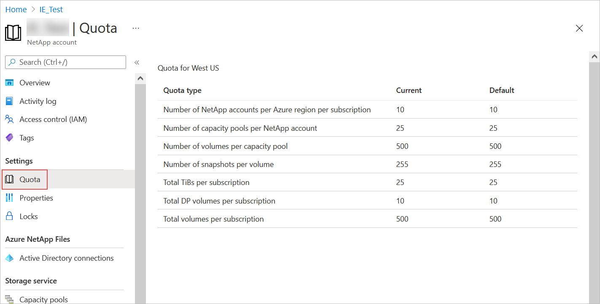

# Regional capacity quota for Azure NetApp Files

This article explains regional capacity quota of Azure NetApp Files.

## Display regional capacity quota

You can click **Quota** under Settings of Azure NetApp Files to display the current and default quota sizes for the region. 

For example: 

 

## Request regional capacity quota increase

You can [submit a support request](azure-netapp-files-resource-limits.md#request-limit-increase) for an increase of a regional capacity quota without incurring extra cost. The support request you submit will be sent to the Azure capacity management team for processing. You will receive a response typically within two business days. The Azure capacity management team might contact you if you have a large request.  

A regional capacity quota increase does not incur a billing increase. Billing is still based on the provisioned capacity pools.
For example, if you currently have 25 TiB of provisioned capacity, you can request a quota increase to 35 TiB.  Within two business days, your quota increase will be applied to the requested region. When the quota increase is applied, you still pay for only the current provisioned capacity (25 TiB). But when you actually provision the additional 10 TiB, you will be billed for 35 TiB.

The current [resource limits](azure-netapp-files-resource-limits.md#resource-limits) for Azure NetApp Files are not changing. You will still be able to provision a 500-TiB capacity pool. But before doing so, the regional capacity quota needs to be increased to 500 TiB.

## Next steps  

- [Resource limits for Azure NetApp Files](azure-netapp-files-resource-limits.md)
- [Understand the storage hierarchy of Azure NetApp Files](azure-netapp-files-understand-storage-hierarchy.md)
- [Cost model for Azure NetApp Files](azure-netapp-files-cost-model.md)
