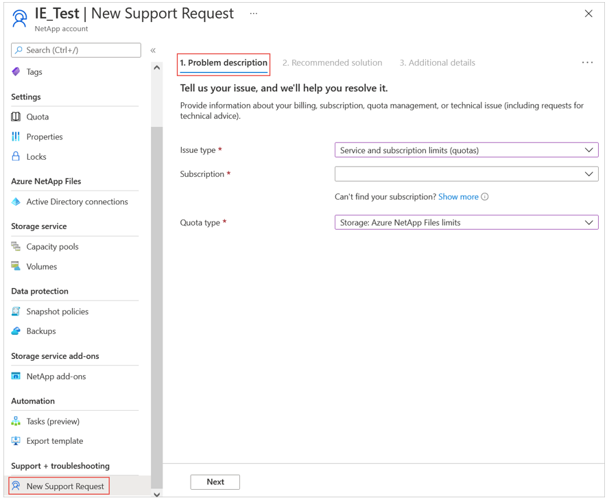
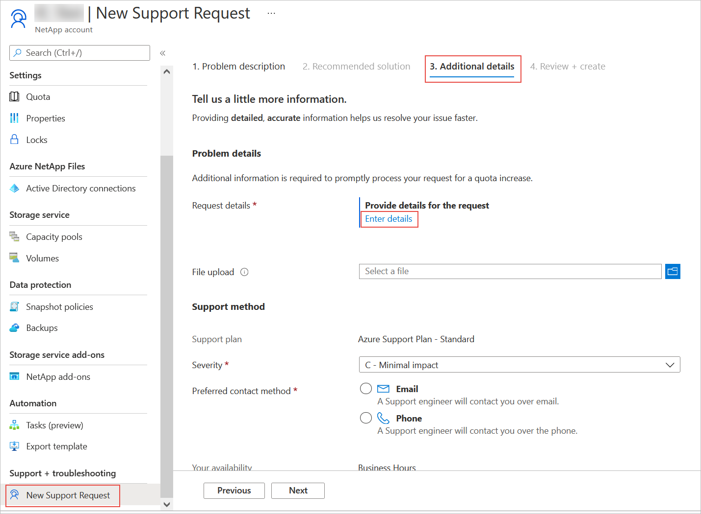
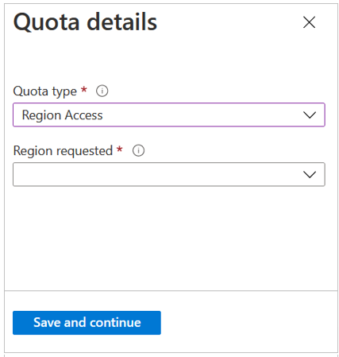

# Request region access for Azure NetApp Files

In some special situations, you might need to explicitly request access to a region. This article explains how to submit a request. 

## Steps

1. Go to **New Support Request** under **Support + troubleshooting**.   

2. Under the **Problem description** tab, provide the required information:
    1. For **Issue Type**, select **Service and Subscription Limits (Quotas)**.
    2. For **Subscription**, select your subscription. 
    3. For **Quota Type**, select **Storage: Azure NetApp Files limits**.

    

3. Under the **Additional details** tab, click **Enter details** in the Request Details field.  

    

4. To request region access, provide the following information in the Quota Details window that appears:   
    1. In **Quota Type**, select **Region Access**.
    2. In **Region Requested**, select your region.

    

5. Click **Save and continue**. Click **Review + create** to create the request.

## Next steps  

- [Understand the storage hierarchy of Azure NetApp Files](azure-netapp-files-understand-storage-hierarchy.md)
- [Cost model for Azure NetApp Files](azure-netapp-files-cost-model.md)
- [Regional capacity quota for Azure NetApp Files](regional-capacity-quota.md)
- [Resource limits for Azure NetApp Files](azure-netapp-files-resource-limits.md)
