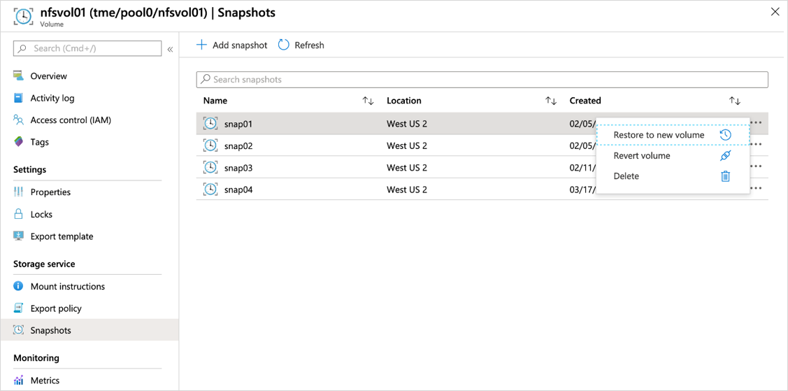

# Delete snapshots using Azure NetApp Files 

You can delete snapshots that you no longer need. 

> [!IMPORTANT]
> You can't undo the snapshot deletion. You can't recover a deleted snapshot. 

## Considerations 

* You can't delete a snapshot if it's part of an active file-restore operation or if it's in the process of being cloned.
* You can't delete a replication generated snapshot that is used for volume baseline data replication.

## Steps

1. Go to the **Snapshots** menu of a volume. Select the three dots at the end of the row of the snapshot want to delete. Select **Delete**.

     

2. In the Delete Snapshot window, confirm that you want to delete the snapshot by selecting **Yes**. 

      

## Next steps

* [Learn more about snapshots](snapshots-introduction.md)
* [Azure NetApp Files snapshot overview](https://anfcommunity.com/2021/01/31/azure-netapp-files-snapshot-overview/)
