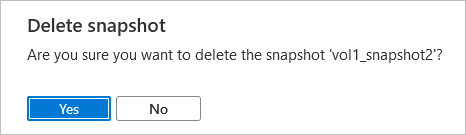

# Delete snapshots using Azure NetApp Files 

You can delete snapshots that you no longer need to keep. 

> [!IMPORTANT]
> The snapshot deletion operation cannot be undone. A deleted snapshot cannot be recovered. 

## Considerations 

* You can't delete a snapshot if it is part of an active file-restore operation or if it is in the process of being cloned.
* You can't delete a replication generated snapshot that is used for volume baseline data replication.

## Steps

1. Go to the **Snapshots** menu of a volume. Right-click the snapshot you want to delete. Select **Delete**.

     

2. In the Delete Snapshot window, confirm that you want to delete the snapshot by clicking **Yes**. 

      

## Next steps

* [Learn more about snapshots](snapshots-introduction.md)
* [Azure NetApp Files Snapshot Overview](https://anfcommunity.com/2021/01/31/azure-netapp-files-snapshot-overview/)
