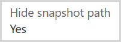

# Edit the Hide snapshot path option of Azure NetApp Files
The Hide snapshot path option controls whether the snapshot path of a volume is visible. During the creation of an [NFS](azure-netapp-files-create-volumes.md#create-an-nfs-volume) or [SMB](azure-netapp-files-create-volumes-smb.md#add-an-smb-volume) volume, you can specify whether the snapshot path should be hidden. After creating the volume, you can edit the Hide snapshot path option as needed.  

> [!NOTE]
> For a [destination volume](cross-region-replication-create-peering.md#create-the-data-replication-volume-the-destination-volume) in cross-region replication, the Hide snapshot path option is enabled by default. The setting isn't modifiable. 

## Steps

1. To view the Hide snapshot path option setting of a volume, select the volume. The **Hide snapshot path** field shows whether the option is enabled.   
     
2. To edit the Hide Snapshot Path option, select **Edit** on the volume page. Modify the **Hide snapshot path** option as needed.   
     

## Next steps

* [Learn more about snapshots](snapshots-introduction.md)
