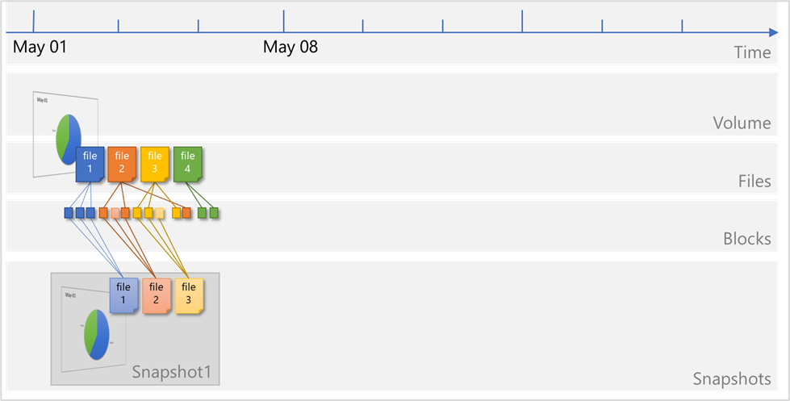
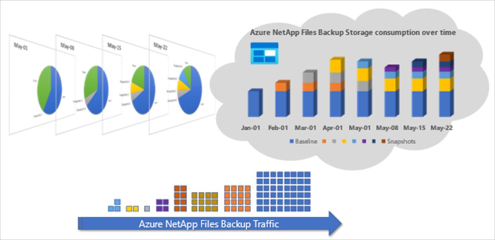
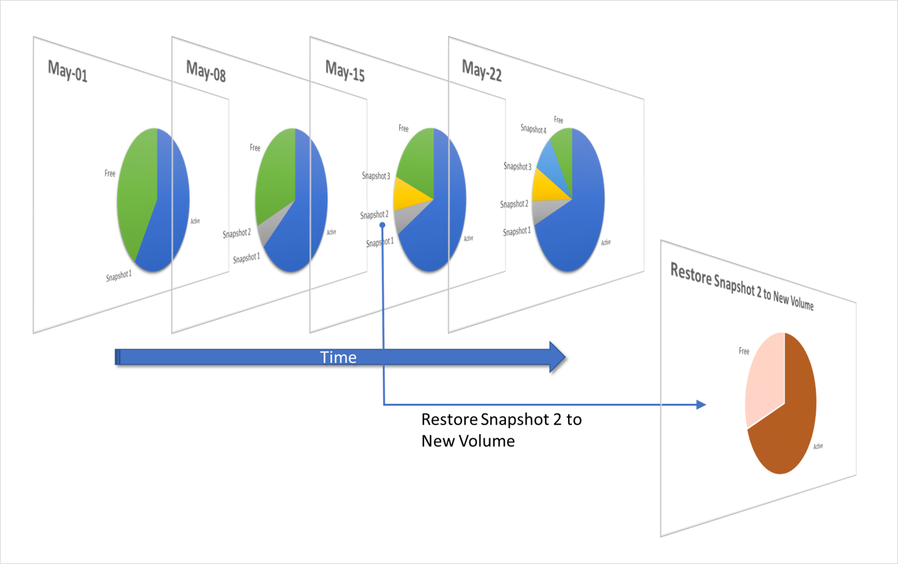
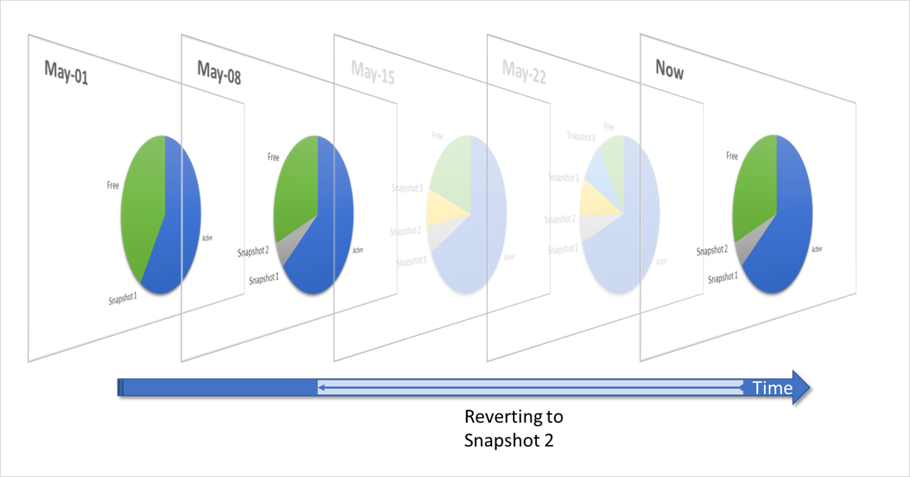
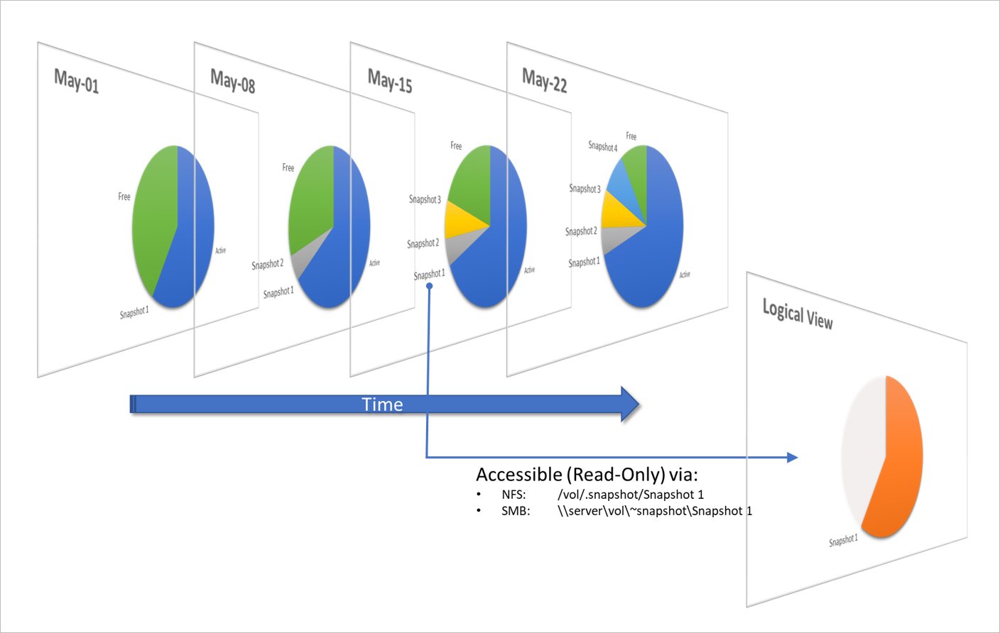
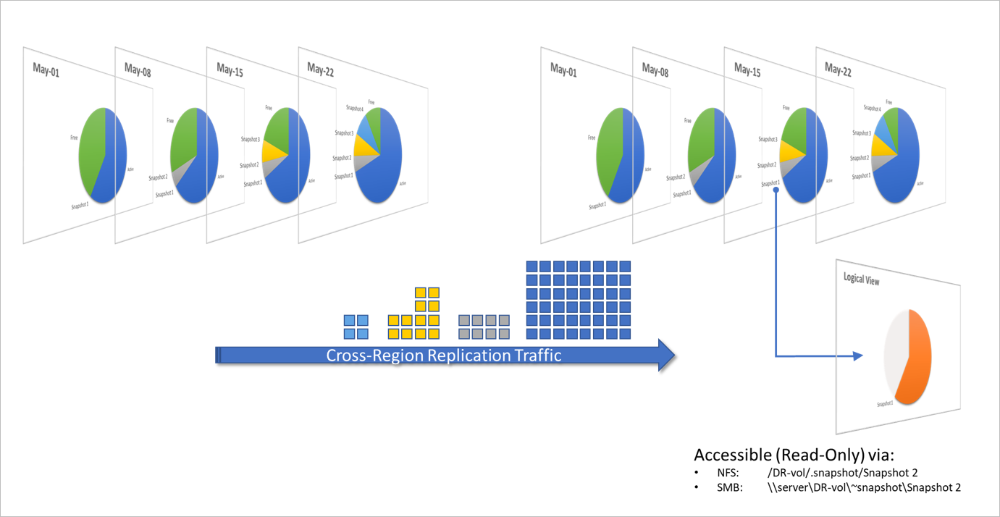
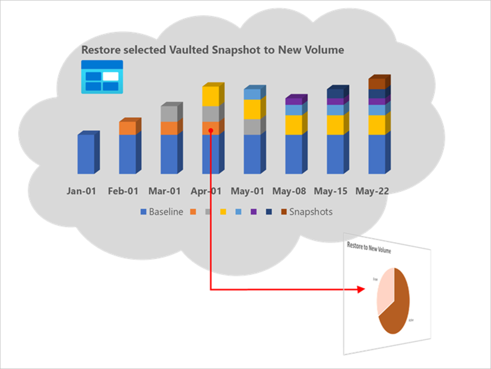

# How Azure NetApp Files snapshots work

This article explains how Azure NetApp Files snapshots work. Azure NetApp Files snapshot technology delivers stability, scalability, and faster recoverability, with no impact to performance. It provides the foundation for data protection solutions, including single-file restores, volume restores and clones, cross-region replication, and long-term retention. 

For steps about using volume snapshots, see [Manage snapshots by using Azure NetApp Files](azure-netapp-files-manage-snapshots.md). For considerations about snapshot management in cross-region replication, see [Requirements and considerations for using cross-region replication](cross-region-replication-requirements-considerations.md).

## What volume snapshots are  

An Azure NetApp Files snapshot is a point-in-time file system (volume) image. It is ideal to serve as an online backup. You can use a snapshot to [create a new volume](snapshots-restore-new-volume.md) (clone), [restore a file](snapshots-restore-file-client.md), or [revert a volume](snapshots-revert-volume.md). In specific application data stored on Azure NetApp Files volumes, extra steps might be required to ensure application consistency. 

Low-overhead snapshots are made possible by the unique features of the underlying volume virtualization technology that is part of Azure NetApp Files. Like a database, this layer uses pointers to the actual data blocks on disk. But, unlike a database, it doesn't rewrite existing blocks; it writes updated data to new blocks and changes the pointers, thus maintaining the new and the old data. An Azure NetApp Files snapshot simply manipulates block pointers, creating a “frozen”, read-only view of a volume that lets applications access older versions of files and directory hierarchies without special programming. Actual data blocks aren’t copied. As such, snapshots are efficient in the time needed to create them; they are near-instantaneous, regardless of volume size. Snapshots are also efficient in storage space; only delta blocks between snapshots and the active volume are kept.

The following diagrams illustrate the concepts:  

1. Files consist of metadata and data blocks written to a volume. In this illustration, there are three files, each consisting of three blocks: file 1, file 2, and file 3.

   

2. A snapshot `Snapshot1` is taken, which copies the metadata and only the pointers to the blocks that represent the files:

   

3. Files on the volume continue to change, and new files are added. Modified data blocks are written as new data blocks on the volume. The blocks that were previously captured in `Snapshot1` remain unchanged: 

   

4. A new snapshot `Snapshot2` is taken to capture the changes and additions:

   

When a snapshot is taken, the pointers to the data blocks are copied, and modifications are written to new data locations. The snapshot pointers continue to point to the original data blocks that the file occupied when the snapshot was taken, giving you a live and a historical view of the data. If you were to create a new snapshot, the current pointers (that is, the ones created after the most recent additions and modifications) are copied to a new snapshot `Snapshot2`. This creates access to three generations of data (the live data, `Snapshot2`, and `Snapshot1`, in order of age) without taking up the volume space that three full copies would require.

A snapshot takes only a copy of the volume metadata (*inode table*). It takes just a few seconds to create, regardless of the volume size, the capacity used, or the level of activity on the volume. As such, taking a snapshot of a 100-TiB volume takes the same (next to zero) amount of time as taking a snapshot of a 100-GiB volume. After a snapshot is created, changes to data files are reflected in the active version of the files, as normal.

Meanwhile, the data blocks that are pointed to from snapshots remain stable and immutable. Because of the “Redirect on Write” nature of Azure NetApp Files volumes, snapshots incur no performance overhead and in themselves do not consume any space. You can store up to 255 snapshots per volume over time, all of which are accessible as read-only and online versions of the data, consuming as little capacity as the number of changed blocks between each snapshot. Modified blocks are stored in the active volume. Blocks pointed to in snapshots are kept (as read-only) in the volume for safekeeping, to be repurposed only when all pointers (in the active volume and snapshots) have been cleared. Therefore, volume utilization will increase over time, by either new data blocks or (modified) data blocks kept in snapshots.

 The following diagram shows a volume’s snapshots and used space over time: 

Because a volume snapshot records only the block changes since the latest snapshot, it provides the following key benefits:

* Snapshots are ***storage efficient***.  
    Snapshots consume minimal storage space because they don't copy any data blocks of the entire volume. Two snapshots taken in sequence differ only by the blocks added or changed in the time interval between the two. This block-incremental behavior minimizes associated storage capacity consumption. Many alternative snapshot implementations consume storage volumes equal to the active file system, raising storage capacity requirements. Depending on application daily *block-level* change rates, Azure NetApp Files snapshots will consume more or less capacity, but on changed data only. Average daily snapshot consumption ranges from only 1-5% of used volume capacity for many application volumes, or up to 20-30% for volumes such as SAP HANA database volumes. Be sure to [monitor your volume and snapshot usage](azure-netapp-files-metrics.md#volumes) for snapshot capacity consumption relative to the number of created and maintained snapshots.  

* Snapshots are ***quick to create, replicate, restore, or clone***.  
    It takes only a few seconds to create, replicate, restore, or clone a snapshot, regardless of the volume size and level of activity on the volume. You can [create a volume snapshot on-demand](azure-netapp-files-manage-snapshots.md). You can also use [snapshot policies](snapshots-manage-policy.md) to specify when Azure NetApp Files should automatically create a snapshot and how many snapshots to keep for a volume. Application consistency can be achieved by orchestrating snapshots with the application layer, for example, by using the [AzAcSnap tool](azacsnap-introduction.md) for SAP HANA.

* Snapshots have no impact on volume ***performance***.  
    Because of the “Redirect on Write” nature of the underlaying technology, storing or retaining Azure NetApp Files snapshots has no performance impact, even with heavy data activity. Deleting a snapshot also has little to no performance impact in most cases. 

* Snapshots provide ***scalability*** because they can be created frequently, and many can be retained.  
    Azure NetApp Files volumes support up to 255 snapshots per volume. The ability to store many low-impact, frequently created snapshots increases the likelihood that the desired version of data can be successfully recovered.

* Snapshots can be ***vaulted*** to Azure storage.  
    For compliance and long-term data retention requirements, use the [Azure NetApp Files backup](backup-introduction.md) functionality to vault snapshots to cost-efficient, ZRS-enabled Azure storage, outside of the volume being protected. 

* Snapshots provide ***user visibility*** and ***file recoverability***.  

The high performance, scalability, and stability of Azure NetApp Files snapshot technology means it provides an ideal online backup for user-driven recovery. Snapshots can be made user-accessible for file, directory, or volume restore purposes. Additional solutions allow you to copy backups to offline storage or [replicate cross-region](cross-region-replication-introduction.md) for retention or disaster-recovery purposes.

## Ways to create snapshots   

You can use several methods to create and maintain snapshots:

* Manually (on-demand), by using:   
    * The [Azure portal](azure-netapp-files-manage-snapshots.md#create-an-on-demand-snapshot-for-a-volume), [REST API](/rest/api/netapp/snapshots), [Azure CLI](/cli/azure/netappfiles/snapshot), or [PowerShell](/powershell/module/az.netappfiles/new-aznetappfilessnapshot) tools
    * Scripts (see [examples](azure-netapp-files-solution-architectures.md#sap-tech-community-and-blog-posts))

* Automated, by using:
    * Snapshot policies, via the [Azure portal](snapshots-manage-policy.md), [REST API](/rest/api/netapp/snapshotpolicies), [Azure CLI](/cli/azure/netappfiles/snapshot/policy), or [PowerShell](/powershell/module/az.netappfiles/new-aznetappfilessnapshotpolicy) tools
    * Application consistent snapshot tooling, like [AzAcSnap](azacsnap-introduction.md)

## How volumes and snapshots are replicated cross-region for DR  

Azure NetApp Files supports [cross-region replication](cross-region-replication-introduction.md) for disaster-recovery (DR) purposes. Azure NetApp Files cross-region replication uses SnapMirror technology. Only changed blocks are sent over the network in a compressed, efficient format. After a cross-region replication is initiated between volumes, the entire volume contents (that is, the actual stored data blocks) are transferred only once. This operation is called a *baseline transfer*. After the initial transfer, only changed blocks (as captured in snapshots) are transferred. The result is an asynchronous 1:1 replica of the source volume, including all snapshots. This behavior follows a full and incremental-forever replication mechanism. This technology minimizes the amount of data required to replicate across the regions, therefore saving data transfer costs. It also shortens the replication time. You can achieve a smaller Recovery Point Objective (RPO), because more snapshots can be created and transferred more frequently with minimal data transfers. Further, it takes away the need for host-based replication mechanisms, avoiding virtual machine and software license cost.

The following diagram shows snapshot traffic in cross-region replication scenarios: 

## How snapshots can be vaulted for long-term retention and cost savings

As described, snapshots are used to create fast, space-efficient backups of Azure NetApp Files volumes, efficiently and quickly, and they provide a means to restore data files or complete volumes very effectively. These online snapshots serve as the first line of defense and cover most data recovery operations.  

To keep snapshots for a longer period of time, or to keep more snapshots than the maximum number of online snapshots, you can vault snapshots from Azure NetApp Files volumes into ZRS-enabled Azure storage. This is facilitated by the [*Azure NetApp Files backup*](backup-introduction.md) functionality. The functionality keeps snapshots for extended amounts of time (up to a year or even longer). Backups are stored on Azure storage, which has a cost advantage over the Azure NetApp Files capacity pool cost, and utilizes a different storage platform to eliminate dependencies and to comply with retention requirements.

To enable snapshot vaulting on your Azure NetApp Files volume, [configure a backup policy](backup-configure-policy-based.md) in the Azure NetApp Files subscription (located under the Data Protection section), and specify the number of Daily, Weekly, and Monthly backups you want to keep. This is all you need to do to expand your data protection with cost-efficient long-term storage. 

The following diagram shows how snapshot data is transferred from the Azure NetApp Files volume to Azure NetApp Files backup storage, hosted on Azure storage.

The Azure NetApp Files backup functionality is designed to keep a longer history of backups as indicated in this simplified example. Notice how the backup repository on the right contains more and older snapshots than the protected volume and snapshots on the left. 

Most use cases will require that you keep online snapshots on the Azure NetApp Files volume for a relatively short amount of time (usually several months) to serve the most common recoveries of lost data due to application or user error. The Azure NetApp Files backup functionality is used to extend the data-protection period to a year or longer by sending the snapshots over to cost-efficient Azure storage. As indicated by the blue color in the diagram, the very first transfer is the baseline, which copies all consumed data blocks in the source Azure NetApp Files volume and snapshots. Consecutive backups will use the snapshot mechanism to update the backup repository with only block-incremental updates.

## Ways to restore data from snapshots  

The Azure NetApp Files snapshot technology greatly improves the frequency and reliability of backups. It incurs minimal performance overhead and can be safely created on an active volume. Azure NetApp Files snapshots allow near-instantaneous, secure, and optionally user-managed restores. This section describes various ways in which data can be accessed or restored from Azure NetApp Files snapshots.

### Restoring (cloning) an online snapshot to a new volume

You can restore Azure NetApp Files snapshots to separate, independent volumes (clones). This operation is near-instantaneous, regardless of the volume size and the capacity consumed. The newly created volume is almost immediately available for access, while the actual volume and snapshot data blocks are being copied over. Depending on volume size and capacity, this process can take considerable time during which the parent volume and snapshot cannot be deleted. However, the volume can already be accessed after initial creation, while the copy process is in progress in the background. This capability enables fast volume creation for data recovery or volume cloning for test and development. By nature of the data copy process, storage capacity pool consumption will double when the restore completes, and the new volume will show the full active capacity of the original snapshot. The snapshot used to create the new volume will also be present on the new volume. After this process is completed, the volume will be independent and disassociated from the original volume, and source volumes and snapshot can be managed or removed independently from the new volume.

The following diagram shows a new volume created by restoring (cloning) a snapshot:   

The same operation can be performed on replicated snapshots to a disaster-recovery (DR) volume. Any snapshot can be restored to a new volume, even when cross-region replication remains active or in progress. This capability enables non-disruptive creation of test and development environments in a DR region, putting the data to use, whereas the replicated volumes would otherwise be used only for DR purposes. This use case enables test and development to be isolated from production, eliminating potential impact on production environments. 

The following diagram shows volume restoration (cloning) by using DR target volume snapshot while cross-region replication is taking place:  

When you restore a snapshot to a new volume, the Volume overview page displays the name of the snapshot used to create the new volume in the **Originated from** field. See [Restore a snapshot to a new volume](snapshots-restore-new-volume.md) about volume restore operations.

### Restoring (reverting) an online snapshot in-place

In some cases, because the new volume will consume storage capacity, creating a new volume from a snapshot might not be needed or appropriate. To recover from data corruption quickly (for example, database corruption or ransomware attacks), it might be more appropriate to restore a snapshot within the volume itself. This operation can be done using the Azure NetApp Files [snapshot revert](snapshots-revert-volume.md) functionality. This functionality enables you to quickly revert a volume to the state it was in when a particular snapshot was taken. In most cases, reverting a volume is much faster than restoring individual files from a snapshot to the active file system, especially in large, multi-TiB volumes. 

Reverting a volume snapshot is near-instantaneous and takes only a few seconds to complete, even for the largest volumes. The active volume metadata (*inode table*) is replaced with the snapshot metadata from the time of snapshot creation, thus rolling back the volume to that specific point in time. No data blocks need to be copied for the revert to take effect. As such, it's more space efficient and faster than restoring a snapshot to a new volume.

The following diagram shows a volume reverting to an earlier snapshot:  

> [!IMPORTANT]
> Active filesystem data that was written and snapshots that were taken after the selected snapshot will be lost. The snapshot revert operation will replace all data in the targeted volume with the data in the selected snapshot. You should pay attention to the snapshot contents and creation date when you select a snapshot. You cannot undo the snapshot revert operation. 

See [Revert a volume using snapshot revert](snapshots-revert-volume.md) about how to use this feature.

### Restoring files or directories from online snapshots using a client

If the [Snapshot Path visibility](snapshots-edit-hide-path.md) is not set to `hidden`, you can directly access snapshots to recover from accidental deletion, corruption, or modification of your data. The security of files and directories are retained in the snapshot, and snapshots are read-only by design. As such, the restoration is secure and simple. If the Snapshot Path visibility is set to `hidden`, you can open a support ticket to have a backup admin or system admin restore your files from a snapshot.

The following diagram shows file or directory access to a snapshot using a client: 

In the diagram, Snapshot 1 consumes only the delta blocks between the active volume and the moment of snapshot creation. But when you access the snapshot via the volume snapshot path, the data will *appear* as if it’s the full volume capacity at the time of the snapshot creation. By accessing the snapshot folders, you can restore data by copying files and directories out of a snapshot of choice.

Similarly, snapshots in target cross-region replication volumes can be accessed read-only for data recovery in the DR region. 

The following diagram shows snapshot access in cross-region replication scenarios: 

See [Restore a file from a snapshot using a client](snapshots-restore-file-client.md) about restoring individual files or directories from snapshots.

### Restoring files or directories from online snapshots using single-file snapshot restore

If you don't want to restore the entire snapshot to a new volume or copy large files across the network, you can use the [single-file snapshot restore](snapshots-restore-file-single.md) feature to recover individual files directly within a volume from a snapshot, without requiring an external client data copy.

This feature does not require that you restore the entire snapshot to a new volume, revert a volume, or copy large files across the network. You can use this feature to restore individual files directly on the service from a volume snapshot without requiring data copy using an external client. This approach can drastically reduce RTO and network resource usage when restoring large files. 

The following diagram describes how single-file snapshot restore works:

When a single file is restored in-place (`file2`) or to a new file in the volume (`file2’`), only the *pointers* to existing blocks previously captured in a snapshot are reverted. This operation eliminates the copying of any data blocks and is near-instantaneous, irrespective of the size of the file (the number of blocks in the file).

   

### Restoring volume backups from vaulted snapshots

You can [search for backups](backup-search.md) at the volume level or the NetApp account level. Names used for snapshots are preserved when the snapshots are backed up, and include the prefix “daily”, “weekly” or “monthly”. They also include the timestamp of the snapshot creation time and date. The first snapshot taken when the backup feature is enabled is called a baseline snapshot. The baseline snapshot includes all data on the protected volume and the snapshots. Consecutive vaulted snapshots are block-incremental updates, while snapshots are always a complete representation of the volume at the time the vaulted snapshot was taken and can be directly restored *without* the need to stack the baseline with incremental updates. 

The following diagram illustrates the operation of restoring a selected vaulted snapshot to a new volume:  

### Restoring individual files or directories from vaulted snapshots  

To restore individual files or directories, the complete vaulted snapshot is restored to a new volume, and then the volume can be mounted to browse for the files or directories to be restored. The restore is done by copying the required files  or directories from the newly restored volume to the destination location. When the restore is completed, the restored volume may be deleted. 

If a volume is deleted, its vaulted snapshots (backups) are still retained, unlike the online snapshots, which are part of the volume and are deleted with the volume deletion. You can restore complete volumes and then individual directories from vaulted backups even if the parent volume was deleted or lost due to application or user error. You can do so by selecting the appropriate vaulted snapshot from the backup list and restoring it to a new volume. See [Restore a backup to a new volume](backup-restore-new-volume.md) for details.

## How snapshots are deleted  

This section explains how online snapshots and vaulted snapshots are deleted.

### Deleting online snapshots 

Snapshots consume storage capacity. As such, they are not typically kept indefinitely. For data protection, retention, and recoverability, a number of snapshots (created at various points in time) are usually kept online for a certain duration depending on RPO, RTO, and retention SLA requirements. Snapshots can be deleted from the storage service by an administrator at any time. Any snapshot can be deleted regardless of the order in which it was created. Deleting older snapshots will free up space.

> [!IMPORTANT]
> The snapshot deletion operation cannot be undone. You should retain offline copies (vaulted snapshots) of the volume for data protection and retention purposes. 

When a snapshot is deleted, all pointers from that snapshot to existing data blocks will be removed. Only when a data block has no more pointers pointing at it (by the active volume, or other snapshots in the volume), the data block is returned to the volume-free space for future use. Therefore, removing snapshots usually frees up more capacity in a volume than deleting data from the active volume, because data blocks are often captured in previously created snapshots. 

The following diagram shows the effect on storage consumption of Snapshot 3 deletion from a volume:  

Be sure to [monitor volume and snapshot consumption](azure-netapp-files-metrics.md#volumes) and understand how the application, active volume, and snapshot consumption interact. 

See [Delete snapshots](snapshots-delete.md) about how to manage snapshot deletion. See [Manage snapshot policies](snapshots-manage-policy.md) about how to automate this process.

### Deleting vaulted snapshots

Disabling backups for a volume will delete all vaulted snapshots (backups) stored in Azure storage for that volume.

If a volume is deleted but the backup policy wasn’t disabled before the volume deletion, all backups related to the volume are retained in the Azure storage and will be listed under the associated NetApp account.

See [Disable backup functionality for an Azure NetApp Files volume](backup-disable.md) for details. 

Vaulted snapshot history is managed automatically by the applied snapshot policy where the oldest snapshot is deleted when a new one is added by the vaulted snapshot (backup) scheduler. You can also manually remove vaulted snapshots.

## Next steps

* [Manage snapshots by using Azure NetApp Files](azure-netapp-files-manage-snapshots.md)
* [Monitor volume and snapshot metrics](azure-netapp-files-metrics.md#volumes)
* [Restore individual files using single-file snapshot restore](snapshots-restore-file-single.md)
* [Restore a file from a snapshot using a client](snapshots-restore-file-client.md)
* [Troubleshoot snapshot policies](troubleshoot-snapshot-policies.md)
* [Resource limits for Azure NetApp Files](azure-netapp-files-resource-limits.md)
* [Azure NetApp Files Snapshots 101 video](https://www.youtube.com/watch?v=uxbTXhtXCkw)
* [Azure NetApp Files Snapshot Overview](https://anfcommunity.com/2021/01/31/azure-netapp-files-snapshot-overview/)
* [Understand Azure NetApp Files backup](backup-introduction.md)
* [Configure policy-based backups](backup-configure-policy-based.md)
* [Configure manual backups](backup-configure-manual.md)
* [Manage backup policies](backup-manage-policies.md)
* [Search backups](backup-search.md)
* [Restore a backup to a new volume](backup-restore-new-volume.md)
* [Disable backup functionality for a volume](backup-disable.md)
* [Delete backups of a volume](backup-delete.md)
* [Test disaster recovery for Azure NetApp Files](test-disaster-recovery.md)
