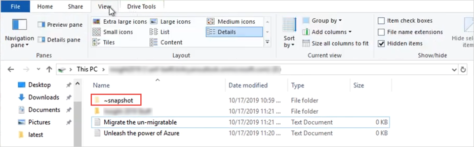
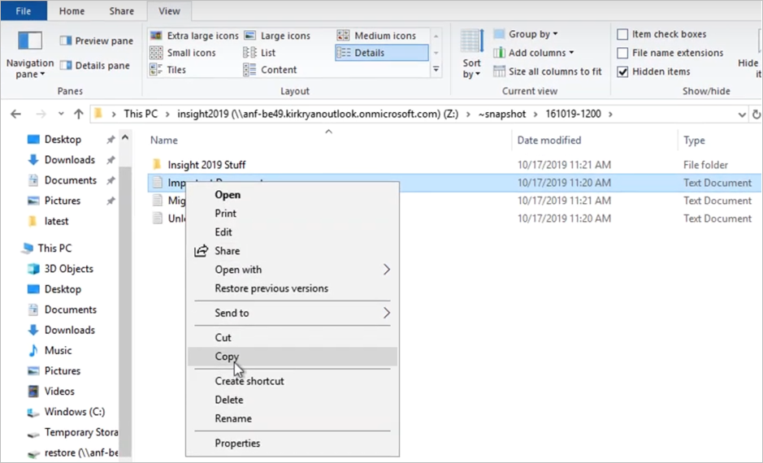
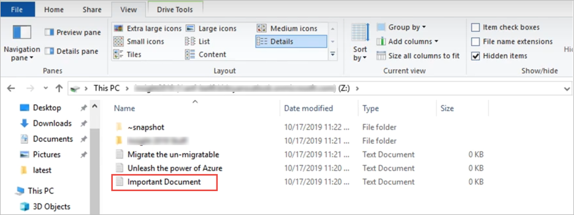

# Restore a file from a snapshot using a client with Azure NetApp Files

[Snapshots](snapshots-introduction.md) enable point-in-time recovery of volumes. If you do not want to [restore the entire snapshot to a volume](snapshots-restore-new-volume.md), you have the option to restore a file from a snapshot by using a client that has the volume mounted.  

The mounted volume contains a snapshot directory named  `.snapshot` (in NFS clients) or `~snapshot` (in SMB clients) that is accessible to the client. The snapshot directory contains subdirectories corresponding to the snapshots of the volume. Each subdirectory contains the files of the snapshot. If you accidentally delete or overwrite a file, you can restore the file to the parent read-write directory by copying the file from a snapshot subdirectory to the read-write directory. 

You can control access to the snapshot directories by using the [Hide Snapshot Path option](snapshots-edit-hide-path.md). This option controls whether the directory should be hidden from the clients. Therefore, it also controls access to files and folders in the snapshots.  

NFSv4.1 does not show the `.snapshot` directory (`ls -la`). However, when the Hide Snapshot Path option is not set, you can still access the `.snapshot` directory via NFSv4.1 by using the `cd <snapshot-path>` command from the client command line. 

## Restore a file by using a Linux NFS client 

1. Use the `ls` Linux command to list the file that you want to restore from the `.snapshot` directory. 

    For example:

    `$ ls my.txt`   
    `ls: my.txt: No such file or directory`   

    `$ ls .snapshot`   
    `daily.2020-05-14_0013/              hourly.2020-05-15_1106/`   
    `daily.2020-05-15_0012/              hourly.2020-05-15_1206/`   
    `hourly.2020-05-15_1006/             hourly.2020-05-15_1306/`   

    `$ ls .snapshot/hourly.2020-05-15_1306/my.txt`   
    `my.txt`

2. Use the `cp` command to copy the file to the parent directory.  

    For example: 

    `$ cp .snapshot/hourly.2020-05-15_1306/my.txt .`   

    `$ ls my.txt`   
    `my.txt`   

## Restore a file by using a Windows client 

1. If the `~snapshot` directory of the volume is hidden, [show hidden items](https://support.microsoft.com/help/4028316/windows-view-hidden-files-and-folders-in-windows-10) in the parent directory to display `~snapshot`.

     

2. Navigate to the subdirectory within `~snapshot` to find the file you want to restore.  Right-click the file. Select **Copy**.  

     

3. Return to the parent directory. Right-click in the parent directory and select `Paste` to paste the file to the directory.

     

4. You can also right-click the parent directory, select **Properties**, click the **Previous Versions** tab to see the list of snapshots, and select **Restore** to restore a file.  

     

## Next steps

* [Learn more about snapshots](snapshots-introduction.md) 
* [Resource limits for Azure NetApp Files](azure-netapp-files-resource-limits.md)
* [Azure NetApp Files Snapshots 101 video](https://www.youtube.com/watch?v=uxbTXhtXCkw)
* [Azure NetApp Files Snapshot Overview](https://anfcommunity.com/2021/01/31/azure-netapp-files-snapshot-overview/)